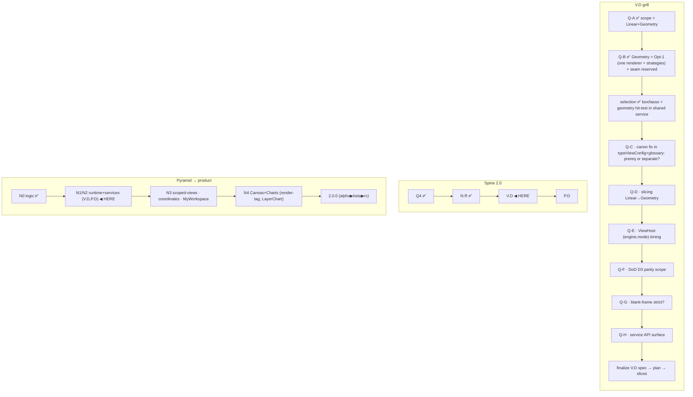

# V.D — Shared Render-Runtime (grill checkpoint, IN PROGRESS)

> **State: brainstorm/grill IN PROGRESS — not yet a finalized spec.** This is the durable
> capture of the 2026-06-17 dev grill so the model is not lost and is visible from the vault.
> Decisions tagged **LOCKED** (dev-confirmed) / **PROPOSED** (mine, awaiting dev) / **OPEN** (queued).
> Seed of the eventual V.D implementation plan. sandbox @ `cc23ad9` (`2.0.0-alpha.1`), no code touched.

## One-line

V.D = decompose the 5 god views into thin **shells** + extract list orchestration into **ONE
shared virtual-layout service** (wrapping `@tanstack/svelte-virtual`) that every virtualized engine
consumes and that mounts `NodeRow` (from N.R). It is the **real perf lever** (the reason 1.1.0 beta.1
was abandoned). Continues the decomposition chain O → A.R → N.R (cell) → **V.D (list-runtime + shells)**.

## LOCKED decisions (dev grill 2026-06-17)

- **D-VD-1 — Runtime scope = Linear + Geometry ONLY.** The shared virtual-layout service applies only
  to engines that virtualize a list/grid of node-cells. **Canvas + Charts = separate render runtimes,
  deferred** (they don't virtualize rows). TanStack Virtual is 1D-offset (+ lanes) range math; it
  CANNOT do free-spatial graphs/canvas (Obsidian graph core = force-sim + canvas/WebGL).
- **D-VD-2 — Engine canon CORRECTED → `Linear / Geometry / Canvas / Charts`.**
  - `Table` is a **MODE of Geometry** (not its own engine). Repo evidence: ViewNodeGrid/Table/Cards all
    already share `createExplorerVariableGeometry` (Fenwick) today; only Linear (tree) is fixed-height.
  - `Charts` = the real 4th engine — distinct viz logic (scales/axes/marks, LayerChart); shares NO
    cell-layout logic with Linear/Geometry/Canvas.
  - **STALE canon to fix:** `typeViewConfig.ts` L64 (`VIEW_ENGINES`, mode maps, capabilities) +
    `glossary.md` L129 + `dev-glossary.md` L82 all still say `Linear/Geometry/Table/Canvas`.
  - **Corrected modes (grounded in function-union-ledger shard 02 + explorer-model 02 + ADR 0009;
    pending dev final-confirm):** Linear = tree-indent · flat-list · miller; **Geometry = grid · cards ·
    masonry · group-box · table** (`masonry` was missing from the stale tracer — real proto mode,
    "node size → column width"; `group-box` = ContainerNode/homescreen-folder mode, NOT live-redesign;
    `matrix` = dense-grid sub-style of `grid`, NOT a top-level mode; `table` folded in per D-VD-2);
    Canvas = mindmap · graph; **Charts = `chart` placeholder** (proto "chart/form" mode).
  - **Charts in the union NOW as a marked placeholder** (canary stream policy: sandbox tolerates
    placeholders, stable=0; reserve-in-comments would only apply on dev/main). `CHARTS_MODES=['chart']`
    placeholder + `ENGINE_DEFAULT_MODE.Charts='chart'`, marked deferred (no renderer until N4).
- **D-VD-3 — Geometry engine = ONE renderer, mode = layout strategy (Opt-1).** A single `GeometryView`
  consumes the shared service + UPV uniformly; per-mode placement (grid / cards / masonry / group-box /
  table) = a thin **strategy** selected by `mode`. Converges across SOLID (SRP if
  strategies extracted; OCP new-mode=new-strategy), LUPA (one addressable `(engine,mode)` entry, no N
  component identities for module/registry boundary), SASI (mode = indexed capability of the engine),
  SCENES (`.scene` stores only `(engine,mode)`; preset-portability = one consumption point), UPV (one
  preset/vocab consumption point per engine). Mirrors N.R's "one configured primitive" precedent.
  **Risk:** recreating a god-component → mitigated by truly extracting per-mode placement strategies
  (the shared service already owns geometry/measure/lanes; the strategy is thin = "where does cell i sit").
- **D-VD-4 — Reserve the seam now (designed-for, unwired).** The `SharedVirtualLayoutService` + Geometry
  renderer contract reserve per-node **size / order / slot** inputs (applied to the **outer row** — view
  turf per N.R A1, not inside NodeRow) + the `NodeRow.media` slot, **wired only for slot regime now**.
  Same discipline as N.R's anticipated abanico + ViewConfig's reserved `ViewPlacement`.
- **D-VD-5 — `ViewPlacement.regime` = the engine boundary.**
  - **slot regime** (move/resize/reorder in slots, incl. multi-slot spans = "free size in slots") stays
    **virtualizable** → Linear/Geometry shared runtime (Fenwick: reorder=reindex, resize=re-measure/lane-span).
    This is what the proto's manual-sort does today → it **adjusts the virtualizer slots**, does NOT become canvas.
  - **coordinates regime** (free xy + free pixel size + z) = NOT virtualizable → **Canvas runtime** (spatial
    culling) + render-tag for on-canvas labels.
  - **No mixing regimes in one virtualized view** (deterministic geometry requires it). "Mostly grid +
    a few free-floating" = a Canvas (coordinates) view that may snap-to-grid, NOT a Geometry with exceptions.
- **D-VD-6 — Selection layering.** STATE (selected set + range anchor + focus) = data-plane ABOVE the view
  (already `selectedIds`/`selectedMap`/`focusedId`). single+modifiers / shift-range = ActionNode→Operation
  via InputRouter (**P.D**); range needs the ordered projection. **box + lasso = geometry hit-test OWNED by
  the shared layout service (V.D)**: `idsInRect`/`idsInPath`, **geometry-based not DOM-based** (must select
  across the unrendered virtualized range). Lift viewTree's `intersectingRowIds` +
  `intersectingRowIdsByFixedGeometry`. Canvas/coordinates → spatial hit-test. WorkspaceMediator `scope`
  (focused|selected-scenes|all) = higher level (panel/scene span), distinct from node-selection.

## PROPOSED (mine, awaiting dev)

- **Manual-sort "free" toggle = regime flip slot→coordinates** → re-resolve the ViewConfig → re-route to the
  Canvas runtime. The user's chosen engine (e.g. cards) becomes Canvas-backed when it goes full-free;
  slot-based manual-sort stays Geometry. Coherent with ViewConfig being COMPUTED.

## Resolved side-questions (model coherence)

- **pretext vs render-tag for resize:** pretext = the **DOM resize-measurement workhorse NOW** (re-`layout`
  wrapped height on width change, no reflow, per drag frame; Linear/Geometry). render-tag = the **canvas
  resize equivalent (N4 only)** — DRAWS html→canvas; not for DOM cells. pretext MEASURES, render-tag DRAWS.
- **Image (svg) as ActionNode in any engine = YES:** renders via `NodeRow.media` slot (reserved, unwired);
  "node is an ActionNode" = activation binds an ActionNode (ADR 0005; InputRouter = P.D); config = cell-config
  (media-only via `nodeElementMask`/`visibleFields`) per-node OR per-panel default; a synthetic "action
  provider" = an explorer of image-buttons. Engine-agnostic (Linear list / Geometry tiles / Canvas free board).
- **PSS + persistent manual layout export:** layout (per-node placement/size/z + cell-config + action
  bindings) = a config payload PSS stores by **scope** (workspace/scene/panel/node) + **storage class** (4
  D-PSS classes) via the **sparse-merge cascade** (= ViewConfig `CascadeContext` model + `.scene` payload,
  D-PSS-4). Per-node placement persistence = **N1** (node-distribution shard 02 §L62). Export: slot regime →
  `.scene`/`.vmscene`/json/yaml/md-frontmatter (`serializeViewConfig` round-trips structural fields);
  coordinates regime → **`.canvas`** (JSON Canvas = native free xy+size+edges). Assets = asset-refs by id.

## WIRED today vs DESIGNED/reserved

| WIRED | DESIGNED / reserved, NOT wired |
|---|---|
| `NodeRow.media` slot (exists, unwired) · `ViewConfig`+`serializeViewConfig` (types, tracer) · `serviceDnd` reorder seam · Fenwick (`serviceExplorerScrollGeometry`) · pretext (`serviceTextMeasure`) · `nodeElementMask`/`visibleFields` · viewTree `intersectingRowIds` (per-view, to be lifted) | `ViewPlacement.coordinates` · per-node placement storage (N1) · PSS facets×scopes×storage · `.scene/.vmscene` (CR-2) · export canvas/json/yaml/frontmatter · ActionNode-binding of nodes (P.D) · regime-flip→Canvas · Canvas + Charts engines · shared `idsInRect`/`idsInPath` |

## OPEN (queued grill questions)

- **Q-C** — fix engine canon in `typeViewConfig`+glossary: types-only prereq inside slice 1, or separate commit first?
- **Q-D** — slicing: confirm Linear pilot → then Geometry order.
- **Q-E** — addressing (thread B): ViewHost switches on resolved `(engine,mode)` (D-C-8) this slice, or after?
- **Q-F** — DoD D3 stable parity: which systems close now (tables/resizers/grid SDF-011/016) vs defer?
- **Q-G** — blank-frame gate: is `strict` flicker mandatory to accept V.D perf claims?
- **Q-H** — `SharedVirtualLayoutService` API surface (confirm interface from frontend-stack research shard 01 §4).

## Question map (kept in sandbox per dev workflow; edit mid-plan)



## Thread A — perf render-runtime: contract + slice 1 plan (2026-06-19)

**Canon NOW-tier LOCKED + landed** → [[docs/architecture/explorer-model/05-view-canon|05 View Canon]] + ADR 0012.
Q-C..Q-H resolved: Q-C canon = separate types-only landing (DONE in 05/ADR) · Q-D Linear pilot → Geometry ·
Q-E ViewHost `(engine,mode)` = thread B (after) · Q-F DoD parity → Geometry slice · **Q-G gate STRICT** · Q-H contract below.
(Note: D-VD-2 mode list above is the early grill trail; final canon = group-box REMOVED, masonry added — see 05.)

### `SharedVirtualLayoutService` contract (LOCKED)

```ts
interface SharedVirtualLayoutService {
  fixedVisibleRange(in:{scrollTop;viewportH;rowHeight;rowCount;overscan}): {startIndex;endIndex};
  variableVisibleRange(in:{providerId;scrollTop;viewportH;rowCount;overscan}): {startIndex;endIndex;top;bottom};
  measure(providerId, index, size): void;            // patch Fenwick per provider (warm cross-view)
  scrollToIndex(providerId, index, align): {offset;align};
  snapshot(providerId): LayoutSnapshot; restore(providerId, snap): void;
  idsInRect(providerId, rect): string[];             // box-select — geometry-based (crosses unrendered range)
  idsInPath(providerId, path): string[];             // lasso
  detectBlankFrame(providerId, in:{scrollTop;viewportH;renderedRowCount;hasVisibleText}): boolean;
  // RESERVED designed-for, unwired (slot regime): per-node size/order/slot · lanes(columns/rows)
}
```
overscan = `ceil(viewportH/estimateSize)`; estimateSize ← pretext.

**Contract Q1-Q4 (dev-confirmed 2026-06-19):**
- **Scope (Q1):** every `regime=slot` view — Linear (all modes/orientations/directions) + Geometry (all). The
  runtime sees only the GEOMETRY shape (fixed-height vs variable-height+lanes), NOT mode/orientation. Config
  change (mode/orientation/engine) = swap strategy params, NOT remount/re-measure; Fenwick kept WARM per provider.
- **Boundary (Q2):** runtime = the layer between `render-projection` and `View` (explorer-model data-flow). Owns
  geometry · window · measure · hit-test · blank-frame · scroll/resize wiring. STOPS at: DOM/markup (View+NodeRow) ·
  intra-cell order (N.R/UPV/CSS) · addressing (ViewConfig/ViewHost, thread B) · data (provider) · selection STATE
  (data-plane) · actions (ActionNode/SASI/NIB, P.D) · coordinates regime (Canvas runtime).
- **Libraries (Q3):** TanStack Virtual (core) + pretext (estimate + resize re-layout) + own Fenwick + RAF rect
  observer. NOT TanStack Table (types-only; column-model = D-FE-4 deferred) · NOT render-tag (canvas N4) ·
  dnd-kit `@dnd-kit/svelte` = adjacent reorder seam, not the core.
- **Framework (Q4):** TWO layers — (a) pure **agnostic core** (geometry/hit-test math; already
  `serviceExplorerScrollGeometry` TS pure; testable sans Svelte); (b) **Svelte 5 shell** (class with `$state`,
  `$derived` window, `$state.raw` geometry snapshot, **`{@attach}`** for scroll/ResizeObserver wiring to
  svelte-virtual — not `$effect`, `createContext` type-safe, keyed `{#each}` by stable id).

### Slice 1 — Linear pilot (in worktree `C:/tmp/vaultman-uv2-vd`, branch `umbrella-v2/wave-1-vd`)

1. **Pure core** `serviceSharedVirtualLayout.ts` (build on `serviceExplorerScrollGeometry`): fixed/variable
   visibleRange · measure · idsInRect/idsInPath (lift viewTree geometry hit-test) · scrollToIndex · snapshot/restore. TDD.
2. **Svelte 5 shell** wrapping `@tanstack/svelte-virtual` + the core (class+`$state`, `{@attach}`, `createContext`).
3. **viewTree consumes the shell** → drop inline `createVirtualizer` + `fallbackFixedVirtualRows` +
   `virtualRowsCoverScrollWindow` + `intersectingRowIds*` + `TREE_OVERSCAN=10` (→ `ceil(viewportH/estimateSize)`).
   Keep sticky rows + box-select (via `service.idsInRect`).
4. **Gate STRICT** (`src/dev/perfProbe.ts`): `blankFrameCount===0 && blankWindowOver100ms===0 &&
   blankWindowOver250ms===0 && flickerFrameCount===0`.
5. **DoD:** viewTree behavior parity + strict gate + svelte-check 0/0 + unit/component green. FF to sandbox after verify.

**Slice 1 progress — COMPLETE + FF'd to sandbox `bd3faf8` (2026-06-19):**
- ✅ **step 1** pure core `serviceSharedVirtualLayout.ts` (`viewportOverscan`·`fixedVisibleRange`·`fixedIndicesInBand`·`fixedScrollOffsetForIndex`) + 12/12 unit. (Committed `8863191` on `wave-1-vd`; rebased → `61ff673` at FF.)
- ✅ **step 2** Svelte 5 shell `serviceSharedVirtualLayout.svelte.ts` — class+`$state`(scrollTop/viewportHeight/rowHeight), `$derived` window/rows/totalHeight via the **core (authoritative, deterministic coverage → no `fallbackFixedVirtualRows`)**, `{@attach}` wires scroll+ResizeObserver + the `@tanstack/svelte-virtual` seam. 9/9 unit + autofixer `issues:[]`. **Design decisions (dev-confirmed):** **Q1 = Option B** — TanStack lives in the shell NOW via `{@attach}` so slice-2 Geometry is purely *additive* (no reshape); core range shadows TanStack's fixed-path range (= the beta.1 fix). Framed to the dev as "same end-result, different internal form" (not "different results"); A (defer TanStack) was rejected because it forces a slice-2 retrofit. **Q2 = local controller per-view now**; the `createContext` warm-measurement *registry* deferred to slice-2 (one context'd instance can't hold N mounted views' scroll state; nothing to warm on fixed-height).
- ✅ **step 3** `viewTree.svelte` consumes the shell — dropped inline `createVirtualizer`+`fallbackFixedVirtualRows`+`virtualRowsCoverScrollWindow`+`intersectingRowIds*`+`scrollTopForAlign`+`TREE_OVERSCAN=10` (→ `overscan=ceil(viewportH/estimateSize)`); box-select via `layout.idsInRect` (geometry hit-test across the unrendered range); sticky rows preserved. **1048→836 lines.** svelte-check **0/0**; viewTree+integration component suite green; unit 1113 pass; panel snapshots **DOM byte-identical** (EOL-only). Two parity tests retargeted to locked-contract behavior (viewport-sized overscan; geometry box hit-test). Fixed one reveal regression: `scrollToIndex` reads the viewport live (`clientHeight`) like the old `scrollRowIntoView` (panelExplorerSelection PageDown).
- ✅ **step 4 STRICT gate** (plugin-dev `tree`, 11162-node stress vault, 100 jumps): `blankFrames=0 blank>100ms=0 blank>250ms=0 flickerFrames=0 maxFlickerRows=0`; **p99 delay 124ms (was ~1051ms)**; `No errors captured`.
- ✅ **step 5 FF** — `wave-1-vd` rebased onto sandbox `76c6cfb` (clean, no overlap with the `main.scss` drift) → `merge --ff-only` → **sandbox `76c6cfb`→`bd3faf8`** (`2.0.0-alpha.1`; no push). Known-ajenos unchanged (eslint 7 · notebook-nav external repo).

**Slice 2 split: 2a = runtime capability (DONE) · 2b = view adoption (NEXT).**

**Slice 2a — Geometry variable-height runtime — COMPLETE + FF'd to sandbox `585e944` (2026-07-02):**
- **Pure core** (`ace61cf`): `variableVisibleRange` (per-provider Fenwick registry over `serviceExplorerScrollGeometry`) · `measure` (O(log n), idempotent) · `snapshot`/`restore` (O(n) accepted: one-time cross-view handoff, NOT hot-path — hot-path rule covers per-frame queries only) · **lanes = ONE striped Fenwick over row-BANDS** (`laneOffsetForIndex`/`laneRangeForBand`; formalizes what ViewNodeGrid/Cards/Table already do independently with `buildGridRows`/`buildCardRows` + their own Fenwick; `laneCount<=1` degenerates to identity → same functions serve variable-height Linear) · variable-aware `idsInRect` (box-select across unrendered range, lanes included).
- **Svelte 5 shell** (`7a31e25`): `SharedVariableVirtualLayout` class alongside the untouched fixed path — `measureElement`-fed cache via `{@attach}` (not `$effect`), `estimateSize` ← pretext, overscan = `ceil(viewportH/estimateSize(0))` (scalar proxy; affects overscan margin only, window itself Fenwick-exact) · **`createContext` warm per-provider registry stood up (Q2 commitment met)**: N mounted views share per-provider Fenwick/measurement state; core remains authoritative (TanStack range shadowed = same beta.1-fix discipline as fixed path).
- **Warmth semantics (interpretation, flagged for dev):** warm-guarantee holds at `providerId`+shape level — same `rowCount` reuses the Fenwick (in-flight `measure` patches never dropped); **`laneCount` change = genuine reshape** (band boundaries shift → rebuild from estimateSize is CORRECT, not a warmth violation). Config swap ≠ remount stands; it does not mean "any param change preserves patches".
- **Verify:** 55/55 focused (existing suites unchanged) + 27 new · component **564/564** with viewTree + 4 Geometry panel snapshots **byte-identical** (no view touched — proven, not assumed) · check 0/0 · unit 1240 (1 known-ajeno) · build exit 0 · plugin-dev reload + `dev:errors` clean. Known tool wart: svelte-autofixer misparses `.svelte.ts` docblocks containing literal `{@attach}` (pre-existing since slice 1; svelte-check is the authoritative gate).

**Slice 2b-TABLE — COMPLETE + gate STRICT PASS (2026-07-04, sandbox `ff828d8`):**
ViewNodeTable (873→777 lines) adopted the shared variable runtime per D-2b-1/2 (local
Fenwick/banding/measure plumbing deleted, ViewHost warm registry stood up inherit-if-ancestor,
`TABLE_OVERSCAN=14`→viewport-derived) + SDF-011 resizers per D-2b-3 (pure `logicTableLayout`
TDD'd against `git show 1.1.6:` oracle; headless `vm-node-table-header-resizer` always +
native `bases-table-header-resizer` only when vocab applies — 4+3 law). 5 flagged additive
shell changes, incl. a REAL 2a fix: reactive `#measurementRevision` (non-reactive Fenwick never
repositioned rows in owned deriveds; headless tests couldn't see it). **Gate STRICT (plugin-dev,
11177 nodes, 100 jumps): `blankFrames=0 blank>100ms=0 blank>250ms=0 flickerFrames=0
maxFlickerRows=0` · p99 delay 17ms · maxDelay 27ms · LoAF 0 · longtask 0.** Live resizer smoke:
synthetic drag → `--vm-node-table-w: 414px` projected (reactive flush is post-tick — read it in
a later eval). dev:errors: 1 known-benign `ResizeObserver loop` warning (P112-era class).
Verify: check 0/0 · eslint 0 · unit 1258 · component 570/570. Harness lessons: `--no-open`
aborts (jumps=0 pseudo-FAIL); in-script plugin reload kills the CLI bridge (use
`--no-build --no-reload`, runner-managed open); long gates survive inside the Monitor tool,
not background Bash. Opens for grid/cards recorded in the 2b-table session-log entry.

**Slice 2b-GRID + 2b-CARDS — COMPLETE + gate STRICT PASS (2026-07-05, sandbox `398dfdb`):**
Both migrated onto the shared runtime per D-2b-1/2 (local `buildGridRows`/`buildCardRows` chunking
+ local `createExplorerVariableGeometry` deleted; `measureRow` `{@attach}` default `offsetHeight`
replaced the per-row RO/`$effect`; `laneCount=columnCount` reactive; `rows[].lane` → CSS placement;
CARD_GAP stays in view turf = gap-free runtime geometry). Runtime pre-work (committed): registry
keyed by `(providerId, laneCount)` shape + `#scheduleMeasure` scroll-active read `untrack`ed.
**Gate STRICT (plugin-dev, 100 jumps each):** grid `blankFrames=0 flickerFrames=0` p99 55ms
(maxDelay 155ms = PNG tile decode outlier); cards `blankFrames=0 flickerFrames=0` p99 153ms
(⚠ maxDelay **37486ms** = single first-render/decode outlier under a loaded machine; blank=0 proves
nothing blanked; **watch-item: re-run on idle to confirm not steady-state**). Verify: check 0/0 ·
unit 1258 (flaky-perf confirmed environmental) · component 570/570 snapshots byte-identical except
each view's own placement wrapper. Grid recovery: subagent crashed mid-slice, phase-1 recovered from
worktree (svelte-check 0/0, deletions proven). Cards recovery: Sonnet crashed `FailedToOpenSocket`
before commit; migration recovered, 5 other-view snapshots were EOL-only noise (reverted).
**➡ GEOMETRY ENGINE ADOPTION COMPLETE (table + grid + cards on the shared runtime).**
**NEXT = thread B:** ViewHost switches on resolved `(engine,mode)` from ViewConfig (D-C-8), retire
the flat `ExplorerViewMode` enum. Then P.D (panel/scene, N3). Masonry deferred (no `ViewNodeMasonry`).

**Slice 2b locks (dev 2026-07-03 "ok recomendaciones"):**
- **D-2b-1 — Full migration (Option B).** Each adopting view migrates its row-chunking onto
  `laneOffsetForIndex`/`laneRangeForBand` and deletes its local band implementation + local
  `createExplorerVariableGeometry` in favor of the shared warm registry. Contract-faithful shape
  ("build the contract shape once"); risk controlled by staging per-view: **table → grid → cards**.
- **D-2b-2 — Shell `measureRow` `{@attach}` REPLACES the views' own `ResizeObserver`+`resizeItem`
  `$effect` measurement paths** (e.g. ViewNodeGrid ~L366-430). Two measurement paths = internal dual
  (DO_NOT_PROMOTE smell) and contradicts the locked Q4 `{@attach}` discipline.
- **D-2b-3 — D3 parity folded into each view's slice, verified against stable 1.1.6** (tag exists
  locally): table slice carries SDF-011 resizer parity (stable-only delta sandbox lacks); grid slice
  carries SDF-016 grid parity. No separate parity slice.
- **Decided (not contested):** masonry excluded from 2b (no `ViewNodeMasonry` exists — canon mode
  name only); table ignores `rows[].lane` (always 0) — no lane-free accessor.
- **Gate:** each 2b view lands ONLY behind the STRICT blank-frame gate
  (`run-explorer-scroll-smoke --view=<v> --strict-flicker`), run by the coordinator on plugin-dev.
- **Reconcile flag (carried):** P112 (codex stable hotfix `3d42010`) touched
  `viewTreeBehavior`/`virtualScrollCssSource` — reconcile when P112 promotes to sandbox.

## Sources (grounded this session)

- `src/types/typeViewConfig.ts` (engine/mode/ViewPlacement/resolve/normalize/serialize) ·
  `src/services/serviceExplorerScrollGeometry.ts` (Fenwick) · `src/components/views/viewTree.svelte`
  (virtualizer + intersectingRowIds) · `src/components/views/NodeRow.svelte` (media slot L101) ·
  `src/components/explorer/ViewHost.svelte` (flat ExplorerViewMode switch — thread B target).
- [[docs/work/hardening/research/2026-06-15-frontend-stack-deep-research/01-tanstack-virtual|TanStack shard 01]] ·
  [[docs/work/hardening/research/2026-06-15-frontend-stack-deep-research/02-pretext-and-render-tag|pretext/render-tag shard 02]] ·
  [[docs/work/hardening/research/2026-05-16-multiview-virtualization-research/index|multiview virtualization]].
- Canon/vocab: `glossary.md` (L129 stale, Scene/Panel/Engine), `dev-glossary.md` (Engine≠renderer L82),
  ADR 0011 (LUPA/SASI/core-module partition), umbrella shard 02 (Node Distribution/WSA), shard 03
  (WSA/PLPZR/UPV N-tiers), shard 01 (D-PSS), N.R plan (A1/B1/Q1).
