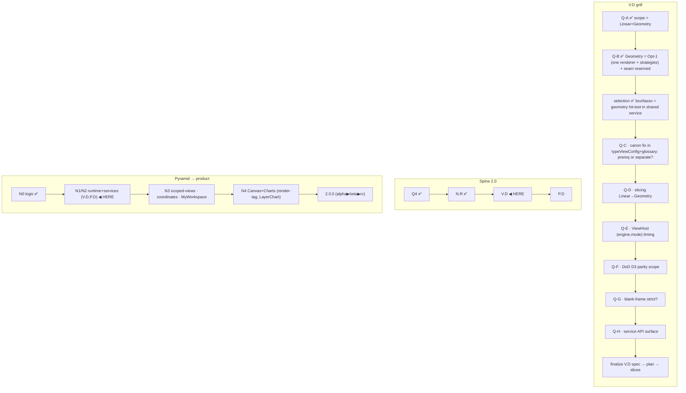

# V.D — Shared Render-Runtime (grill checkpoint, IN PROGRESS)

> **State: brainstorm/grill IN PROGRESS — not yet a finalized spec.** This is the durable
> capture of the 2026-06-17 dev grill so the model is not lost and is visible from the vault.
> Decisions tagged **LOCKED** (dev-confirmed) / **PROPOSED** (mine, awaiting dev) / **OPEN** (queued).
> Seed of the eventual V.D implementation plan. sandbox @ `cc23ad9` (`2.0.0-alpha.1`), no code touched.

## One-line

V.D = decompose the 5 god views into thin **shells** + extract list orchestration into **ONE
shared virtual-layout service** (wrapping `@tanstack/svelte-virtual`) that every virtualized engine
consumes and that mounts `NodeRow` (from N.R). It is the **real perf lever** (the reason 1.1.0 beta.1
was abandoned). Continues the decomposition chain O → A.R → N.R (cell) → **V.D (list-runtime + shells)**.

## LOCKED decisions (dev grill 2026-06-17)

- **D-VD-1 — Runtime scope = Linear + Geometry ONLY.** The shared virtual-layout service applies only
  to engines that virtualize a list/grid of node-cells. **Canvas + Charts = separate render runtimes,
  deferred** (they don't virtualize rows). TanStack Virtual is 1D-offset (+ lanes) range math; it
  CANNOT do free-spatial graphs/canvas (Obsidian graph core = force-sim + canvas/WebGL).
- **D-VD-2 — Engine canon CORRECTED → `Linear / Geometry / Canvas / Charts`.**
  - `Table` is a **MODE of Geometry** (not its own engine). Repo evidence: ViewNodeGrid/Table/Cards all
    already share `createExplorerVariableGeometry` (Fenwick) today; only Linear (tree) is fixed-height.
  - `Charts` = the real 4th engine — distinct viz logic (scales/axes/marks, LayerChart); shares NO
    cell-layout logic with Linear/Geometry/Canvas.
  - **STALE canon to fix:** `typeViewConfig.ts` L64 (`VIEW_ENGINES`, mode maps, capabilities) +
    `glossary.md` L129 + `dev-glossary.md` L82 all still say `Linear/Geometry/Table/Canvas`.
  - **Corrected modes (grounded in function-union-ledger shard 02 + explorer-model 02 + ADR 0009;
    pending dev final-confirm):** Linear = tree-indent · flat-list · miller; **Geometry = grid · cards ·
    masonry · group-box · table** (`masonry` was missing from the stale tracer — real proto mode,
    "node size → column width"; `group-box` = ContainerNode/homescreen-folder mode, NOT live-redesign;
    `matrix` = dense-grid sub-style of `grid`, NOT a top-level mode; `table` folded in per D-VD-2);
    Canvas = mindmap · graph; **Charts = `chart` placeholder** (proto "chart/form" mode).
  - **Charts in the union NOW as a marked placeholder** (canary stream policy: sandbox tolerates
    placeholders, stable=0; reserve-in-comments would only apply on dev/main). `CHARTS_MODES=['chart']`
    placeholder + `ENGINE_DEFAULT_MODE.Charts='chart'`, marked deferred (no renderer until N4).
- **D-VD-3 — Geometry engine = ONE renderer, mode = layout strategy (Opt-1).** A single `GeometryView`
  consumes the shared service + UPV uniformly; per-mode placement (grid / cards / masonry / group-box /
  table) = a thin **strategy** selected by `mode`. Converges across SOLID (SRP if
  strategies extracted; OCP new-mode=new-strategy), LUPA (one addressable `(engine,mode)` entry, no N
  component identities for module/registry boundary), SASI (mode = indexed capability of the engine),
  SCENES (`.scene` stores only `(engine,mode)`; preset-portability = one consumption point), UPV (one
  preset/vocab consumption point per engine). Mirrors N.R's "one configured primitive" precedent.
  **Risk:** recreating a god-component → mitigated by truly extracting per-mode placement strategies
  (the shared service already owns geometry/measure/lanes; the strategy is thin = "where does cell i sit").
- **D-VD-4 — Reserve the seam now (designed-for, unwired).** The `SharedVirtualLayoutService` + Geometry
  renderer contract reserve per-node **size / order / slot** inputs (applied to the **outer row** — view
  turf per N.R A1, not inside NodeRow) + the `NodeRow.media` slot, **wired only for slot regime now**.
  Same discipline as N.R's anticipated abanico + ViewConfig's reserved `ViewPlacement`.
- **D-VD-5 — `ViewPlacement.regime` = the engine boundary.**
  - **slot regime** (move/resize/reorder in slots, incl. multi-slot spans = "free size in slots") stays
    **virtualizable** → Linear/Geometry shared runtime (Fenwick: reorder=reindex, resize=re-measure/lane-span).
    This is what the proto's manual-sort does today → it **adjusts the virtualizer slots**, does NOT become canvas.
  - **coordinates regime** (free xy + free pixel size + z) = NOT virtualizable → **Canvas runtime** (spatial
    culling) + render-tag for on-canvas labels.
  - **No mixing regimes in one virtualized view** (deterministic geometry requires it). "Mostly grid +
    a few free-floating" = a Canvas (coordinates) view that may snap-to-grid, NOT a Geometry with exceptions.
- **D-VD-6 — Selection layering.** STATE (selected set + range anchor + focus) = data-plane ABOVE the view
  (already `selectedIds`/`selectedMap`/`focusedId`). single+modifiers / shift-range = ActionNode→Operation
  via InputRouter (**P.D**); range needs the ordered projection. **box + lasso = geometry hit-test OWNED by
  the shared layout service (V.D)**: `idsInRect`/`idsInPath`, **geometry-based not DOM-based** (must select
  across the unrendered virtualized range). Lift viewTree's `intersectingRowIds` +
  `intersectingRowIdsByFixedGeometry`. Canvas/coordinates → spatial hit-test. WorkspaceMediator `scope`
  (focused|selected-scenes|all) = higher level (panel/scene span), distinct from node-selection.

## PROPOSED (mine, awaiting dev)

- **Manual-sort "free" toggle = regime flip slot→coordinates** → re-resolve the ViewConfig → re-route to the
  Canvas runtime. The user's chosen engine (e.g. cards) becomes Canvas-backed when it goes full-free;
  slot-based manual-sort stays Geometry. Coherent with ViewConfig being COMPUTED.

## Resolved side-questions (model coherence)

- **pretext vs render-tag for resize:** pretext = the **DOM resize-measurement workhorse NOW** (re-`layout`
  wrapped height on width change, no reflow, per drag frame; Linear/Geometry). render-tag = the **canvas
  resize equivalent (N4 only)** — DRAWS html→canvas; not for DOM cells. pretext MEASURES, render-tag DRAWS.
- **Image (svg) as ActionNode in any engine = YES:** renders via `NodeRow.media` slot (reserved, unwired);
  "node is an ActionNode" = activation binds an ActionNode (ADR 0005; InputRouter = P.D); config = cell-config
  (media-only via `nodeElementMask`/`visibleFields`) per-node OR per-panel default; a synthetic "action
  provider" = an explorer of image-buttons. Engine-agnostic (Linear list / Geometry tiles / Canvas free board).
- **PSS + persistent manual layout export:** layout (per-node placement/size/z + cell-config + action
  bindings) = a config payload PSS stores by **scope** (workspace/scene/panel/node) + **storage class** (4
  D-PSS classes) via the **sparse-merge cascade** (= ViewConfig `CascadeContext` model + `.scene` payload,
  D-PSS-4). Per-node placement persistence = **N1** (node-distribution shard 02 §L62). Export: slot regime →
  `.scene`/`.vmscene`/json/yaml/md-frontmatter (`serializeViewConfig` round-trips structural fields);
  coordinates regime → **`.canvas`** (JSON Canvas = native free xy+size+edges). Assets = asset-refs by id.

## WIRED today vs DESIGNED/reserved

| WIRED | DESIGNED / reserved, NOT wired |
|---|---|
| `NodeRow.media` slot (exists, unwired) · `ViewConfig`+`serializeViewConfig` (types, tracer) · `serviceDnd` reorder seam · Fenwick (`serviceExplorerScrollGeometry`) · pretext (`serviceTextMeasure`) · `nodeElementMask`/`visibleFields` · viewTree `intersectingRowIds` (per-view, to be lifted) | `ViewPlacement.coordinates` · per-node placement storage (N1) · PSS facets×scopes×storage · `.scene/.vmscene` (CR-2) · export canvas/json/yaml/frontmatter · ActionNode-binding of nodes (P.D) · regime-flip→Canvas · Canvas + Charts engines · shared `idsInRect`/`idsInPath` |

## OPEN (queued grill questions)

- **Q-C** — fix engine canon in `typeViewConfig`+glossary: types-only prereq inside slice 1, or separate commit first?
- **Q-D** — slicing: confirm Linear pilot → then Geometry order.
- **Q-E** — addressing (thread B): ViewHost switches on resolved `(engine,mode)` (D-C-8) this slice, or after?
- **Q-F** — DoD D3 stable parity: which systems close now (tables/resizers/grid SDF-011/016) vs defer?
- **Q-G** — blank-frame gate: is `strict` flicker mandatory to accept V.D perf claims?
- **Q-H** — `SharedVirtualLayoutService` API surface (confirm interface from frontend-stack research shard 01 §4).

## Question map (kept in sandbox per dev workflow; edit mid-plan)

## Sources (grounded this session)

- `src/types/typeViewConfig.ts` (engine/mode/ViewPlacement/resolve/normalize/serialize) ·
  `src/services/serviceExplorerScrollGeometry.ts` (Fenwick) · `src/components/views/viewTree.svelte`
  (virtualizer + intersectingRowIds) · `src/components/views/NodeRow.svelte` (media slot L101) ·
  `src/components/explorer/ViewHost.svelte` (flat ExplorerViewMode switch — thread B target).
- [[docs/work/hardening/research/2026-06-15-frontend-stack-deep-research/01-tanstack-virtual|TanStack shard 01]] ·
  [[docs/work/hardening/research/2026-06-15-frontend-stack-deep-research/02-pretext-and-render-tag|pretext/render-tag shard 02]] ·
  [[docs/work/hardening/research/2026-05-16-multiview-virtualization-research/index|multiview virtualization]].
- Canon/vocab: `glossary.md` (L129 stale, Scene/Panel/Engine), `dev-glossary.md` (Engine≠renderer L82),
  ADR 0011 (LUPA/SASI/core-module partition), umbrella shard 02 (Node Distribution/WSA), shard 03
  (WSA/PLPZR/UPV N-tiers), shard 01 (D-PSS), N.R plan (A1/B1/Q1).
