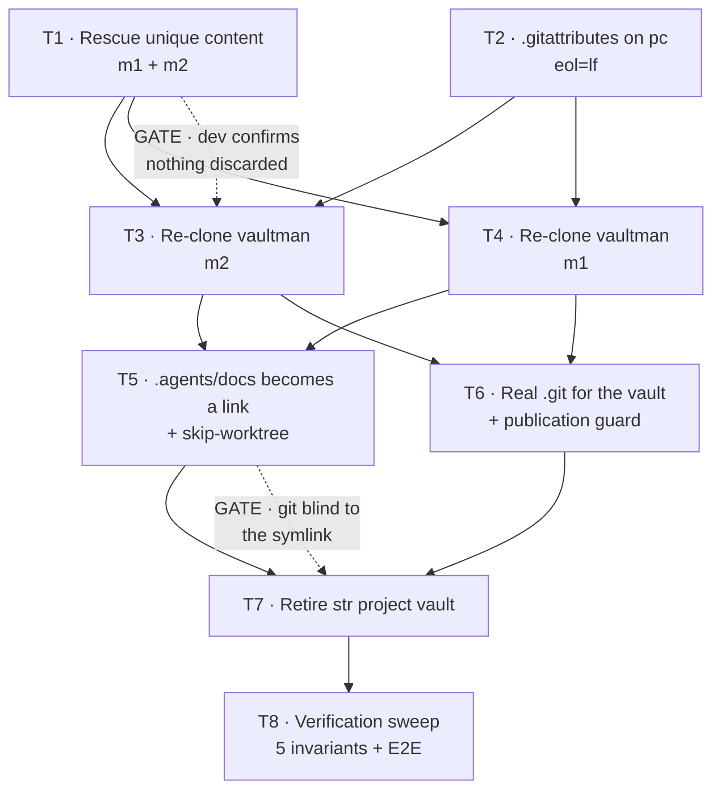
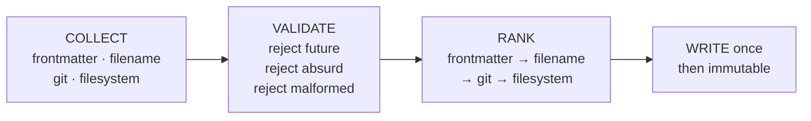

# Node Sync Engine — Visual Map

One visual per initiative. The **drawing** carries the spec-level view — ownership and
transport. The **Mermaid sections below** carry the plan-level view — execution order
and gates. They answer different questions on purpose; neither restates the other.

## Sources

- [spec index](../index.md)
- [01 diagnosis](../01-diagnostico.md)
- [02 model and topology](../02-modelo-y-topologia.md)
- [03 fidelity](../03-fidelidad.md)
- [04 engine](../04-motor.md)
- [05 sanitation](../05-saneamiento.md)
- [06 adversarial pass](../06-riesgos.md)

## Phase 0 — Task graph and gates

Plan-level. The drawing shows the destination; this shows the route and what may not be
reordered. Tasks are those of [the phase 0 plan](../plan/index.md).

Two hard constraints: Task 1 must precede 3 and 4, because re-cloning destroys the only
copy of what Task 1 rescues; and Task 2 must precede them too, or the fresh clones
acquire CRLF on first checkout and F2 returns.



The acceptance test is T8 step 7: creating a worktree against `origin/dev` on m2 with a
clean tree — the thing that is impossible today.

## Transport routes — verified, not assumed

Plan-level. Recorded here because the plan depends on exactly one of these working.

| Route | Result |
| --- | --- |
| `vic_a@meibbopc:C:/Users/.../vaultman` | fails — cmd.exe mangles the quoted path |
| `ssh://vic_a@meibbopc/C:/Users/.../vaultman` | fails — same cause |
| `ssh://vic@meibbopc:2222/mnt/c/Users/.../vaultman` | **works** — WSL sshd reaches the same repo |

git-direct to `pc` therefore goes through WSL. This is what makes "pc and WSL are one
node" a mechanical fact rather than a convention.

## Metadata resolution — collect, validate, rank

Plan-level. Not in the drawing because it is a decision procedure, not a topology.
No source gives a verdict until every source is collected.



Absurd rejection requires disagreement with **both** remaining sources, so a single bad
clock cannot veto a good date.

## Filename patterns — derived from the live vault

| Pattern | Example | Verdict |
| --- | --- | --- |
| `YYYY-MM-DD` prefix | `2024-11-16.md` | accept |
| `YYYY-MM-DD` + text | `2025-08-14 Finneas - Lost my mind.md` | accept |
| `YYYYMMDDHHMM` Zettelkasten ID | `202507150801 Ideas para...md` | accept — minute precision |
| bare year | `2024.md`, `2000 20's.md` | reject |
| date mid-name | `notas sobre 2025-01-01.md` | reject |
| ambiguous order | `13-08-2026` | reject |

## Verification

| Check | Status | Source |
| --- | --- | --- |
| `.agents/docs` is a junction into the vault on pc | passed | `fsutil reparsepoint query` |
| symlink from Termux home into /sdcard, read + write | passed | 01-diagnostico.md F7 |
| symlink created inside /sdcard | failed — Permission denied | 01-diagnostico.md F7 |
| mtime settable on /sdcard | passed | 01-diagnostico.md F8 |
| user xattrs on /sdcard | failed — not supported | 01-diagnostico.md F8 |
| birthtime on /sdcard | failed — not stored | 01-diagnostico.md F8 |
| Google Drive client running | passed — absent | 01-diagnostico.md F12 |
| node names resolve across nodes | failed — F11 | 06-riesgos.md A10 |
| phase 0 executed | not-run | — |

==⚠  Switch to EXCALIDRAW VIEW in the MORE OPTIONS menu of this document. ⚠==

# Excalidraw Data
## Text Elements
Start of The Road
vault — owns the docs ^sUNBhFWV

.agents/docs
LINK, not a copy ^IZWkRo8p

vaultman
code repo ^hVqFnjuo

git-direct
tailscale / LAN ^OI7bldpw

rclone
bulk only ^rTfeBX7f

pc — Windows + WSL ^p77McVt3

m1 — Termux + proot ^qdpnOq0e

m2 — Termux ^Hr1iRh1g

rclone over .git
retired — cause of F1-F3 ^BM6OQVyJ

%%
## Drawing
```json
{
  "type": "excalidraw",
  "version": 2,
  "source": "vaultman-vm-work-visualizer",
  "elements": [
    {
      "id": "padTop",
      "type": "rectangle",
      "x": 60,
      "y": -30,
      "width": 1,
      "height": 1,
      "angle": 0,
      "strokeColor": "#1e293b",
      "backgroundColor": "transparent",
      "fillStyle": "solid",
      "strokeWidth": 0,
      "strokeStyle": "solid",
      "roughness": 1,
      "opacity": 0,
      "groupIds": [],
      "frameId": null,
      "index": "a0",
      "roundness": {
        "type": 3
      },
      "seed": 458563405,
      "version": 1,
      "versionNonce": 565388071,
      "isDeleted": false,
      "boundElements": null,
      "updated": 1,
      "link": null,
      "locked": true
    },
    {
      "id": "e1",
      "type": "arrow",
      "x": 786,
      "y": 350,
      "width": -92,
      "height": 0,
      "angle": 0,
      "strokeColor": "#475569",
      "backgroundColor": "transparent",
      "fillStyle": "solid",
      "strokeWidth": 2,
      "strokeStyle": "solid",
      "roughness": 1,
      "opacity": 100,
      "groupIds": [],
      "frameId": null,
      "index": "a1",
      "roundness": null,
      "seed": 2216349443,
      "version": 1,
      "versionNonce": 3723764149,
      "isDeleted": false,
      "boundElements": null,
      "updated": 1,
      "link": null,
      "locked": false,
      "points": [
        [
          0,
          0
        ],
        [
          -92,
          0
        ]
      ],
      "lastCommittedPoint": null,
      "startBinding": {
        "elementId": "vm",
        "focus": 0,
        "gap": 4,
        "fixedPoint": [
          0,
          0.5
        ]
      },
      "endBinding": {
        "elementId": "link",
        "focus": 0,
        "gap": 4,
        "fixedPoint": [
          1,
          0.5
        ]
      },
      "startArrowhead": null,
      "endArrowhead": "arrow",
      "elbowed": false
    },
    {
      "id": "e2",
      "type": "arrow",
      "x": 436,
      "y": 350,
      "width": -82,
      "height": 0,
      "angle": 0,
      "strokeColor": "#475569",
      "backgroundColor": "transparent",
      "fillStyle": "solid",
      "strokeWidth": 2,
      "strokeStyle": "solid",
      "roughness": 1,
      "opacity": 100,
      "groupIds": [],
      "frameId": null,
      "index": "a2",
      "roundness": null,
      "seed": 2233127062,
      "version": 1,
      "versionNonce": 1051117176,
      "isDeleted": false,
      "boundElements": null,
      "updated": 1,
      "link": null,
      "locked": false,
      "points": [
        [
          0,
          0
        ],
        [
          -82,
          0
        ]
      ],
      "lastCommittedPoint": null,
      "startBinding": {
        "elementId": "link",
        "focus": 0,
        "gap": 4,
        "fixedPoint": [
          0,
          0.5
        ]
      },
      "endBinding": {
        "elementId": "vault",
        "focus": 0,
        "gap": 4,
        "fixedPoint": [
          1,
          0.5
        ]
      },
      "startArrowhead": null,
      "endArrowhead": "arrow",
      "elbowed": false
    },
    {
      "id": "e3",
      "type": "arrow",
      "x": 306.59494551642604,
      "y": 412.0858000378159,
      "width": 173.1737453307843,
      "height": 105.82839992436817,
      "angle": 0,
      "strokeColor": "#475569",
      "backgroundColor": "transparent",
      "fillStyle": "solid",
      "strokeWidth": 2,
      "strokeStyle": "solid",
      "roughness": 1,
      "opacity": 100,
      "groupIds": [],
      "frameId": null,
      "index": "a3",
      "roundness": null,
      "seed": 2249904681,
      "version": 1,
      "versionNonce": 1667615795,
      "isDeleted": false,
      "boundElements": null,
      "updated": 1,
      "link": null,
      "locked": false,
      "points": [
        [
          0,
          0
        ],
        [
          173.1737453307843,
          105.82839992436817
        ]
      ],
      "lastCommittedPoint": null,
      "startBinding": {
        "elementId": "vault",
        "focus": 0,
        "gap": 4,
        "fixedPoint": [
          0.838558,
          1
        ]
      },
      "endBinding": {
        "elementId": "gitd",
        "focus": 0,
        "gap": 4,
        "fixedPoint": [
          0.172727,
          0
        ]
      },
      "startArrowhead": null,
      "endArrowhead": "arrow",
      "elbowed": false
    },
    {
      "id": "e4",
      "type": "arrow",
      "x": 205,
      "y": 414,
      "width": 0,
      "height": 102,
      "angle": 0,
      "strokeColor": "#475569",
      "backgroundColor": "transparent",
      "fillStyle": "solid",
      "strokeWidth": 2,
      "strokeStyle": "solid",
      "roughness": 1,
      "opacity": 100,
      "groupIds": [],
      "frameId": null,
      "index": "a4",
      "roundness": null,
      "seed": 2266682300,
      "version": 1,
      "versionNonce": 665309758,
      "isDeleted": false,
      "boundElements": null,
      "updated": 1,
      "link": null,
      "locked": false,
      "points": [
        [
          0,
          0
        ],
        [
          0,
          102
        ]
      ],
      "lastCommittedPoint": null,
      "startBinding": {
        "elementId": "vault",
        "focus": 0,
        "gap": 4,
        "fixedPoint": [
          0.5,
          1
        ]
      },
      "endBinding": {
        "elementId": "rcl",
        "focus": 0,
        "gap": 4,
        "fixedPoint": [
          0.5,
          0
        ]
      },
      "startArrowhead": null,
      "endArrowhead": "arrow",
      "elbowed": false
    },
    {
      "id": "e5",
      "type": "arrow",
      "x": 816.1589083486106,
      "y": 412.1286861808734,
      "width": -168.226907606312,
      "height": 105.74262763825323,
      "angle": 0,
      "strokeColor": "#475569",
      "backgroundColor": "transparent",
      "fillStyle": "solid",
      "strokeWidth": 2,
      "strokeStyle": "solid",
      "roughness": 1,
      "opacity": 100,
      "groupIds": [],
      "frameId": null,
      "index": "a5",
      "roundness": null,
      "seed": 2283459919,
      "version": 1,
      "versionNonce": 2055429809,
      "isDeleted": false,
      "boundElements": null,
      "updated": 1,
      "link": null,
      "locked": false,
      "points": [
        [
          0,
          0
        ],
        [
          -168.226907606312,
          105.74262763825323
        ]
      ],
      "lastCommittedPoint": null,
      "startBinding": {
        "elementId": "vm",
        "focus": 0,
        "gap": 4,
        "fixedPoint": [
          0.118182,
          1
        ]
      },
      "endBinding": {
        "elementId": "gitd",
        "focus": 0,
        "gap": 4,
        "fixedPoint": [
          0.818182,
          0
        ]
      },
      "startArrowhead": null,
      "endArrowhead": "arrow",
      "elbowed": false
    },
    {
      "id": "e6",
      "type": "arrow",
      "x": 693.9857931674295,
      "y": 559.0997921266961,
      "width": 102.02841366514099,
      "height": -8.622119464659818,
      "angle": 0,
      "strokeColor": "#475569",
      "backgroundColor": "transparent",
      "fillStyle": "solid",
      "strokeWidth": 2,
      "strokeStyle": "solid",
      "roughness": 1,
      "opacity": 100,
      "groupIds": [],
      "frameId": null,
      "index": "a6",
      "roundness": null,
      "seed": 2300237538,
      "version": 1,
      "versionNonce": 1460091252,
      "isDeleted": false,
      "boundElements": null,
      "updated": 1,
      "link": null,
      "locked": false,
      "points": [
        [
          0,
          0
        ],
        [
          102.02841366514099,
          -8.622119464659818
        ]
      ],
      "lastCommittedPoint": null,
      "startBinding": {
        "elementId": "gitd",
        "focus": 0,
        "gap": 4,
        "fixedPoint": [
          1,
          0.394366
        ]
      },
      "endBinding": {
        "elementId": "pc",
        "focus": 0,
        "gap": 4,
        "fixedPoint": [
          0,
          0.626761
        ]
      },
      "startArrowhead": null,
      "endArrowhead": "arrow",
      "elbowed": false
    },
    {
      "id": "e7",
      "type": "arrow",
      "x": 693.8773363518608,
      "y": 602.6731275258238,
      "width": 102.24532729627845,
      "height": 25.921350582155128,
      "angle": 0,
      "strokeColor": "#475569",
      "backgroundColor": "transparent",
      "fillStyle": "solid",
      "strokeWidth": 2,
      "strokeStyle": "solid",
      "roughness": 1,
      "opacity": 100,
      "groupIds": [],
      "frameId": null,
      "index": "a7",
      "roundness": null,
      "seed": 2317015157,
      "version": 1,
      "versionNonce": 1279303311,
      "isDeleted": false,
      "boundElements": null,
      "updated": 1,
      "link": null,
      "locked": false,
      "points": [
        [
          0,
          0
        ],
        [
          102.24532729627845,
          25.921350582155128
        ]
      ],
      "lastCommittedPoint": null,
      "startBinding": {
        "elementId": "gitd",
        "focus": 0,
        "gap": 4,
        "fixedPoint": [
          1,
          0.816901
        ]
      },
      "endBinding": {
        "elementId": "m1",
        "focus": 0,
        "gap": 4,
        "fixedPoint": [
          0,
          0.119718
        ]
      },
      "startArrowhead": null,
      "endArrowhead": "arrow",
      "elbowed": false
    },
    {
      "id": "e8",
      "type": "arrow",
      "x": 652.9665499185274,
      "y": 622.0365506560303,
      "width": 195.97166206770703,
      "height": 115.92689868793946,
      "angle": 0,
      "strokeColor": "#475569",
      "backgroundColor": "transparent",
      "fillStyle": "solid",
      "strokeWidth": 2,
      "strokeStyle": "solid",
      "roughness": 1,
      "opacity": 100,
      "groupIds": [],
      "frameId": null,
      "index": "a8",
      "roundness": null,
      "seed": 2333792776,
      "version": 1,
      "versionNonce": 2871776122,
      "isDeleted": false,
      "boundElements": null,
      "updated": 1,
      "link": null,
      "locked": false,
      "points": [
        [
          0,
          0
        ],
        [
          195.97166206770703,
          115.92689868793946
        ]
      ],
      "lastCommittedPoint": null,
      "startBinding": {
        "elementId": "gitd",
        "focus": 0,
        "gap": 4,
        "fixedPoint": [
          0.838095,
          1
        ]
      },
      "endBinding": {
        "elementId": "m2",
        "focus": 0,
        "gap": 4,
        "fixedPoint": [
          0.218254,
          0
        ]
      },
      "startArrowhead": null,
      "endArrowhead": "arrow",
      "elbowed": false
    },
    {
      "id": "e9",
      "type": "arrow",
      "x": 615.1463163240986,
      "y": 696.9735482535431,
      "width": 245.38637969748186,
      "height": -283.94709650708614,
      "angle": 0,
      "strokeColor": "#475569",
      "backgroundColor": "transparent",
      "fillStyle": "solid",
      "strokeWidth": 2,
      "strokeStyle": "solid",
      "roughness": 1,
      "opacity": 100,
      "groupIds": [],
      "frameId": null,
      "index": "a9",
      "roundness": null,
      "seed": 2350570395,
      "version": 1,
      "versionNonce": 4094967885,
      "isDeleted": false,
      "boundElements": null,
      "updated": 1,
      "link": null,
      "locked": false,
      "points": [
        [
          0,
          0
        ],
        [
          245.38637969748186,
          -283.94709650708614
        ]
      ],
      "lastCommittedPoint": null,
      "startBinding": {
        "elementId": "risk",
        "focus": 0,
        "gap": 4,
        "fixedPoint": [
          0.644033,
          0
        ]
      },
      "endBinding": {
        "elementId": "vm",
        "focus": 0,
        "gap": 4,
        "fixedPoint": [
          0.292593,
          1
        ]
      },
      "startArrowhead": null,
      "endArrowhead": "arrow",
      "elbowed": false
    },
    {
      "id": "vault",
      "type": "rectangle",
      "x": 60,
      "y": 290,
      "width": 290,
      "height": 120,
      "angle": 0,
      "strokeColor": "#7c3aed",
      "backgroundColor": "#ede9fe",
      "fillStyle": "solid",
      "strokeWidth": 2,
      "strokeStyle": "solid",
      "roughness": 1,
      "opacity": 100,
      "groupIds": [],
      "frameId": null,
      "index": "a10",
      "roundness": {
        "type": 3
      },
      "seed": 1162439599,
      "version": 1,
      "versionNonce": 2909102993,
      "isDeleted": false,
      "boundElements": [
        {
          "id": "sUNBhFWV",
          "type": "text"
        },
        {
          "id": "e2",
          "type": "arrow"
        },
        {
          "id": "e3",
          "type": "arrow"
        },
        {
          "id": "e4",
          "type": "arrow"
        }
      ],
      "updated": 1,
      "link": null,
      "locked": false
    },
    {
      "id": "sUNBhFWV",
      "type": "text",
      "x": 72,
      "y": 302,
      "width": 266,
      "height": 96,
      "angle": 0,
      "strokeColor": "#0f172a",
      "backgroundColor": "transparent",
      "fillStyle": "solid",
      "strokeWidth": 2,
      "strokeStyle": "solid",
      "roughness": 1,
      "opacity": 100,
      "groupIds": [],
      "frameId": null,
      "index": "a11",
      "roundness": null,
      "seed": 3678625706,
      "version": 1,
      "versionNonce": 1792302844,
      "isDeleted": false,
      "boundElements": [],
      "updated": 1,
      "link": null,
      "locked": false,
      "text": "Start of The Road\nvault — owns the docs",
      "rawText": "Start of The Road\nvault — owns the docs",
      "fontSize": 20,
      "fontFamily": 1,
      "textAlign": "center",
      "verticalAlign": "middle",
      "containerId": "vault",
      "originalText": "Start of The Road\nvault — owns the docs",
      "autoResize": false,
      "lineHeight": 1.25
    },
    {
      "id": "link",
      "type": "rectangle",
      "x": 440,
      "y": 290,
      "width": 250,
      "height": 120,
      "angle": 0,
      "strokeColor": "#d97706",
      "backgroundColor": "#fef3c7",
      "fillStyle": "solid",
      "strokeWidth": 2,
      "strokeStyle": "solid",
      "roughness": 1,
      "opacity": 100,
      "groupIds": [],
      "frameId": null,
      "index": "a12",
      "roundness": {
        "type": 3
      },
      "seed": 232457833,
      "version": 1,
      "versionNonce": 3823231219,
      "isDeleted": false,
      "boundElements": [
        {
          "id": "IZWkRo8p",
          "type": "text"
        },
        {
          "id": "e1",
          "type": "arrow"
        },
        {
          "id": "e2",
          "type": "arrow"
        }
      ],
      "updated": 1,
      "link": null,
      "locked": false
    },
    {
      "id": "IZWkRo8p",
      "type": "text",
      "x": 452,
      "y": 302,
      "width": 226,
      "height": 96,
      "angle": 0,
      "strokeColor": "#0f172a",
      "backgroundColor": "transparent",
      "fillStyle": "solid",
      "strokeWidth": 2,
      "strokeStyle": "solid",
      "roughness": 1,
      "opacity": 100,
      "groupIds": [],
      "frameId": null,
      "index": "a13",
      "roundness": null,
      "seed": 4155281415,
      "version": 1,
      "versionNonce": 2235378377,
      "isDeleted": false,
      "boundElements": [],
      "updated": 1,
      "link": null,
      "locked": false,
      "text": ".agents/docs\nLINK, not a copy",
      "rawText": ".agents/docs\nLINK, not a copy",
      "fontSize": 20,
      "fontFamily": 1,
      "textAlign": "center",
      "verticalAlign": "middle",
      "containerId": "link",
      "originalText": ".agents/docs\nLINK, not a copy",
      "autoResize": false,
      "lineHeight": 1.25
    },
    {
      "id": "vm",
      "type": "rectangle",
      "x": 790,
      "y": 290,
      "width": 250,
      "height": 120,
      "angle": 0,
      "strokeColor": "#16a34a",
      "backgroundColor": "#dcfce7",
      "fillStyle": "solid",
      "strokeWidth": 2,
      "strokeStyle": "solid",
      "roughness": 1,
      "opacity": 100,
      "groupIds": [],
      "frameId": null,
      "index": "a14",
      "roundness": {
        "type": 3
      },
      "seed": 1078575660,
      "version": 1,
      "versionNonce": 4081357678,
      "isDeleted": false,
      "boundElements": [
        {
          "id": "hVqFnjuo",
          "type": "text"
        },
        {
          "id": "e1",
          "type": "arrow"
        },
        {
          "id": "e5",
          "type": "arrow"
        },
        {
          "id": "e9",
          "type": "arrow"
        }
      ],
      "updated": 1,
      "link": null,
      "locked": false
    },
    {
      "id": "hVqFnjuo",
      "type": "text",
      "x": 802,
      "y": 302,
      "width": 226,
      "height": 96,
      "angle": 0,
      "strokeColor": "#0f172a",
      "backgroundColor": "transparent",
      "fillStyle": "solid",
      "strokeWidth": 2,
      "strokeStyle": "solid",
      "roughness": 1,
      "opacity": 100,
      "groupIds": [],
      "frameId": null,
      "index": "a15",
      "roundness": null,
      "seed": 2627191040,
      "version": 1,
      "versionNonce": 2388229618,
      "isDeleted": false,
      "boundElements": [],
      "updated": 1,
      "link": null,
      "locked": false,
      "text": "vaultman\ncode repo",
      "rawText": "vaultman\ncode repo",
      "fontSize": 20,
      "fontFamily": 1,
      "textAlign": "center",
      "verticalAlign": "middle",
      "containerId": "vm",
      "originalText": "vaultman\ncode repo",
      "autoResize": false,
      "lineHeight": 1.25
    },
    {
      "id": "gitd",
      "type": "rectangle",
      "x": 440,
      "y": 520,
      "width": 250,
      "height": 100,
      "angle": 0,
      "strokeColor": "#475569",
      "backgroundColor": "#f1f5f9",
      "fillStyle": "solid",
      "strokeWidth": 2,
      "strokeStyle": "solid",
      "roughness": 1,
      "opacity": 100,
      "groupIds": [],
      "frameId": null,
      "index": "a16",
      "roundness": {
        "type": 3
      },
      "seed": 2386955165,
      "version": 1,
      "versionNonce": 4154012471,
      "isDeleted": false,
      "boundElements": [
        {
          "id": "OI7bldpw",
          "type": "text"
        },
        {
          "id": "e3",
          "type": "arrow"
        },
        {
          "id": "e5",
          "type": "arrow"
        },
        {
          "id": "e6",
          "type": "arrow"
        },
        {
          "id": "e7",
          "type": "arrow"
        },
        {
          "id": "e8",
          "type": "arrow"
        }
      ],
      "updated": 1,
      "link": null,
      "locked": false
    },
    {
      "id": "OI7bldpw",
      "type": "text",
      "x": 452,
      "y": 532,
      "width": 226,
      "height": 76,
      "angle": 0,
      "strokeColor": "#0f172a",
      "backgroundColor": "transparent",
      "fillStyle": "solid",
      "strokeWidth": 2,
      "strokeStyle": "solid",
      "roughness": 1,
      "opacity": 100,
      "groupIds": [],
      "frameId": null,
      "index": "a17",
      "roundness": null,
      "seed": 2101887001,
      "version": 1,
      "versionNonce": 340384803,
      "isDeleted": false,
      "boundElements": [],
      "updated": 1,
      "link": null,
      "locked": false,
      "text": "git-direct\ntailscale / LAN",
      "rawText": "git-direct\ntailscale / LAN",
      "fontSize": 20,
      "fontFamily": 1,
      "textAlign": "center",
      "verticalAlign": "middle",
      "containerId": "gitd",
      "originalText": "git-direct\ntailscale / LAN",
      "autoResize": false,
      "lineHeight": 1.25
    },
    {
      "id": "rcl",
      "type": "rectangle",
      "x": 60,
      "y": 520,
      "width": 290,
      "height": 100,
      "angle": 0,
      "strokeColor": "#475569",
      "backgroundColor": "#f1f5f9",
      "fillStyle": "solid",
      "strokeWidth": 2,
      "strokeStyle": "solid",
      "roughness": 1,
      "opacity": 100,
      "groupIds": [],
      "frameId": null,
      "index": "a18",
      "roundness": {
        "type": 3
      },
      "seed": 755198954,
      "version": 1,
      "versionNonce": 4149791932,
      "isDeleted": false,
      "boundElements": [
        {
          "id": "rTfeBX7f",
          "type": "text"
        },
        {
          "id": "e4",
          "type": "arrow"
        }
      ],
      "updated": 1,
      "link": null,
      "locked": false
    },
    {
      "id": "rTfeBX7f",
      "type": "text",
      "x": 72,
      "y": 532,
      "width": 266,
      "height": 76,
      "angle": 0,
      "strokeColor": "#0f172a",
      "backgroundColor": "transparent",
      "fillStyle": "solid",
      "strokeWidth": 2,
      "strokeStyle": "solid",
      "roughness": 1,
      "opacity": 100,
      "groupIds": [],
      "frameId": null,
      "index": "a19",
      "roundness": null,
      "seed": 449489021,
      "version": 1,
      "versionNonce": 918568087,
      "isDeleted": false,
      "boundElements": [],
      "updated": 1,
      "link": null,
      "locked": false,
      "text": "rclone\nbulk only",
      "rawText": "rclone\nbulk only",
      "fontSize": 20,
      "fontFamily": 1,
      "textAlign": "center",
      "verticalAlign": "middle",
      "containerId": "rcl",
      "originalText": "rclone\nbulk only",
      "autoResize": false,
      "lineHeight": 1.25
    },
    {
      "id": "pc",
      "type": "rectangle",
      "x": 800,
      "y": 500,
      "width": 240,
      "height": 80,
      "angle": 0,
      "strokeColor": "#2563eb",
      "backgroundColor": "#dbeafe",
      "fillStyle": "solid",
      "strokeWidth": 2,
      "strokeStyle": "solid",
      "roughness": 1,
      "opacity": 100,
      "groupIds": [],
      "frameId": null,
      "index": "a20",
      "roundness": {
        "type": 3
      },
      "seed": 1313756516,
      "version": 1,
      "versionNonce": 1439754022,
      "isDeleted": false,
      "boundElements": [
        {
          "id": "p77McVt3",
          "type": "text"
        },
        {
          "id": "e6",
          "type": "arrow"
        }
      ],
      "updated": 1,
      "link": null,
      "locked": false
    },
    {
      "id": "p77McVt3",
      "type": "text",
      "x": 812,
      "y": 512,
      "width": 216,
      "height": 56,
      "angle": 0,
      "strokeColor": "#0f172a",
      "backgroundColor": "transparent",
      "fillStyle": "solid",
      "strokeWidth": 2,
      "strokeStyle": "solid",
      "roughness": 1,
      "opacity": 100,
      "groupIds": [],
      "frameId": null,
      "index": "a21",
      "roundness": null,
      "seed": 3609783624,
      "version": 1,
      "versionNonce": 3788368186,
      "isDeleted": false,
      "boundElements": [],
      "updated": 1,
      "link": null,
      "locked": false,
      "text": "pc — Windows + WSL",
      "rawText": "pc — Windows + WSL",
      "fontSize": 20,
      "fontFamily": 1,
      "textAlign": "center",
      "verticalAlign": "middle",
      "containerId": "pc",
      "originalText": "pc — Windows + WSL",
      "autoResize": false,
      "lineHeight": 1.25
    },
    {
      "id": "m1",
      "type": "rectangle",
      "x": 800,
      "y": 620,
      "width": 240,
      "height": 80,
      "angle": 0,
      "strokeColor": "#2563eb",
      "backgroundColor": "#dbeafe",
      "fillStyle": "solid",
      "strokeWidth": 2,
      "strokeStyle": "solid",
      "roughness": 1,
      "opacity": 100,
      "groupIds": [],
      "frameId": null,
      "index": "a22",
      "roundness": {
        "type": 3
      },
      "seed": 2486071275,
      "version": 1,
      "versionNonce": 2228909597,
      "isDeleted": false,
      "boundElements": [
        {
          "id": "qdpnOq0e",
          "type": "text"
        },
        {
          "id": "e7",
          "type": "arrow"
        }
      ],
      "updated": 1,
      "link": null,
      "locked": false
    },
    {
      "id": "qdpnOq0e",
      "type": "text",
      "x": 812,
      "y": 632,
      "width": 216,
      "height": 56,
      "angle": 0,
      "strokeColor": "#0f172a",
      "backgroundColor": "transparent",
      "fillStyle": "solid",
      "strokeWidth": 2,
      "strokeStyle": "solid",
      "roughness": 1,
      "opacity": 100,
      "groupIds": [],
      "frameId": null,
      "index": "a23",
      "roundness": null,
      "seed": 1623443145,
      "version": 1,
      "versionNonce": 336126035,
      "isDeleted": false,
      "boundElements": [],
      "updated": 1,
      "link": null,
      "locked": false,
      "text": "m1 — Termux +\nproot",
      "rawText": "m1 — Termux + proot",
      "fontSize": 20,
      "fontFamily": 1,
      "textAlign": "center",
      "verticalAlign": "middle",
      "containerId": "m1",
      "originalText": "m1 — Termux + proot",
      "autoResize": false,
      "lineHeight": 1.25
    },
    {
      "id": "m2",
      "type": "rectangle",
      "x": 800,
      "y": 740,
      "width": 240,
      "height": 80,
      "angle": 0,
      "strokeColor": "#2563eb",
      "backgroundColor": "#dbeafe",
      "fillStyle": "solid",
      "strokeWidth": 2,
      "strokeStyle": "solid",
      "roughness": 1,
      "opacity": 100,
      "groupIds": [],
      "frameId": null,
      "index": "a24",
      "roundness": {
        "type": 3
      },
      "seed": 2502848894,
      "version": 1,
      "versionNonce": 1984619456,
      "isDeleted": false,
      "boundElements": [
        {
          "id": "Hr1iRh1g",
          "type": "text"
        },
        {
          "id": "e8",
          "type": "arrow"
        }
      ],
      "updated": 1,
      "link": null,
      "locked": false
    },
    {
      "id": "Hr1iRh1g",
      "type": "text",
      "x": 812,
      "y": 752,
      "width": 216,
      "height": 56,
      "angle": 0,
      "strokeColor": "#0f172a",
      "backgroundColor": "transparent",
      "fillStyle": "solid",
      "strokeWidth": 2,
      "strokeStyle": "solid",
      "roughness": 1,
      "opacity": 100,
      "groupIds": [],
      "frameId": null,
      "index": "a25",
      "roundness": null,
      "seed": 2342996987,
      "version": 1,
      "versionNonce": 2411701293,
      "isDeleted": false,
      "boundElements": [],
      "updated": 1,
      "link": null,
      "locked": false,
      "text": "m2 — Termux",
      "rawText": "m2 — Termux",
      "fontSize": 20,
      "fontFamily": 1,
      "textAlign": "center",
      "verticalAlign": "middle",
      "containerId": "m2",
      "originalText": "m2 — Termux",
      "autoResize": false,
      "lineHeight": 1.25
    },
    {
      "id": "risk",
      "type": "rectangle",
      "x": 400,
      "y": 700,
      "width": 330,
      "height": 110,
      "angle": 0,
      "strokeColor": "#dc2626",
      "backgroundColor": "#fee2e2",
      "fillStyle": "solid",
      "strokeWidth": 2,
      "strokeStyle": "solid",
      "roughness": 1,
      "opacity": 100,
      "groupIds": [],
      "frameId": null,
      "index": "a26",
      "roundness": {
        "type": 3
      },
      "seed": 4079720170,
      "version": 1,
      "versionNonce": 3044759484,
      "isDeleted": false,
      "boundElements": [
        {
          "id": "BM6OQVyJ",
          "type": "text"
        },
        {
          "id": "e9",
          "type": "arrow"
        }
      ],
      "updated": 1,
      "link": null,
      "locked": false
    },
    {
      "id": "BM6OQVyJ",
      "type": "text",
      "x": 412,
      "y": 712,
      "width": 306,
      "height": 86,
      "angle": 0,
      "strokeColor": "#0f172a",
      "backgroundColor": "transparent",
      "fillStyle": "solid",
      "strokeWidth": 2,
      "strokeStyle": "solid",
      "roughness": 1,
      "opacity": 100,
      "groupIds": [],
      "frameId": null,
      "index": "a27",
      "roundness": null,
      "seed": 2015416071,
      "version": 1,
      "versionNonce": 379210185,
      "isDeleted": false,
      "boundElements": [],
      "updated": 1,
      "link": null,
      "locked": false,
      "text": "rclone over .git\nretired — cause of F1-F3",
      "rawText": "rclone over .git\nretired — cause of F1-F3",
      "fontSize": 20,
      "fontFamily": 1,
      "textAlign": "center",
      "verticalAlign": "middle",
      "containerId": "risk",
      "originalText": "rclone over .git\nretired — cause of F1-F3",
      "autoResize": false,
      "lineHeight": 1.25
    },
    {
      "id": "padBot",
      "type": "rectangle",
      "x": 60,
      "y": 920,
      "width": 1,
      "height": 1,
      "angle": 0,
      "strokeColor": "#1e293b",
      "backgroundColor": "transparent",
      "fillStyle": "solid",
      "strokeWidth": 0,
      "strokeStyle": "solid",
      "roughness": 1,
      "opacity": 0,
      "groupIds": [],
      "frameId": null,
      "index": "a28",
      "roundness": {
        "type": 3
      },
      "seed": 2821325331,
      "version": 1,
      "versionNonce": 1501798853,
      "isDeleted": false,
      "boundElements": null,
      "updated": 1,
      "link": null,
      "locked": true
    }
  ],
  "appState": {
    "gridSize": 20,
    "viewBackgroundColor": "#ffffff"
  },
  "files": {}
}
```
%%
