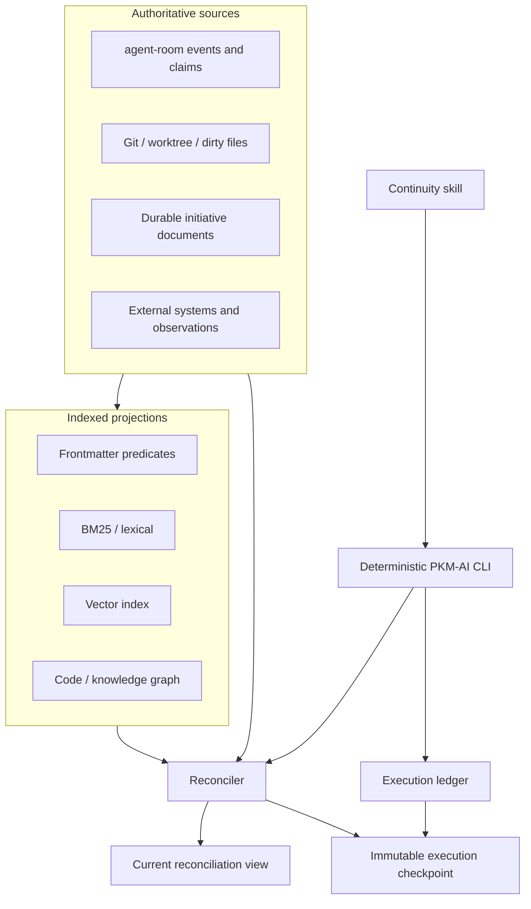
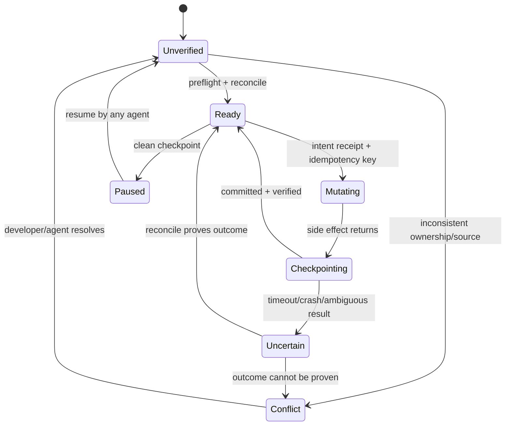

# Revised C2 Contract

This is a research outcome, not yet an approved implementation design.

## Architecture



## Two Capsule Artifacts

### Immutable execution checkpoint

Records what was known at one boundary:

- task and actor identity;
- protocol and schema version;
- event cursor and task claim revision;
- worktree identity, HEAD and dirty fingerprint;
- projection manifest and retrieval evidence IDs;
- decisions, known-red state and next executable step;
- pending/committed/unknown side-effect receipts;
- verification performed and timestamp.

It is append-only. It is authoritative only about the execution observation, not about the current domain state.

### Current reconciliation view

Rebuilt on start/resume from current truth and projections. It compares current epochs against the last immutable checkpoint and reports:

- unchanged and safe to resume;
- changed but automatically reconcilable;
- fuzzy and requiring targeted revalidation;
- conflicted and requiring another agent or the developer.

## Scope Model

Keep these dimensions separate:

| Dimension | Example | Enforcement |
| --- | --- | --- |
| Execution owner | `task_054` | One active claim revision |
| Write scope | research folder or symbol set | Lease + overlap check |
| Read slice | task + initiative + policies | Read-only retrieval view |
| Private scratch | agent-local hypotheses | Never treated as shared truth |
| Structural impact | callers, schemas, generated files | Fresh graph advisory/gate |

## Projection Manifest

Every retrieval adapter returns:

```text
adapter
source_id
absolute_source_root
git_common_dir
worktree_root
head
dirty_fingerprint
generated_at
source_cursor
coverage
health
freshness = fresh | stale | partial | unknown
```

`health=ready` without a source cursor or coverage is insufficient.

## Retrieval Router

| Question | Required path |
| --- | --- |
| Who is working on this now? | agent-room recent events and live claims |
| What files are dirty? | Git/worktree |
| Which issues are open? | frontmatter predicate query |
| Where is an exact symbol/path? | lexical index or code graph |
| Who calls or depends on this? | code graph |
| What prior work is conceptually related? | vector + lexical hybrid |
| What decision is authoritative? | open cited source document |
| Are sources contradictory? | retrieve sources, compare timestamps and supersession |

Vector retrieval may propose evidence; it cannot settle ownership, status or source authority.

## Execution State Machine



## Mechanical Gates

Before mutation:

1. task claim is live and revision matches;
2. write scope is non-empty and has no known overlap;
3. worktree and projections resolve to the intended source;
4. relevant inbox events are acknowledged;
5. last checkpoint is reconciled;
6. side effect has a stable idempotency key;
7. a `pending` receipt is durable.

After mutation:

1. capture the raw result;
2. verify the authoritative system, not only command exit;
3. mark receipt `committed`, `failed` or `unknown`;
4. update the immutable checkpoint;
5. refresh or invalidate affected projections;
6. publish a task/scope event for other agents.

## Context Profiles

| Profile | Default use | Contents |
| --- | --- | --- |
| Micro | Read-only status or healthy continuation | Conflicts, next step, exact evidence links |
| Short | Short-context agent | Micro plus decisions, dirty summary, known-red and commands |
| Standard | Normal implementation | Short plus targeted source excerpts and structural impact |
| Deep | Reconciliation, design or incident | Progressive retrieval; never one unbounded dump |

Each profile has explicit line/token and latency budgets. `--full` is never the default.

## Skill Responsibility

The eventual skill should:

- choose `start`, `resume`, `checkpoint`, `handoff`, `inspect` or `reconcile`;
- invoke deterministic commands;
- present conflicts and request developer decisions;
- load referenced evidence progressively.

It must not:

- manufacture capsule fields from prose;
- declare indexes fresh;
- merge concurrent state;
- infer successful side effects;
- bypass a failed gate.

## Open Design Decisions

1. Whether immutable checkpoints live inside agent-room state, an adjacent event store, or a dedicated local database.
2. Which operations require strict quiescence versus a fuzzy snapshot plus optimistic validation.
3. Whether structural-impact conflicts are hard gates or severity-ranked warnings for the first version.
4. How codebase-memory exposes a trustworthy source cursor and dirty coverage.
5. Retention periods and archive format for old room runs and checkpoints.
