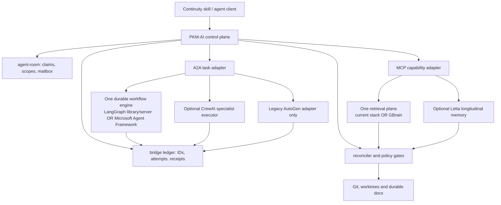

# Direct Provider Federation Behind PKM-AI

Research-only assessment of a stronger alternative to the prior C2 proposal:
run the external systems themselves and make PKM-AI the bridge between them,
instead of merely copying their design lessons.

## Verdict

The hypothesis is directionally good but unsafe if interpreted as five co-equal
runtimes.

PKM-AI should **federate bounded capabilities, not federate authority**. Directly
adopting mature providers can avoid rebuilding durable execution, longitudinal
memory and hybrid retrieval. However, installing all five as peer orchestrators
would create several conflicting state machines, memories and indexes with no
transaction spanning them.

The recommended shape is:

1. PKM-AI remains the canonical policy, live-coordination and reconciliation
   plane.
2. Git/worktrees and durable documents remain the domain truth.
3. External systems are replaceable capability providers behind versioned
   adapters.
4. A2A carries delegated agent tasks; MCP carries tool, retrieval and memory
   calls. Native support is not assumed: several providers require wrappers.
5. Only one provider owns a capability slot at a time. Other providers may run
   in read-only shadow mode for evaluation.

This is **option B executed with option C's incremental discipline** in
[[docs/work/pkm-ai/research/2026-07-29-provider-federation-bridge-analysis/02-architecture-options|02 — architecture options]].

## What “Direct Adoption” Must Mean

Installing a package or starting a server is insufficient. A provider is
adopted only when PKM-AI also has:

- a capability and protocol-version manifest;
- an explicit authority boundary;
- stable cross-system identity mapping;
- idempotent request and side-effect receipts;
- health, freshness and source/worktree evidence;
- timeout, circuit-breaker and fallback behavior;
- an upgrade and in-flight migration policy;
- a removal path that preserves canonical project state.

Without those conditions, direct adoption produces five adjacent islands, not a
federated system.

## Recommended Authority Map

| State | Sole authority | External-provider role |
| --- | --- | --- |
| Presence, task claims, scopes, mailbox | PKM-AI agent-room | Read-only projection |
| File contents, branch, worktree, dirty state | Git and filesystem | Evidence source |
| Accepted decisions, ADRs, specs, research | Durable Markdown in Git/local agent-doc stream | Retrieval source |
| Cross-provider task identity and receipts | PKM-AI bridge ledger | Emits provider observations |
| Workflow checkpoint internals | One selected workflow provider | Mirrored as an immutable PKM-AI receipt |
| Retrieval ranking and embeddings | One active retrieval provider | Projection, never authority |
| Longitudinal/private agent memory | Optional Letta instance | Advice with provenance |
| Delegated specialist work | Selected executor | Untrusted artifact until verified |

No provider may write task ownership, accepted decisions or completion directly.
It proposes an observation; the reconciler verifies the authoritative surface
before committing the PKM-AI transition.

## Recommended Topology

## Provider Disposition

| Provider | Direct role worth piloting | Disposition |
| --- | --- | --- |
| LangGraph | Durable step workflow/checkpoint engine | Candidate, mutually exclusive with another primary workflow engine |
| CrewAI | Autonomous specialist crew for bounded research/synthesis | Optional executor, not control plane or shared truth |
| Letta | Long-lived specialist identity and private/longitudinal memory | Optional memory service, never authoritative project memory |
| AutoGen | Compatibility with existing AutoGen agents | Do not start new core work; upstream is in maintenance mode |
| GBrain | Possible consolidation of document/code hybrid retrieval | Strong replacement candidate, benchmark against the current dual stack |

The set has already aged: AutoGen's maintainers now direct new projects toward
Microsoft Agent Framework. A bridge must therefore model **capability slots**,
not hard-code today's five vendor names.

## Why Not Five Peers

Five peers would create:

- three or more independent workflow state machines;
- at least four overlapping memories/indexes;
- ambiguous ownership of cancellation, resume and human input;
- retry-driven duplicate side effects;
- Node, Python, Bun, Docker, Postgres and possibly Redis as one startup surface;
- protocol and schema skew during upgrades;
- more context spent explaining the bridge than doing the task;
- a distributed consistency problem without a distributed transaction.

The right consistency model is a **saga with reconciliation**, not dual writes:
persist intent in PKM-AI, call one provider with an idempotency key, record the
raw result, verify the authoritative surface, then commit or mark the result
`unknown`.

## Incremental Adoption Order

1. Define the provider-neutral bridge contract and failure-injection harness.
2. Benchmark GBrain in read-only shadow mode against `query-docs` plus
   codebase-memory; select one active retrieval plane.
3. Pilot one resumable workflow in LangGraph JS or Microsoft Agent Framework;
   do not install two primary workflow engines.
4. Pilot Letta only if a longitudinal-memory benchmark beats durable documents
   under a fixed context budget.
5. Add a CrewAI executor only for tasks where a specialist crew demonstrates
   measurable quality or latency benefit.
6. Keep AutoGen as a compatibility adapter, not a new dependency.

No provider receives canonical writes during the pilot phases.

## Decision Gate

Proceed only if the roadmap truly needs heterogeneous remote agents,
long-running execution across restarts, or multiple machines/worktrees. For a
few local coding agents whose main problem is context compaction, full provider
federation is over-engineering; the revised C2 contract plus one improved
retrieval plane is cheaper and more inspectable.

## Shards

- [[docs/work/pkm-ai/research/2026-07-29-provider-federation-bridge-analysis/01-provider-fit-and-boundaries|01 — Provider fit and boundaries]]
- [[docs/work/pkm-ai/research/2026-07-29-provider-federation-bridge-analysis/02-architecture-options|02 — Architecture options and bridge contract]]
- [[docs/work/pkm-ai/research/2026-07-29-provider-federation-bridge-analysis/03-adversarial-failure-model|03 — Adversarial failure model and pilot gates]]
- [[docs/work/pkm-ai/research/2026-07-29-provider-federation-bridge-analysis/04-current-readiness-and-query-docs|04 — Current PKM-AI readiness and query-docs relationship]]

## Evidence Quality

Claims use official documentation, source repositories, specifications and
maintainer notices accessed on 2026-07-29. Local runtime observations are a
point-in-time feasibility check, not a claim that a dependency can never work on
Windows.
