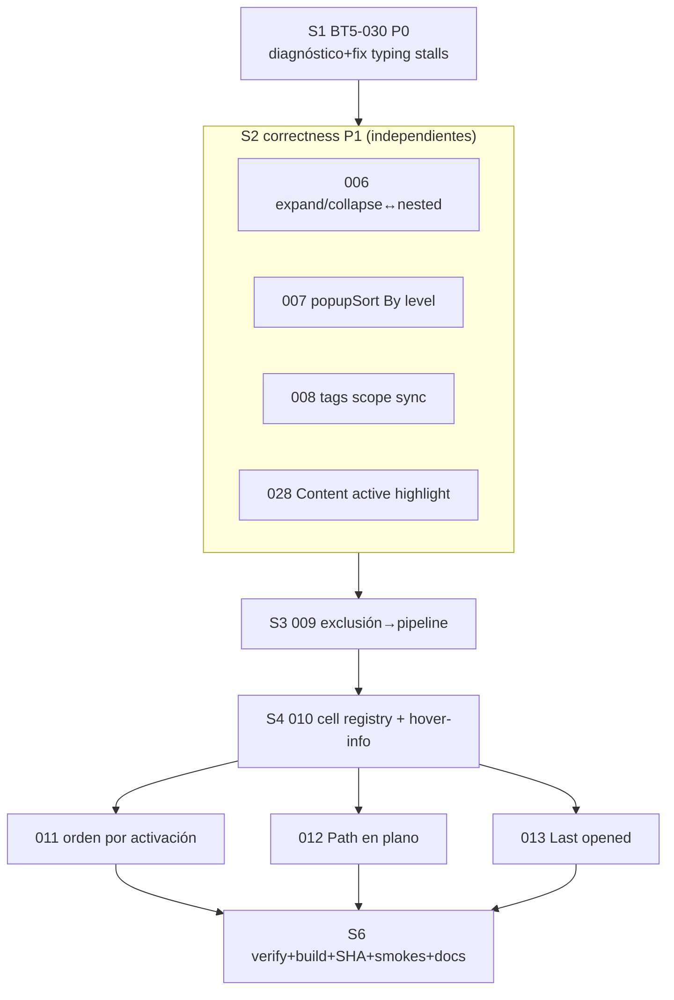

# BT5 next-10 implementation plan

Ejecuta exactamente: BT5-030 (P0), BT5-006/007/008/009/010/028 (P1), BT5-011/012/013
(P2, gated por 010). Excluidos: BT5-014 (bloqueado por benchmark HITL de 003);
BT5-002/003/004 conservan sus estados HITL.

## Session envelope (fail-closed)

| Campo | Valor |
|---|---|
| Worktree producto | `C:/tmp/vaultman-release-beta2-final2` |
| Rama | `codex/bt5-next-10` (base `codex/bt5-001-005` @ `14de6fbb`, verificado limpio) |
| Protegidos | `sandbox` = solo docs `.agents` (local-only, jamás push); no push/tag/merge/PR |
| Artefactos | SOLO `C:/Users/vic_A/Desktop/plugin-dev/.obsidian/plugins/vaultman` |
| Vault runtime | SOLO `vault=plugin-dev` literal; `test:integrity` PROHIBIDO |
| Issues | 030, 006, 007, 008, 009, 010, 028, 011, 012, 013 |
| Autoridad extra | otro vault · push · integración → requiere dev |

## Slices (orden de ejecución)

1. **S1 BT5-030** — diagnóstico matriz A/B → atribución → fix → regresión. Shard
   [[01-envelope-and-bt5-030|01]]. Si no hay repro objetivo: documentar, dejar
   pendiente/HITL, continuar (release sigue bloqueado).
2. **S2 correctness P1** — 006 (expansión gated a nested) · 007 (popupSort By level)
   · 008 (tags scope sync) · 028 (Content active highlight). Shard [[02-p1-slices|02]].
3. **S3 BT5-009** — exclusión de files al pipeline de FilterService. Shard 02.
4. **S4 BT5-010** — registro compartido de cells + hover-info. Shard
   [[03-registry-slices|03]].
5. **S5 consumers** — 011 (activación) → 012 (Path plano) → 013 (Last opened).
   Shard 03.
6. **S6 cierre** — un `pnpm run verify` limpio · build · SHA-256 vs plugin-dev ·
   smokes runtime · dev:errors · docs/commits. Shard [[04-verification-adversarial|04]].

Cada slice: test focal RED → implementación mínima → focal GREEN → autofixer Svelte
si tocó `.svelte`. Commits de producto por seam; `.agents` local-only aparte.

## Progreso 2026-07-19

- **S1 / BT5-030: deferred por decisión del dev.** El profiler atribuyó long tasks a los
  handlers de Tags y Props, con trabajo adicional de PropertyIndex, FilterService e Iconic;
  falta el baseline disabled y no se aplicó fix. El parcial quedó aislado en `stash@{0}` de
  la rama de producto y el issue conserva su gate sin resolver.
- **S2 completado.** BT5-006/007/008 aterrizaron en `f1dbe2f5`; BT5-028 en `017d8049`.
  Una revisión independiente encontró y cerró dos órdenes de inicialización de Tags:
  View config antes del lazy mount y remount del navbar en Tags→Content→Tags.
- **Verificación final:** `pnpm run verify` exit 0; Svelte 0 errores/0 warnings; 109 archivos,
  615 tests; scorecard 17/17. `pnpm run build` sincronizó exclusivamente a `plugin-dev`;
  SHA-256 de `main.js`, `manifest.json` y `styles.css` coincide con `dist/build`;
  `plugin:reload id=vaultman` pasó y `dev:errors` devolvió `No errors captured`.
- El autofixer oficial de Svelte agotó timeout en dos intentos sin producir diagnóstico;
  Prettier, TypeScript, `svelte-check`, lint y la suite completa quedaron verdes.
- **Siguiente orden:** BT5-009 → BT5-010 → BT5-011/012/013. El plan permanece activo.

## Mapa símbolo/test por issue (resumen)

| Issue | Símbolos clave | Tests focales |
|---|---|---|
| 030 | `explorerProps.ts:334` changed→render · `servicePropertyIndex.ts:38` resolved→rebuild · `explorerTags.ts:147` resolved→render · `VaultmanFrame.svelte:1172` onVaultResolved · polls 2500ms icons/snippets/plugins | `test/unit/explorerIdleWork.test.ts` (nuevo) |
| 006 | `navbarFilters.svelte` `supportsExpansion`/`openToolsMenu`/markup 1713-1746 · `nestedActiveFor` | `test/unit/expansionAvailability.test.ts` + sortUiSource guards |
| 007 | `popupSort.svelte` · `addByLevelItems` · nuevo `logicSortMenu.ts` · `isSortOptionVisible` | `test/unit/sortMenuModel.test.ts` + sortUiSource |
| 008 | `explorerTags.applyExternalSortScope:444` · `navbarFilters` handler externo files 811-827 | `test/unit/tagsScopeSync.test.ts` |
| 009 | `serviceFilter.applyFilters` · `explorerFiles._filesForDisplay:886` · `file.exclude:164` · `VaultmanSettings:523` | `test/unit/fileExclusionFilter.test.ts` |
| 010 | nuevo `logicCellRegistry.ts` · navbar CELL_* 209-273 · `logicFileHoverInfo.ts` · `VaultmanSettings` files-hover 615+ | `test/unit/cellRegistry.test.ts` + hover tests |
| 028 | `pageFilters.svelte:204` estado · `tabContent.svelte:231` is-active · `workspace.on('file-open')` | `test/unit/contentActiveFile.test.ts` |
| 011 | registry resolver · `viewTree` render cells 545-810 · `toggleVisibleCell` | `test/unit/cellOrderResolver.test.ts` |
| 012 | `logicsFiles.buildFlatFileNodes` labelMode · registry `path` requiresNestedOff | `test/unit/flatPathCell.test.ts` |
| 013 | nuevo `serviceLastOpened.ts` · `logicSort` + `_compareFileTreeNodes` 'opened' | `test/unit/lastOpenedService.test.ts` |

Detalle técnico por slice en shards 01-04. Pase adversarial: shard 04.
