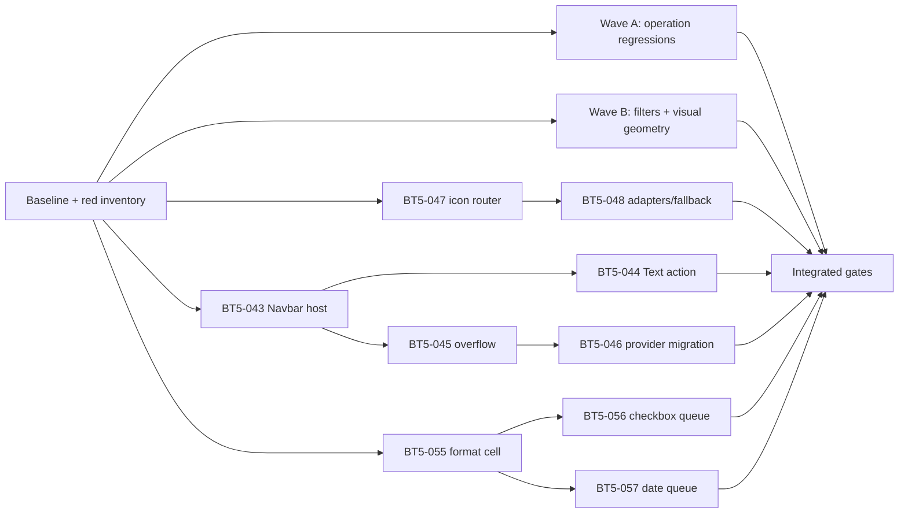

# Vaultman v1.2.0 final stable audit implementation plan

> **For agentic workers:** REQUIRED SUB-SKILL: Use `executing-plans` to execute this plan task-by-task; use `test-driven-development` for every behavior change and `verification-before-completion` before any completion claim.

**Goal:** Close every behavior in the three original release prompts plus the dev's follow-up corrections, with durable regressions and enough runtime evidence for a direct stable-release decision after dev approval.

**Architecture:** Introduce two canonical seams instead of adding more per-page/per-provider branches: a provider-fed universal Navbar `panelWidget`, and a capability-routed ChangeIcon action. Preserve the operation queue as the only mutation boundary for rename/property action cells. Keep presentation settings (`format`, glyph color, scrollbar footprint) declarative and project them consistently into each supported engine.

**Tech stack:** TypeScript 5.8, Svelte 5, Obsidian 1.12, Vitest, WDIO/Obsidian integration testing, CSS in `styles.css`, pnpm 11.

---

## Source of truth

- Approved issue-set: [[../../issues/bt5-final-stable-audit/index|BT5 final stable audit]].
- Literal prompts, corrections, Git forensics and audit evidence: [[../../../../sessions/2026-07-22-codex-gpt5-root|session audit shard]].
- Product worktree: `C:\tmp\vaultman-release-beta2-final2`.
- Product branch / audited HEAD: `codex/bt5-next-10` / `b56b9a78`.
- AI work files remain local-only in `C:\Users\vic_A\Desktop\vaultman`; never mix them into a product commit or push them to origin.

## Non-negotiable execution rules

1. Before each slice, read its issue and inspect the current diff for every target file.
2. Write the narrowest behavior test first and run it to observe the expected failure.
3. Implement only enough production code to make that contract pass; then refactor behind green tests.
4. Run the focused unit group, `pnpm run check`, and any source-contract tests named by the task.
5. For Svelte work, load `svelte-code-writer` and `svelte-core-bestpractices`; for CSS load `scss-professional` even though the shipped sheet is plain CSS.
6. Never silently revert or absorb the pre-existing edit in `src/logic/logicResponsiveLayout.ts`. Its removal of `scroll` is baseline evidence for BT5-045; replace it only as part of that issue and record the transition.
7. No push, tag, merge, version bump or release command without a fresh explicit order from the dev.
8. A HITL issue may be code-complete but remains release-open until its runtime matrix is accepted by the dev.

## Dependency graph and execution waves

The independent waves may be interleaved only at green checkpoints. Do not leave a partially refactored shared registry, queue service, or Svelte host while starting another shared slice.

## Shards

1. [[01-baseline-and-guardrails|Baseline, ownership and test gates]].
2. [[02-operation-regressions/index|Self-disable, Snippet Reveal and rich queued Rename]].
3. [[03-filter-and-geometry-corrections/index|Scrollbar, filter copy/polarity, property menus, glyph and top geometry]].
4. [[04-change-icon-router|Canonical ChangeIcon capability router and adapters]].
5. [[05-universal-navbar/index|Universal Navbar, Text action, measured overflow and provider migration]].
6. [[06-property-action-cells/index|Property format cell and queued checkbox/date action cells]].
7. [[07-integrated-verification|Integrated regression, runtime and stable preflight]].

## Slice ledger

| Order | Issue | Completion evidence | Commit boundary |
|---:|---|---|---|
| 0 | Baseline | known-red ledger + clean target ownership | no commit |
| 1 | BT5-060 | rich modal + queued Content/Snippet rename tests | `fix(operations): restore rich queued rename flows` |
| 2 | BT5-049 | Vaultman disable enabled, uninstall absent | `fix(plugins): allow Vaultman self-disable` |
| 3 | BT5-050 | one localized canonical reveal action | `fix(snippets): canonicalize reveal action` |
| 4 | BT5-052 | Git-restored short filter labels | combine with 053 only if same tests |
| 5 | BT5-053 | transactional inclusive/exclusive/remove interaction | `fix(filters): make polarity interaction reversible` |
| 6 | BT5-051 | one scrollbar/index footprint in full matrix | `fix(layout): preserve one hidden-scrollbar gutter` |
| 7 | BT5-054 | complete type/conversion menus | `fix(properties): complete type and conversion actions` |
| 8 | BT5-058 | glyph color reaches rail and Files name | `fix(glyphs): close projection gaps` |
| 9 | BT5-059 | restored top-edge clipping after Navbar seam known | `fix(layout): restore frame top-edge geometry` |
| 10 | BT5-047 | router contract and provider descriptors | `refactor(icons): add change-icon capability router` |
| 11 | BT5-048 | Iconic/add-on/fallback matrix and dedupe | `fix(icons): unify picker adapters and fallback` |
| 12 | BT5-043 | one provider-fed Navbar host | `refactor(navbar): introduce universal panel widget` |
| 13 | BT5-044 | Text Has/Hasn't action in correct order | `fix(content): move exclusion toggle to navbar` |
| 14 | BT5-045 | measured condensed/scroll/wrap | `fix(navbar): implement measured overflow strategies` |
| 15 | BT5-046 | Statistics/all providers use same host | `refactor(navbar): migrate provider contributions` |
| 16 | BT5-055 | opt-in format cell across engines | `feat(properties): add value format cell` |
| 17 | BT5-056 | interactive checkbox queues replaceable `set` | `feat(properties): queue checkbox action cells` |
| 18 | BT5-057 | local-date-safe picker queues `set` | `feat(properties): queue date action cells` |
| 19 | Preflight | all automated + runtime matrices | no release action |

## Definition of done

- All issue acceptance checkboxes are supported by a test or named runtime observation.
- `pnpm run verify`, `pnpm run test:integrity`, relevant WDIO suites, scroll smoke and scorecard are freshly green.
- Upgrade from beta.6 and clean-install behavior are both exercised.
- No unexpected diff remains; the known `logicResponsiveLayout.ts` edit is either intentionally superseded by BT5-045 or still attributed.
- The dev receives a release-decision report containing remaining HITL items and known non-goals, not a premature “ready” claim.

## Explicit non-goals / quality boundaries

- Do not add folders to Files Table/Cards merely to demonstrate folder glyph color.
- Do not make Daily Note navigation a queued property mutation.
- Do not promise arbitrary third-party picker support without an adapter contract; unknown integrations must fall through safely.
- Do not turn Save Layout, folder move, property-key rename or Tag inline rename into file-pattern operations when their domain contract differs.
- Do not preserve the current duplicated Navbar or hardcoded overflow merely for smaller diffs; those are the audited architectural causes.
