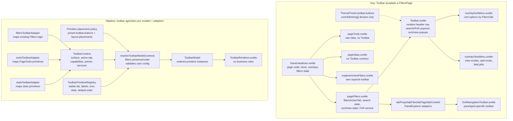

# Toolbar Architecture And Primitive Ordering Map

## Pregunta

Necesitamos entender qué abarca el toolbar actual, por qué hoy está conectado casi exclusivamente a la Filters page, y cómo convertirlo en un módulo agnóstico al tab sin romper la lógica existente de filtros, búsqueda, orden, vista, FnR, queue, active filters, navegación o theme presets.

## Lectura corta

El `Toolbar.svelte` actual no es un toolbar genérico del frame. Es un toolbar de exploradores de filtros con nombre de layout. La evidencia principal:

- `pageFilters.svelte` es el único call site productivo de `<Toolbar />`.
- La interface de `Toolbar.svelte` exige `activeTab: 'props' | 'files' | 'tags' | 'content'` y props de filtros/exploradores.
- `frameVaultman.svelte` conserva el estado de Filters page y lo inyecta en `FiltersPage`, pero no tiene una interface de toolbar por página.
- `pageTools.svelte`, `StatisticsPage`, `explorerActiveFilters.svelte` y `GridNavigationToolbar.svelte` tienen sus propios controles fuera del contrato del toolbar.
- `ThemePreset.toolbar.buttons` existe como contrato declarativo, pero todavía no se consume para decidir presencia u orden.

El camino sano es no hacer más condicionales dentro de `Toolbar.svelte`.
Primero conviene crear un módulo profundo: un resolver de modelo que decide qué primitives existen, en qué orden aparecen y qué adapter les da estado y acciones. El renderer debe quedarse tonto: renderiza una lista de primitives resueltas, no decide reglas de negocio.

## Shards

- [[01-current-map|01-current-map]]: qué módulos abarca el toolbar actual y por qué está conectado a Filters page.
- [[02-target-architecture|02-target-architecture]]: cómo volverlo agnóstico y unificar orden/presencia sin manipular la lógica.

## Diagrama Mermaid

## Decisión práctica

El primer módulo profundo no debería ser "un Toolbar enorme". Debería ser el resolver de modelo. Ese módulo da leverage porque concentra orden/presencia en un sitio y da locality porque cada superficie conserva su adapter y su lógica existente.
