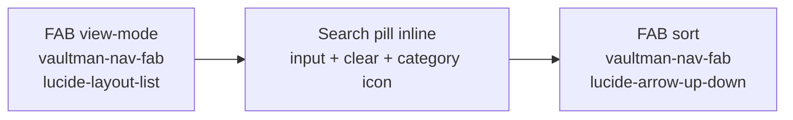
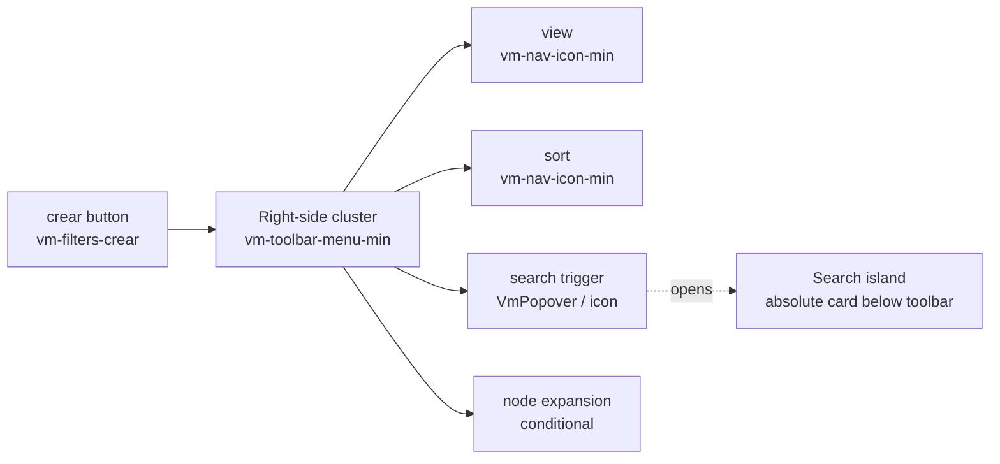
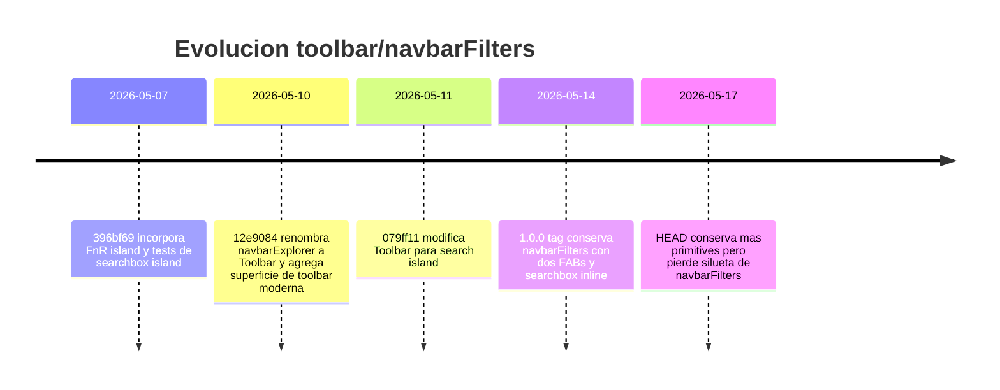

# Evidence Comparison

## Evidencia base

| Fuente | Evidencia |
| --- | --- |
| `git show 1.0.0:src/components/layout/navbarFilters.svelte` | El header renderiza `vaultman-nav-fab`, `vaultman-filters-header-search-pill`, `vaultman-nav-fab`, en ese orden. |
| `git show 1.0.0:styles.css` | Los FABs son circulares, filled accent, `2.25em`; el search pill es `flex: 1`, `height: 26px`, `border-radius: 999px`. |
| `src/components/layout/Toolbar.svelte` | El header actual renderiza `crear`, luego `.vm-toolbar-menu-min` con view, sort, search popover y node expansion. |
| `src/styles/explorer/_explorer.scss` | `.vm-toolbar-menu-min` fuerza un cluster derecho con `margin-left: auto`; `.vm-toolbar-search-island` hace absolute popover/card. |
| `test/component/toolbarMenuPlacement.test.ts` | El comportamiento actual esta testeado: view/sort despues de `crear`, search y expansion dentro del cluster. |
| `test/component/searchboxIsland.test.ts` | El search moderno esta testeado como island/popover montado desde `Toolbar`. |

## `1.0.0`: navbarFilters

El DOM principal del header era:

Detalle del orden en `navbarFilters.svelte`:

| Posicion | Primitive | Clase | Rol visual |
| --- | --- | --- | --- |
| 1 | View mode | `vaultman-nav-fab` | FAB circular accent a la izquierda. |
| 2 | Searchbox | `vaultman-filters-header-search-pill` | Centro flexible, siempre visible. |
| 2a | Clear | `vaultman-filters-search-clear` | Dentro del search pill, solo si hay texto. |
| 2b | Category | `vaultman-filters-search-mode` | Icono dentro del search pill. |
| 3 | Sort | `vaultman-nav-fab` | FAB circular accent a la derecha. |

La composicion era clara porque el search era el centro del toolbar, no una superficie secundaria. Los dos comandos de borde eran FABs simetricos.

## HEAD: Toolbar actual

El DOM principal actual es:

Detalle del orden visible en `Toolbar.svelte`:

| Posicion | Primitive | Clase | Rol visual |
| --- | --- | --- | --- |
| 1 | Crear | `vm-filters-crear` | Boton textual/plus antes del cluster. |
| 2 | View mode | `vm-nav-icon vm-nav-icon-min` | Icono compacto dentro del cluster derecho. |
| 3 | Sort | `vm-nav-icon vm-nav-icon-min` | Icono compacto dentro del cluster derecho. |
| 4 | Search | `VmPopover` o `vm-nav-icon-min` | Ya no es input central; abre island. |
| 5 | Node expansion | `vm-nav-icon-min` | Condicional, tambien en el cluster. |
| Popover | Search/FnR body | `vm-toolbar-search-island` | Card absoluto con input, mode pill, category, flags, help, history y rename. |

El toolbar actual tiene mas botones porque incorpora capacidades nuevas. El problema no es que existan mas primitives, sino que todas compiten en un grupo lateral mientras el search dejo de ser el centro visual.

## Comparacion de estilo

| Aspecto | `1.0.0` navbarFilters | HEAD Toolbar |
| --- | --- | --- |
| Silueta | Dos FABs y searchbox central. | Boton `crear` + cluster lateral de iconos + search island. |
| Search | Inline, siempre visible, `flex: 1`. | Trigger en toolbar; input vive en popover/island absoluto. |
| FABs | `2.25em`, circulares, accent filled, sombra suave. | Iconos compactos `22px`, translucidos, dentro de cluster. |
| Balance | Simetrico: view a izquierda, sort a derecha. | Peso visual concentrado al costado por `margin-left: auto`. |
| Scan path | Ojo va directo al search. | Ojo debe encontrar el icono de search dentro de un grupo. |
| Complejidad | Pocas primitives visibles. | Muchas primitives y modos; mas funcional pero menos claro. |

La regla de diseno que se perdio: **el search debe ser el primitive central del toolbar de filtros**. Si el search pasa a ser una isla secundaria, el toolbar deja de sentirse como `navbarFilters` y se vuelve un menu de iconos.

## Linea historial

> [!note] Inferencia
> No se hizo bisect con test rojo porque la regresion reportada es visual y no
> hay un test actual que defina "debe parecer navbarFilters". La evidencia
> fuerte es comparativa: tag `1.0.0`, DOM actual, SCSS actual y tests que
> fijan el cluster derecho/search island.

## Fuentes leidas

- `src/components/layout/Toolbar.svelte`
- `src/components/pages/pageFilters.svelte`
- `src/styles/data/_filters.scss`
- `src/styles/explorer/_explorer.scss`
- `src/styles/nav/_v3-nav.scss`
- `test/component/toolbarMenuPlacement.test.ts`
- `test/component/searchboxIsland.test.ts`
- `test/component/toolbarClickWeights.test.ts`
- `test/unit/styles/toolbarIconCentering.test.ts`
- `git show 1.0.0:src/components/layout/navbarFilters.svelte`
- `git show 1.0.0:styles.css`
- `git log --oneline -- src/components/layout/Toolbar.svelte`
