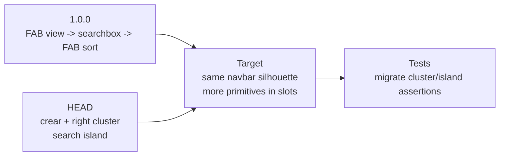

# Toolbar Vs NavbarFilters 1.0.0 Regression Map

## Pregunta

Comparar el toolbar actual contra el `navbarFilters` de `1.0.0`, con enfasis en orden de primitives y estilo. La preocupacion concreta es visual y de composicion: el toolbar actual tiene mas botones, el search se convirtio en isla/popover, y los botones quedaron agrupados a un costado de forma pesada. En `1.0.0`, la silueta era mas simple: dos FABs circulares y un searchbox central.

## Veredicto corto

La version buena para la silueta visual es el tag `1.0.0` (`b75706b`, `chore: prepare release 1.0.0`). El componente relevante era `src/components/layout/navbarFilters.svelte`.

La version actual no puede restaurarse copiando `navbarFilters.svelte` literalmente. El toolbar moderno tiene capacidades reales que no existian en `1.0.0`: FnR island, search modes, flags, history, `crear`, operation scope, field visibility, node expansion, mouse gestures y popovers. La reparacion sana es conceptual: recuperar la composicion visual de navbar `FAB izquierdo -> searchbox inline -> FAB derecho`, pero conservar las capacidades actuales como primitives dentro del search pill, en secondary slots, o en overflow controlado.

> [!warning] No hacer restauracion literal
> Volver al archivo de `1.0.0` perderia handlers y estado actuales. Este caso
> encaja con `vm-regression-resolver` Fase 4B: adaptar la intencion visual
> funcional al codebase actual.

## Shards

- [[01-evidence-comparison|01-evidence-comparison]]: fuentes, orden de primitives, comparacion de estilo e historial.
- [[02-adaptation-plan|02-adaptation-plan]]: target de adaptacion, regla de UI, pasos para el siguiente agente y checklist de verificacion.

## Visual Overview

## Canvas

- [[visuals/toolbar-navbarfilters-regression.canvas|Toolbar navbarFilters regression canvas]]

## Fuentes principales

- `git show 1.0.0:src/components/layout/navbarFilters.svelte`
- `git show 1.0.0:styles.css`
- `src/components/layout/Toolbar.svelte`
- `src/styles/data/_filters.scss`
- `src/styles/explorer/_explorer.scss`
- `test/component/toolbarMenuPlacement.test.ts`
- `test/component/searchboxIsland.test.ts`
- [[docs/work/polish/research/2026-05-17-toolbar-architecture/index|Toolbar architecture and primitive ordering map]]
