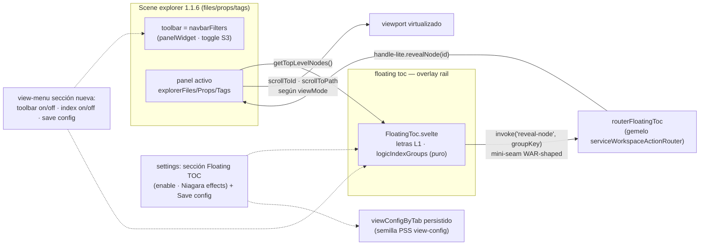

# Spec — v1.2 Floating TOC

Port del **Niagara Index** de proto-v12 a la línea stable como **floating toc**, + toggle de toolbar, + save-config, publicado como **v1.2.0** (feature-minor, enmienda D4 2026-07-14 en [[docs/work/hardening/specs/2026-06-10-vaultman-2-0-synthesis-umbrella/01-locked-decisions-grill|umbrella 01]]) con ciclo beta BRAT para testing mobile ([[docs/architecture/policies/release|policy release]]).

## Base y ramas

- **Base de código = tag `1.1.6` = `origin/main`.** `dev` local está 57 commits behind / 0 ahead → **FF `dev` → `origin/main` como paso 0** (sin conflicto posible).
- Código en worktree `C:/tmp/vaultman-v12-*` desde `dev`; docs en sandbox `.agents/docs` (vault-visible). Disciplina two-commit (código pushable / docs local-only).
- 1.1.6 es **greenfield** para esta feature (verificado: cero toc/index/scrubber previo).

## Mapa canon (resumen; detalle en el [[docs/work/hardening/research/2026-07-14-goal-taxonomy-alignment/index|catálogo de taxonomía]])

- floating toc = **rail flotante asistivo = overlay surface** (carve-out D-NIB-3:
  bar persistente=panelWidget · rail flotante=overlay). En v2 (stream goal): overlay que hostea `indexScene{indexProvider → panelWidget de action_nodes}` bajo WASA/MyWorkspace, ruteado por **WAR** hacia `PanelHandle.revealNode` — cadena que sandbox YA tiene inerte (P.D slice 4). **v1.2 = shape-twin sin maquinaria**: mini-seam local con action id `reveal-node` + handle-lite; port a v2 = move, no reshape.
- Letras = `glyph` letter-mode (primera letra del **label** por grupo); glyph ⊇ character.
- "toolbar on/off" = toggle de visibilidad de `navbarFilters` (panelWidget) — precursor del visibility-manager de S-24 (ScenesManagerScene); copy debe anticiparlo.
- "save config" = semilla PSS view-config (VIECO.modes + NAVCO.sorts + cells TBD), clave settings PSS-shaped (patrón PAI-002, semántica storageClass 'config').
- Efectos = opción **"Niagara effects"**; preset minimal (default nuevos usuarios) = estático (canon per-preset ADR 0011: stable-minimal=native).

## Port del proto (fuente: informe anatomía 2026-07-13)

- **Se porta (renombrado)**: derivación de grupos (`vmGroupList`-like sobre nodos L1;
  fallback `first-char` si no hay groupBy; render solo si >1 grupo), glifo = primera letra del label, gate por tab. CSS `.vm-nia-*` → `.vaultman-floating-toc*`.
- **Se re-implementa (mandato docs proto)**: el jump — NUNCA el DOM-query `querySelectorAll+offsetTop` del proto; usar scroll del runtime virtualizado 1.1.6 (`UnifiedTreeView.scrollToId` / `scrollToPath` table-grid).
- **Primitivo separado, no cell** (decisión N.R abanico 2026-06-15).
- **Efectos (S5, opción off-default)**: glow blur(3px) · wave-magnify gaussiana · displacement/perp · spread vecinos · rail-follow/HWM · haptics vibrate(3) · bounce cubic-bezier · name-pill backdrop-blur · reveal falloff · pila vertical de letras.
- Config fina del proto (posición/glyph-mode/labelMode/hardJump…) = **backlog patches** 1.2.x, NO v1.2.0.

## Arquitectura v1.2 (Mermaid único del plan)

## Slices (issue-set [[docs/work/polish/issues/ftc-floating-toc/index|FTC]])

| # | Contenido | Gate clave |
|---|---|---|
| FTC-001 | Rail estático: `logicIndexGroups.ts` puro + `FloatingToc.svelte` + accessor `getTopLevelNodes()` por panel + settings enable + gate tabs (files/props/tags; content NO tiene árbol) | RED/GREEN focal · check 0/0 · build · smoke plugin-dev + emulateMobile |
| FTC-002 | Jump: mini-seam `reveal-node` (router + handle-lite) → `scrollToId`/`scrollToPath` según viewMode | jump correcto en tree/table/grid, filas no renderizadas incluidas |
| FTC-003 | Sección nueva al inicio del view-menu (nativo minimal + popup no-minimal): toolbar on/off · index on/off · save config; toolbar default también en settings (Q2=ambos) | paridad de menú en ambos caminos |
| FTC-004 | Save-config: clave `viewConfigByTab` {viewMode·sort·visibleCells} + rehidratación en `navbarFilters` (hoy `pageRenderKey++` resetea TODO) + sección settings | persiste tras reload; migración default sana |
| FTC-005 | Efectos Niagara como opción off-default (port del paquete) | perf gate con datos de beta.1 en device real |
| FTC-006 | DIFERIDA a 1.2.x: scope option (parent L1 ↔ `gc_file`/hierarchy_level) | — |

## Betas y release

`1.2.0-beta.1` (FTC-001..004) → BRAT device real + clean-install + emulateMobile → `beta.2` (+FTC-005) → `1.2.0` stable. Cierre de beta con caveat BRAT (prerelease users no auto-saltan al stable → patch `1.2.1` temprano o aviso). Runbook completo:
[[docs/architecture/policies/release|policy release]].

## Non-goals v1.2.0

- NO construir WIR/ActionNode machinery real (solo shape-twin).
- NO scope option (FTC-006 → patch) · NO content-tab · NO masonry · NO posición configurable/glyph-modes del proto (backlog patches).
- NO absorber arquitectura sandbox (V.D/N.R/P.D) a la línea 1.x.

## Anclajes de implementación

Shard [[docs/work/polish/specs/2026-07-14-v1-2-floating-toc/01-anchors-1-1-6|01 — anclajes 1.1.6]] (paths+líneas verificados vía `git show 1.1.6:`).

## Registro 2.0 (hooks)

- Fila nueva en el function-union ledger: capability "floating toc / niagara index" (hoy NO inventariada — gap detectado 2026-07-13).
- El toc = consumidor designado de la cadena `reveal-node` inerte de sandbox (pendientes §3) cuando se implemente en 2.0.
