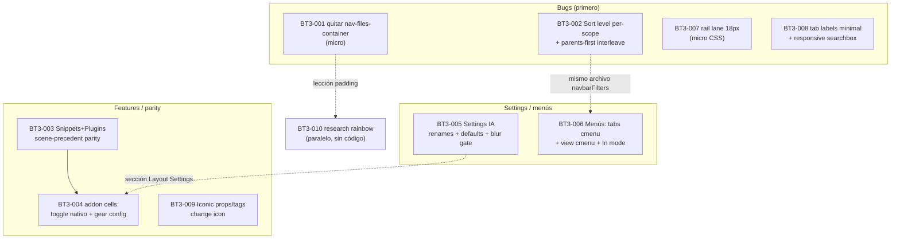

# v1.2.0-beta.3 batch (spec)

Base: `dev` @ `5e5fa1df` (= `origin/dev` = `1.2.0-beta.2`). Worktree de referencia:
`C:/tmp/vaultman-release-beta2-final2` (checkout limpio de `dev`). Implementación en rama `v12/bt3` apilada sobre `dev`; FF/push los decide el dev.

Origen: revisión manual del dev sobre beta.2 (2026-07-17, este chat). Diagnóstico previo verificado en código (3 Explore agents + verificación coordinador). Issue-set:
[[docs/work/polish/issues/bt3-beta3-batch/index|BT3-001..010]].

## Decisiones locked (grill 2026-07-17)

| # | Decisión |
|---|---|
| D1 | `nav-files-container` se QUITA de `explorerFiles` (L151/L483). Sin override-keep. |
| D2 | Sort por scope con submenú **"Sort level"**; estado per-scope persistente; entra en `SavedViewConfig.sortState`. Detalle: [[01-sort-level|shard 01]]. |
| D3 | Tags Sort level = `All` (default) · `Scope drill mode`. Props = `Properties` (default) · `Values`. Files = `Parents first` (toggle) + divider + `All` (default) · `Scope drill mode`. |
| D4 | Fix parents-first=off: folders se ordenan INTERCALADOS con files por el comparator activo (hoy sigue hoisted). Sin re-barajeos al cambiar opciones del submenú (invariante no-reshuffle). |
| D5 | Snippets/Plugins: parity toolbar completa montada como **precedente de scene** (contratos shape-twin del refactor sandbox, patrón FTC WAR-shaped). Sin expand-all (no hay sub-nodos). |
| D6 | Cell on/off addons: **markup nativo Obsidian por defecto**; setting en Layout Settings togglea a nuestra versión badge. Enable/disable = un solo click (double-click se retira). |
| D7 | Plugins: cell gear → abre settings del plugin; **oculto** si el plugin no registra settings-tab. |
| D8 | Installed/updated: snippets = ctime/mtime del propio archivo `.css`; plugins = stat de `manifest.json` (installed=ctime, updated=mtime). |
| D9 | Blur: **gate runtime por preset** — minimal fuerza blur 0; experimental usa el valor guardado (default 60 intacto). |
| D10 | "Style Config" → **"Layout Settings"**. "View Config" (sección settings) → **"Layouts"**. "Colored badges" → **"Colored cell badges"**. Selector de idioma FUERA de la UI (setting interno queda, `auto`). |
| D11 | Toolbar group: sub-page "Toolbar" dentro de Layout Settings (patrón files-hover) con show tab labels · show toolbar · condense files tools. |
| D12 | View cmenu (minimal) orden: **1 Layouts** (lista guardados → Save layout al FINAL) · **2 In mode** · **3 Cells** (`nested` PRIMERO) · **4 Modos/engines**. El item suelto "ADD mode" desaparece (absorbido por In mode). |
| D13 | **In mode** (ex "change mode"): files = `Open` (default) · `Add` · `Select` (port sandbox); props/tags = `Open` (nuevo, primero en lista) · `Filter` (default) · `Add`. Props/tags `Open`: click = expand/collapse; ctrl+click = búsqueda por content del nodo. |
| D14 | Tabs cmenu orden: Files→Props→Tags→Content / sep Filters+Queue / sep Floating TOC / sep **Statistics→Snippets→Plugins** / sep toggle Toolbar. |
| D15 | Files cell `count` (cuenta props: `_propCountForFile`) → label **"Props"**; FUERA de `DEFAULT_VISIBLE_CELLS.files` para usuarios nuevos. |
| D16 | Tab labels en minimal: `filtersShowTabLabels` controla el label del botón de tabs (generaliza SDF-009); responsive esconde también el searchbox si el label consume el min-width (parche temporal pre-refactor). |
| D17 | Rail lane: `--vaultman-toc-reserved-lane-size` = ancho real del track (18px; mobile proporcional). |
| D18 | Iconic: props/tags explorers resuelven iconos property/tag de Iconic + exponen "Change icon" en cmenu (paridad core All Properties / core Tags). Gate `iconicEnabled`. |
| D19 | Research (sin código): compat del snippet `fancyfile-explorer-rainbow` con nuestros explorers (cli + web-lab), aunque sea config files-only. |
| D20 | Paridad del reorder en popupView (experimental) = DEFER al refactor (divergencia temporal aceptada por dev). |

## Mapa de issues

Serialización recomendada: BT3-001/007 (micro) → 002 → 008 → 003 → 004 → 009 → 005 → 006. 010 corre paralelo en cualquier momento (read-only). 002 y 006 tocan ambos `navbarFilters.svelte` — no paralelizar entre sí.

## Gates por issue (policy dev-lock 2026-07-14/15, sin cambio)

RED/GREEN focal · svelte-check 0/0 · autofixer `issues:[]` en `.svelte` tocados · lint/stylelint según alcance · build · full unit al integrar. Testing visual/UI/Obsidian/mobile **delistado para agentes** — validación manual del dev.
Two-commit: `feat/fix` código-only (pushable) + `docs:` local-only.

## Adversarial pass (C2)

- **Migración sortState**: layouts guardados con shape legacy `{sortBy,direction,childLevel}` deben migrar sin romper load; regla en shard 01 §Migración. Riesgo si un layout guardado apunta a `drillNodeId` inexistente → fallback `All` (cubierto D2).
- **`In mode` Select (port sandbox)**: sandbox trae semántica selection (P.D slice 3:
  `select-visible-active-explorer`/`clear-active-explorer-selection`) pero su runtime difiere del stream dev — el port es semántico, no copy-paste. beta.2 ya trae `logicFileSelection.ts` como base local. Riesgo de scope-creep: Select entra mínimo (click=select/toggle, sin box-select). |
- **Cell `count`→`Props` (files)**: `sort.by.count` es label compartido entre tabs — el rename es files-only (label por tab), no global; verificado que el binding interno ya usa `'props'` (explorerFiles L549/723).
- **No cubierto adrede**: paridad popupView (D20) · box-select en Select mode · sub-efectos Niagara dormidos (backlog FTC) · perf virtualization (V.D sandbox).
- **Qué se pierde vs status quo**: double-click de addons (D6) muere como gesto;
  el item ADD mode desaparece como toggle rápido de primer nivel (queda a 2 clicks dentro de In mode) — aceptado por dev en D12/D13.
- Nombres verificados contra código real (no memoria): `filtersShowTabLabels` · `toolbarToolsMenu` · `coloredBadges` · `glassBlurIntensity` · `tocReservedLane` · `addModeActive`/`setAddMode` · `DEFAULT_VISIBLE_CELLS` · `_propCountForFile` · `IconicService.getFileIcon` · `logicResponsiveLayout` · `longPressGesture`.
