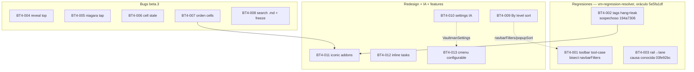

# v1.2.0-beta.4 batch (spec)

Base: `dev` @ `fa48b96a` (= `1.2.0-beta.3` publicada + fix guard scorecard).
Beta.3 = commits `03fe92bc..7ba6a3c9` (codex) sobre beta.2 `5e5fa1df`.
Worktree: `C:/tmp/vaultman-release-beta2-final2`; rama nueva `v12/bt4`.
Issue-set: [[docs/work/polish/issues/bt4-beta4-batch/index|BT4-001..013]].

**Regresiones se resuelven con el skill `vm-regression-resolver`** (oráculo =
beta.2 `5e5fa1df`; commits granulares de beta.3 permiten bisect). Vaults de
inspección del dev via obsidian-cli: `start of the road` (beta.2 activa) y
`plugin-dev` (beta.3).

## Decisiones locked (grill 2026-07-18)

| # | Decisión |
|---|---|
| D21 | Toolbar responsive: restaurar comportamiento beta.2 — con poco width, nodos del 5º en adelante COLAPSAN en menú "tool-case"; beta.3 los desaparece. |
| D22 | Tags explorer: eliminar cuelgue + fuga de memoria al abrir (sospechoso: loop `iconicService.onChanged → _render`). |
| D23 | Reserve index lane: el rail DEBE moverse del scrollbar al lane reservado (beta.2 lo hacía); conservar el ancho nuevo compacto (22/26px), NO volver a 36px. |
| D24 | Addon explorers (snippets/plugins) index reveal: primer nodo coincidencia queda PRIMERO (top) del frame, no al medio. Unificar reveal con el resto de explorers — mismo seam, no implementaciones divergentes. |
| D25 | Niagara: tap rápido NO deforma el rail (solo jump). Deformación requiere intención: press-hold o arrastre (ver §UX). |
| D26 | Plugin toggle cell reacciona a cambios de estado hechos fuera del explorer (Settings core): refresh del cell al enable/disable externo. |
| D27 | Cells plugins: `config` ANTES de `toggle`; toggle SIEMPRE en el extremo derecho (default; orden configurable = versión futura, fuera de scope). |
| D28 | Content search: SOLO archivos `.md` (beta.3 escanea binarios, p.ej. mp4) + input sin freeze (debounce + trabajo async/chunked). |
| D29 | Sort "By level": rediseño completo del submenú (rename desde "Sort level") — diseño en [[01-by-level-sort|shard 01]]. Incluye fix del bug "All no ordena L1 root". |
| D30 | Settings section de layouts guardados ("Layouts") → **"View configs"**. |
| D31 | Setting nuevo: drill del floating index puede COMPARTIR scope con el sort (activada: index drill define scope del sort; cerrar index → sort vuelve a default). |
| D32 | Setting nuevo (default ON): opciones de By level INLINE en el sort menu (sin submenú), en la posición del "Folders first" de beta.3: sort_options → divider → by-level options → divider → menú by type. OFF → submenú "By level". |
| D33 | Options contextuales: ocultar "sort by sub-elements" en props con scope=values (sin sub-elementos); ocultar sort "path" cuando nested activo. Regla general: opción sin sentido en contexto → no aparece. |
| D34 | Settings: "show dock" baja DEBAJO de "style-preset". Sección "context menus" → sub-page al FINAL de Layout Settings. Sub-page nueva "Explorer" bajo Layout Settings: add-on state cell · colored badge · cancel badge interaction · explorer search highlights. |
| D35 | Iconic addons: "change icon" también para snippets y plugins. Plugins además EMITEN iconos propios (ribbon/registrados, como el `lucide-vault` de Vaultman en main.ts) → fetch como icono default del nodo. Auditar lo que `194a7306` entregó realmente en props/tags (reporte dev: incompleto). |
| D36 | Feature: cell + sort + hover_info "remaining inline tasks" (conteo de tasks `- [ ]` sin marcar por archivo). |
| D37 | Feature: files node-cmenu configurable — sub-page en Layout Settings estilo hover-info + drag-and-drop para orden, show/hide por opción y dividers agregables. **El sub-page de hover-info TAMBIÉN gana DnD de orden** (lock dev 2026-07-18). |

## §UX — Niagara tap vs scrub (crítica adversarial, D25)

Propuesta dev: timer 0.8s. Contra-propuesta (estándar de plataforma): 800ms se
siente roto (long-press estándar = 400-500ms iOS/Android). Diseño intent-based:

- pointer-down en rail: nada visible.
- **Scrub/deformación** arranca si: press sostenido ≥ ~450ms **O** movimiento
  vertical > ~8px con el pointer abajo (intención de arrastre).
- **Tap** (< 450ms y < 8px): jump al nodo, rail estático.
- pointer-leave/cancel resetea. Umbrales como constantes ajustables (HITL dev).

**ACEPTADA por el dev 2026-07-18** (450ms / 8px, intent-based; descarta timer 800ms).

## Triage → issues

| Grupo | Issues |
|---|---|
| Regresiones (regression-resolver) | BT4-001 toolbar collapse · BT4-002 tags hang · BT4-003 rail→lane |
| Bugs beta.3 | BT4-004 addon index reveal · BT4-005 niagara tap · BT4-006 toggle cell stale · BT4-007 orden cells plugins · BT4-008 content search |
| Redesign | BT4-009 By level sort (shard 01) |
| Settings IA | BT4-010 (D30/D34) |
| Iconic | BT4-011 (D35) |
| Features | BT4-012 inline tasks · BT4-013 cmenu configurable |

Orden recomendado: BT4-002 (hang = bloqueante de uso) → 001 → 003 → 008 →
004/006/007 (addons) → 005 → 009 → 011 → 010 → 012 → 013. 001/009 comparten
`navbarFilters.svelte` — serial entre sí.

## Gates

Policy sin cambio: RED/GREEN focal · check 0/0 · autofixer `issues:[]` en `.svelte`
tocados · lint/stylelint · build · full unit al integrar · scorecard. Testing
visual/UI/Obsidian/mobile delistado para agentes (dev valida). Two-commit
código/docs; `.agents` jamás en pushes. Regresiones: cita `COMMIT_BUENO`/`COMMIT_MALO`
en el commit fix (protocolo del skill).

## Adversarial pass (C2)

- BT4-002: fix superficial (quitar listener) puede matar refresh legítimo de iconos —
  el fix debe conservar re-render por cambio de Iconic SIN loop (memo/equality gate).
- BT4-009 explota combinaciones (nested × folders-first × fixed-folders × drill ×
  all-levels × inline/submenu × index-drill-sync): shard 01 trae matriz; tests deben
  cubrir la matriz, no casos sueltos.
- BT4-008: limitar a `.md` cambia semántica para vaults con `.canvas`/`.base` — se
  documenta como decisión (D28) y el seam queda extensible por extensión-allowlist.
- BT4-013 introduce persistencia de orden de menú: shape debe sobrevivir a opciones
  nuevas futuras (merge por id, no por índice).
- No cubierto: BT3-010 research rainbow (sigue pendiente, no entra en beta.4 salvo
  pedido) · reorder de cells por usuario (D27 lo excluye) · popupView parity (D20).
