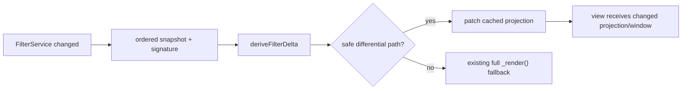

# U121-013 + U121-012 — Generic highlight contract and differential Files filtering

## Decision

Implement U121-013/#47 before U121-012/#63 as one vertical train on `claude/u121-029-panel-widget`.

U121-013 introduces a provider-neutral highlight projection and an explicit separation between stable node decoration and order/ancestry-dependent decoration.
U121-012 then consumes that separation to avoid the current unconditional full `_render()` after every Files filter change.

The train is scoped away from the six dirty U121-029 Navbar paths present when this spec was written: `navbarFilters.svelte`, `logicPanelWidgetOverflow.ts`, `styles.css`, `mobileCssSource.test.ts`, `navbarFiltersSource.test.ts`, and `panelWidgetRegressions.test.ts`.

## Verified baseline

### Filter evaluation is no longer the dominant defect

`FilterService.applyFilters()` already performs the BT5-088 P2 work:

- one vault-wide evaluation pass;
- markdown results derived as a subset;
- cached full basename order filtered in O(n);
- `changed` emitted only when result lists or the filter-state signature change.

The remaining cost begins at `FilesExplorerPanel._refreshFromFilterService()`:

```ts
this._sourceFiles = this._filesForCurrentScope();
this._currentFiles = this._sourceFiles;
// ...
this._render();
```

The tree render then rebuilds or recomputes sorting, folder times, hierarchy, time cells, rainbow folders, queue badges, the bubble index, folder expansion icons, glyph projection, index roots, and the virtual view projection.

### Existing incremental precedents

- U121-027 patches visible time/statistic cells through an invalidate → notify → patch pipeline and only reorders when the sort demands it.
- `_applyBubbleDots()` reprojects a cached activity index onto expansion state and touches carriers rather than rescanning the full tree in normal dot mode.
- Cached tree paths already exist for cell refresh, resort, and topology switching.

The differential filter path extends these patterns; it does not introduce a second renderer or a global cache.

## Definitions

### Filter result snapshot

A snapshot is the ordered visible file-path sequence plus a filter-state signature.
The ordered sequence is authoritative for membership and order; the signature distinguishes semantic changes whose membership happens to be identical.

### Filter delta

Given previous and next snapshots:

- `entered`: paths present only in next;
- `exited`: paths present only in previous;
- `retained`: paths in both;
- `orderChanged`: retained relative order differs;
- `stateOnly`: signature changed while membership and order did not.

The delta helper is DOM-free, deterministic, and O(previous + next).

### Stable decoration

Stable decoration depends on node identity and stable external revisions, not on its current position, ancestor visibility, or sibling rank:

- resolved base icon and plugin icon override;
- absolute/relative time text for a given timestamp revision;
- name/path label for a given label-mode revision;
- provider-neutral highlight state attached to the node/glyph.

Stable does not mean immutable forever; each cached value carries the minimal revision/signature required to invalidate it.

### Projection decoration

Projection decoration depends on ordering, topology, expansion, ancestry, or queue placement:

- positional rainbow bucket and inherited branch colour;
- bubble dots and inherited collapsed badges;
- queue-derived operation badges and delete state;
- folder open/closed icon;
- virtual/index roots and row positions.

These are recomputed only for affected sibling scopes or ancestor chains when that can be proven correct; otherwise the path deliberately falls back to the existing full render.

## U121-013 — provider-neutral highlight contract

Introduce a pure contract shaped around independent channels rather than one mutually exclusive enum:

```ts
interface ExplorerCellHighlight {
  hover: boolean;
  inclusive: boolean;
  exclusive: boolean;
  deletion: boolean;
}
```

The resolved projection additionally carries semantic CSS classes/tokens, but operation badges remain separate data.
Deletion may coexist with inclusive/exclusive state; hover is ephemeral and must not invalidate cached structural decoration.

Required invariants:

1. The contract contains no Files-, Props-, Tags-, or Text-specific identifiers.
2. Glyph consumers receive the resolved highlight through the shared node/cell projection.
3. Status bubble dots are not operation badges and never replace them.
4. A collapsed parent exposes at most two status dots, ordered before operation badges.
5. An exclusive-state transition invalidates the affected status projection even when filtered membership is unchanged.
6. Existing queue badges and delete styling keep their current meaning.

The first consumer is Files, but tests instantiate at least one non-Files provider-shaped node to prove the contract is generic.

## U121-012 — differential filter refresh

### Data flow



### Safe differential path

Start with the flat Files tree because it has no synthetic folder ancestry and its ordered rows map one-to-one to files.
For a filter transition:

1. Derive the delta from the previous and next ordered file paths.
2. Reuse retained `TreeNode<FileMeta>` instances and their valid stable decoration.
3. Create stable nodes only for `entered` paths.
4. Drop `exited` nodes from the projection and selection/index state where required.
5. Recompute projection decoration for the next ordered sequence.
6. Render the updated node array through the existing virtual view contract.

This removes hierarchy construction and stable per-node decoration for retained nodes while preserving one authoritative renderer.

### Nested Files path

Nested filtering changes folder existence, rebasing, sparse-root auto-expansion, ancestor chains, rainbow top-level buckets, and bubbled activity.
The initial implementation may use the full-render fallback for nested mode unless a focused test proves a subtree splice preserves all of those invariants.

This is an intentional tracer-bullet boundary, not a claim that the acceptance criterion is met for nested mode.
The issue closes only after nested mode also avoids rebuilding unaffected subtrees or benchmark evidence shows another cost dominates and the dev accepts a revised criterion.

### Table and grid

Table and grid already receive ordered file arrays and own virtualization/layout state.
They must expose or adopt an update contract that distinguishes membership/order changes from cell-only changes.
Do not reach into their DOM from `FilesExplorerPanel`.
If a view lacks a safe incremental method, retain its full render temporarily and keep the issue open.

### Fallback conditions

Use the current full `_render()` when any of these change:

- view mode or topology;
- sort definition outside the filter-produced basename baseline;
- folder rebase scope;
- visible cell schema or cell activation order;
- a setting revision that changes node shape;
- an unknown or incomplete previous snapshot;
- empty-state boundary until explicitly characterized;
- any invariant assertion fails in development.

Fallback is correctness infrastructure, not an error.

## Interaction with active work

### U121-027

The stable-decoration cache must reuse, not bypass, the live-cell patch pipeline.
Time/statistic revisions invalidate only their cells; they do not invalidate the filter snapshot.

### U121-001–004 and U121-029

No panelWidget projection, Navbar renderer, overflow logic, Scene action port, or current dirty Navbar path changes in this train.
Filter counts may continue to feed Navbar state through the existing port.

### U121-016/017/019

Text lifecycle, native search adapter, result rendering, and Has/Hasn't state remain out of scope.
Their inclusion/exclusion semantics contribute test cases only.
No state or adapter is shared between Text and Files.

### U121-010

Glyph colour remains an input to stable/projection decoration according to its actual dependency.
Positional rainbow colours are projection-dependent and must never be memoized as identity-only decoration.

## Performance evidence

Add counters/timings that report at minimum:

- previous/next result counts;
- entered/exited/retained counts;
- stable nodes reused/created;
- projection nodes recomputed;
- whether fallback occurred and why;
- total filter refresh duration;
- view render duration.

Benchmark narrow, broaden, exclusion, and state-only transitions on the registered large vault using explicit `vault=plugin-dev` or the named stress vault.
Compare the same branch, toolchain, view, topology, sort, and warm/cold state before and after.

Success requires both:

- structural evidence that retained stable nodes are not rebuilt;
- live evidence of reduced main-thread work without changed output.

No fixed millisecond target is invented before the baseline is captured.

## Test strategy

1. Pure RED tests for delta derivation: identical, narrow, broaden, exclusion, reorder, and state-only transitions.
2. Pure RED tests for independent highlight channels and status/operation badge coexistence.
3. Host-level RED tests proving a flat Files filter transition reuses retained nodes and does not call the full render path.
4. Regression tests for rainbow reorder, queue deletion, collapsed parent dots, selection, active reveal, and empty-state boundaries.
5. Characterization tests before changing table, grid, or nested tree behavior.
6. Large-vault benchmark and live smoke after automated gates.

## Adversarial pass

### Degenerate and roadmap scenarios

- A filter produces the same paths but flips inclusive → exclusive: membership delta is empty, but highlight/status projection must update through the state signature.
- A rename or move changes identity between snapshots: it is an exit + enter unless the file event supplies an explicit identity migration.
- A top-level insertion shifts every positional rainbow bucket: projection decoration may require a full sibling-scope pass even though stable nodes are reused.
- A collapsed folder loses its only matching descendant: ancestor visibility and bubble carriers change; patching only the leaf is incorrect.
- Queue operations arrive during a filter refresh: queue revision mismatch forces projection recomputation or fallback.
- A time-sorted view receives mtime updates concurrently: U121-027 owns reorder; the filter patch must not overwrite its newer ordering snapshot.
- Third-party icon providers change their revision: cached stable icon decoration must invalidate without a filter change.
- A future provider adopts the contract: it must supply projection inputs without importing `FilesExplorerPanel`.

### SOLID/readability check

- Delta derivation is a pure module with one responsibility.
- Highlight resolution is a provider-neutral pure module.
- Files orchestration owns fallback selection but not view DOM internals.
- Views receive explicit projection/update contracts.
- Cache entries expose their revision dependencies; no opaque `Map<string, any>` is allowed.

### Explicit losses and non-goals

- The first tracer slice does not accelerate nested, table, and grid simultaneously.
- Retaining node instances increases memory retention; cache lifetime is panel-local and bounded by current/previous projection, not the vault history.
- Differential rendering adds branch complexity; the full-render fallback and equivalence tests are mandatory.
- No debounce is added because callers require synchronous filtered results.
- No generic cross-provider renderer, global registry, or Text/Files shared reactive state.
- No performance claim is accepted from unit tests alone.

## Acceptance and closure

U121-013 closes when the generic contract, glyph consumption, exclusive invalidation, two-dot cap, and badge coexistence pass across provider-shaped tests.

U121-012 closes only when narrow, broaden, and exclusion transitions avoid rebuilding unaffected Files rows in every production-selectable Files view/topology included by its public acceptance criteria, output equivalence is proven, and a large-vault benchmark records reduced work.

If implementation lands only the flat-tree tracer, record it as partial and keep #63 open.
