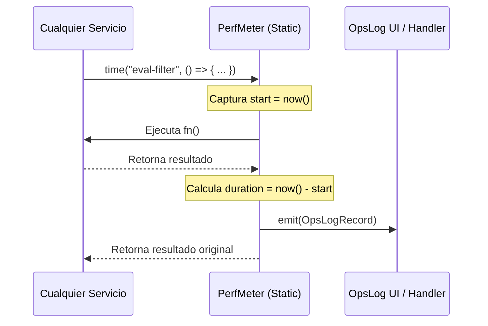
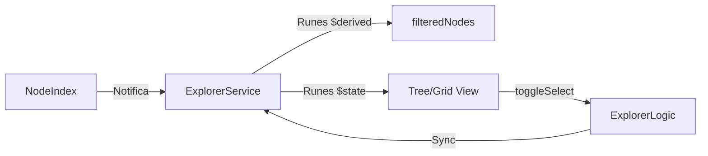
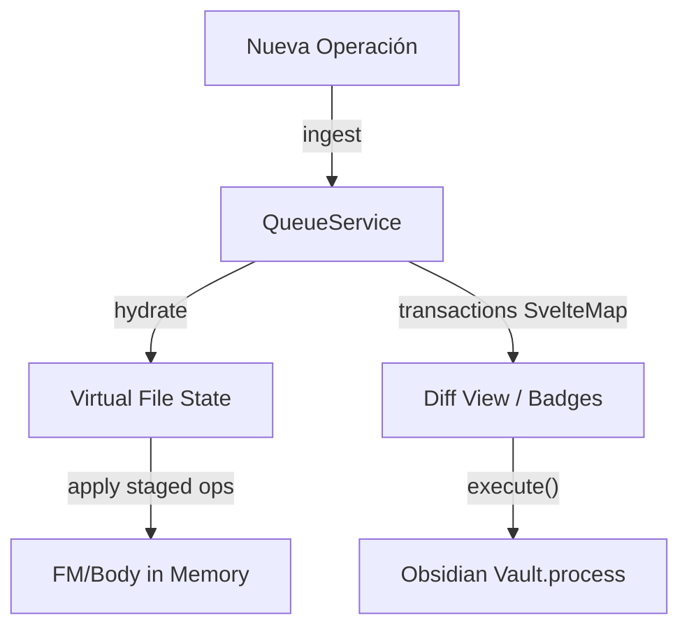
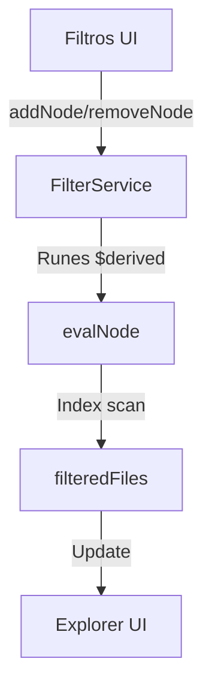

# Batch 2: Servicios Core y Reactividad

## `src/services/perfMeter.ts` - Instrumentación Transversal de Rendimiento

### Propósito
Provee un mecanismo estático y centralizado para medir la latencia de operaciones tanto síncronas como asíncronas en todo el codebase. Su diseño desacopla la medición del reporte, emitiendo registros (`OpsLogRecord`) a suscriptores (como `serviceOpsLog`) sin añadir dependencias circulares. Es vital para mantener la promesa de rendimiento de Vaultman durante operaciones masivas.

### Dependencias
- **IN**: Ninguna. Usa APIs nativas del navegador (`performance.now`, `Date.now`).
- **OUT**: Define tipos de contrato (`OpsLogKind`, `OpsLogRecord`) consumidos por el sistema de logs y auditoría de la UI.

### Flujo de datos

### Issues/Mejoras
- **Globalidad Estática**: Al ser una clase estática, es difícil de testear en aislamiento sin resetear manualmente el estado (`__resetForTests`).
- **Sobrecarga de Eventos**: Emite un registro por cada micro-operación. Podría inundar la memoria si el manejador de logs no tiene una política de retención agresiva.

---

## `src/services/serviceExplorer.svelte.ts` - Motor de Navegación Reactivo

### Propósito
Gestiona el estado de navegación de los exploradores de nodos (Tree, Grid, Table). Utiliza **Svelte 5 Runes** para derivar automáticamente qué nodos deben mostrarse basados en la búsqueda. Implementa la interfaz `IExplorer` y delega la persistencia de la selección a `ExplorerLogic`.

### Dependencias
- **IN**: `ExplorerLogic`, `INodeIndex`, `IDecorationManager`.
- **OUT**: Consumido por `panelExplorer.svelte` y todas las vistas de nodos.

### Flujo de datos

### Issues/Mejoras
- **Reactividad de Filtro**: `filteredNodes` se recalcula cada vez que `search` cambia. Para vaults gigantes, esto debería estar de-bounced.

---

## `src/services/serviceQueue.svelte.ts` - Sistema de Archivo Virtual (VFS) y Cola Atómica

### Propósito
Gestiona una "Capa de Transacción" sobre el sistema de archivos de Obsidian. Permite encolar cambios sin aplicarlos a disco inmediatamente, permitiendo previsualizaciones reactivas en tiempo real mediante un **VFS (Virtual File State)**.

### Dependencias
- **IN**: Obsidian API (`Vault`, `MetadataCache`, `FileManager`), `serviceMessage`, `PerfMeter`.
- **OUT**: Implementa `IOperationQueue`. Expone `transactions` (SvelteMap) a la UI.

### Flujo de datos

### Issues/Mejoras
- **Parseo de YAML**: Utiliza `splitYamlBody` manual. Los bloques de código con `---` pueden causar falsos positivos.
- **Race Conditions**: La hidratación concurrente de miles de archivos puede presionar la memoria. Se beneficiaría de paginación en la UI.

---

## `src/services/serviceFilter.svelte.ts` - Motor de Filtrado Lógico

### Propósito
Gestiona el árbol de filtros dinámicos (`FilterGroup`). Procesa la lógica de inclusión/exclusión de archivos basada en reglas de metadatos, etiquetas y rutas. Es el "cerebro" detrás de la búsqueda avanzada.

### Dependencias
- **IN**: `IFilesIndex`, `evalNode` (util), `PerfMeter`.
- **OUT**: `filteredFiles` (derivado reactivo).

### Flujo de datos

### Issues/Mejoras
- **Complejidad O(n)**: El filtrado recorre el índice en cada cambio. Se han añadido probes de rendimiento, pero para reglas muy complejas se podría cachear el resultado de ramas del árbol de filtros.
