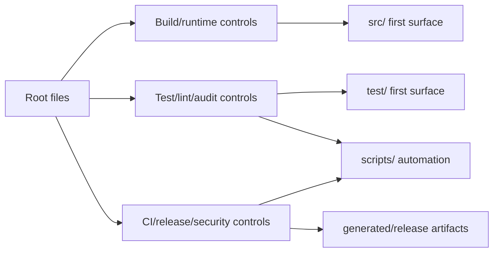

# Root Surface Layer

## Scope

This phase maps root files and root directories, then connects them to the first visible surfaces of `src/`, `test/`, and `scripts/`. It does not claim to cover internal module-by-module flow inside those directories; that belongs to later phases.

## Shards

- [[01a-root-inventory|01a-root-inventory]]: root files, root directories, and first-level source/test/script surfaces.
- [[01b-root-flows|01b-root-flows]]: package scripts, build/runtime, tests, scripts, CI/security, and next-layer recommendation.

## Root Layer Map

## Key Findings

- `package.json` is the root orchestrator. Most root files are inputs to its scripts or to GitHub workflows that call those scripts.
- `vite.config.ts` is the build boundary. It reaches `src/pluginEntry.ts`, `src/main.ts`, and `src/main.scss` before anything else.
- `vitest.config.ts` is the test boundary. It routes unit, component, and integration tests and aliases Obsidian to `test/helpers/obsidian-mocks.ts`.
- `.github/` plus `codeql/` form a security/release layer that extends local verification with CodeQL, Scorecard, SBOM, attestation, and release bundles.
- `main.js` and `styles.css` are generated root artifacts, not source of truth.
- `.agents/` is an agent workflow layer for this branch, not product runtime.

## Visual

- [[visuals/phase-01-root-surface.canvas|Phase 01 root surface canvas]]
