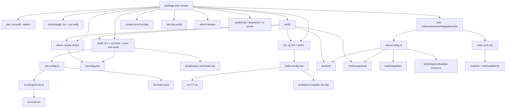
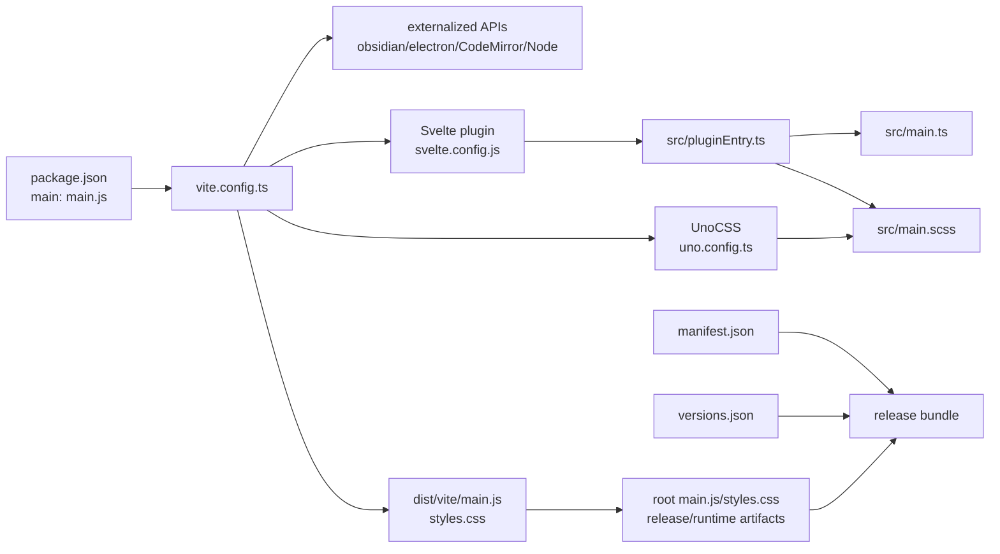
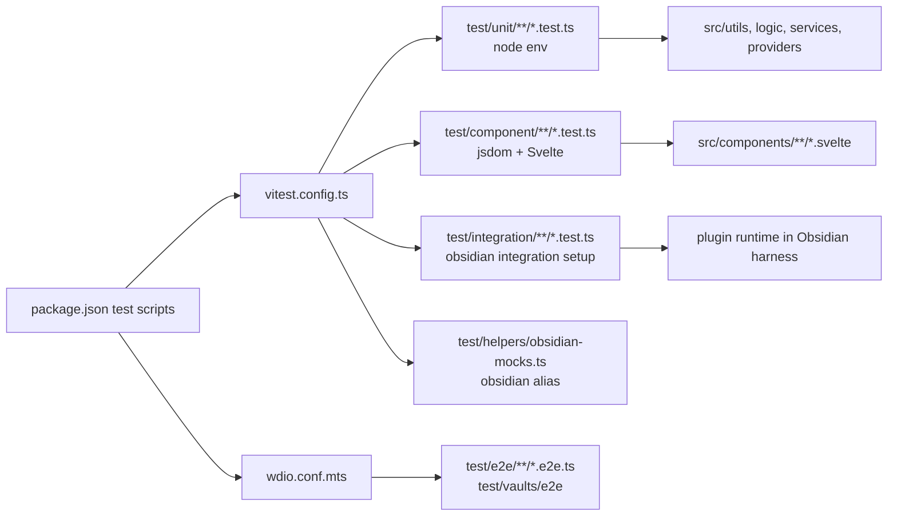

# Root Flows

## Package Script Flow

## Build And Runtime Surface

Root build control is concentrated in `package.json`, `vite.config.ts`, `svelte.config.js`, `uno.config.ts`, and `tsconfig.json`. The source surface it touches first is `src/pluginEntry.ts`, then `src/main.ts` and `src/main.scss`.

## Test Surface

`vitest.config.ts` is the root switchboard for fast verification. It separates node unit tests, browser-like Svelte component tests, and Obsidian integration tests. The e2e layer is separate through WDIO.

## Scripts Surface

| Script | Called by | Root-to-surface role |
| --- | --- | --- |
| `scripts/sync-test-build.mjs` | `pnpm build` | Syncs built plugin artifacts after `vp build` for local test/development target. |
| `scripts/run-explorer-scroll-smoke.mjs` | `smoke:scroll`, `smoke:scroll:stress` | Drives Obsidian CLI/perf smoke for Explorer scroll behavior. |
| `scripts/security-audit.mjs` | `security:audit`, CI, release | Runs prod/dev dependency audit gates. |
| `scripts/generate-release-sbom.mjs` | `sbom:release`, release workflow | Generates release SBOM. |
| `scripts/no-mutable-vfs.mjs` | `eslint.config.mts` | Local lint rule preventing unsafe mutable VFS patterns in `src/**/*.ts`. |

## CI And Security Surface

```mermaid
flowchart TD
  github[".github/workflows"] --> ci["ci.yml"]
  github --> codeqlWf["codeql.yml"]
  github --> releaseWf["release.yml"]
  github --> scorecard["scorecard.yml"]
  github --> dependabot["dependabot.yml"]

  ci --> install["vp install"]
  ci --> audit["vp run security:audit"]
  ci --> lint["vp run lint"]
  ci --> check["vp run check"]
  ci --> build["vp run build"]
  ci --> cover["vp run test:cover"]

  codeqlWf --> codeqlConfig[".github/codeql/codeql-config.yml"]
  codeqlWf --> codeqlQueries["codeql/queries/javascript/vaultman"]
  codeqlWf --> codeqlTests["codeql/tests/javascript/vaultman"]

  releaseWf --> verify["vp run verify"]
  releaseWf --> buildPlugin["vp run build:plugin"]
  releaseWf --> sbom["vp run sbom:release"]
  releaseWf --> assets["dist/release/main.js\nstyles.css\nmanifest.json"]

  scorecard --> sarif["Scorecard SARIF upload"]
  dependabot --> deps["npm + GitHub Actions updates"]
```

The root CI layer is intentionally not just a mirror of local commands. It adds security audit, CodeQL query tests, Scorecard, release attestation, checksums, and SBOM generation.

## Next Layer Recommendation

Map `src/pluginEntry.ts`, `src/main.ts`, `src/main.scss`, and the first-level runtime directories next. That should define the trunk that later canvases can attach to:

- `src/components/` UI surface.
- `src/services/`, `providers/`, `registry/` behavior surface.
- `src/types/`, `config/`, `settingsVM.ts` contract surface.
- `src/dev/` smoke/perf hooks.
