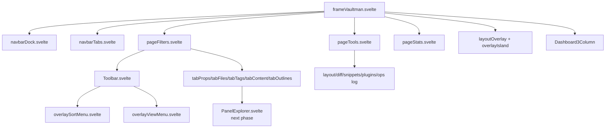

# Phase 04 - Layout And Pages Layer

This phase maps the component layer immediately below `src/components/frame/`.
It explains how the frame's primitive state becomes visible navigation, toolbar controls, popups, page tabs, explorer panels, statistics, and tools.

## Files In This Phase

| Area | Files | Role |
|---|---|---|
| Navigation | `navbarDock.svelte`, `navbarTabs.svelte` | Generic dock/top-tab renderers for frame pages and filter/tool tabs. |
| Toolbar | `Toolbar.svelte`, `overlaySortMenu.svelte`, `overlayViewMenu.svelte` | Filter-page command surface: view, sort, search/FnR, crear, fields, scope, DnD, hidden/selected toggles. |
| Popups | `layoutOverlay.svelte`, `overlayIsland.svelte`, `popupFilters.svelte`, `popupMove.svelte`, `tabViewMenuDetach.svelte` | Modal/popup shells and island content. |
| Pages | `pageFilters.svelte`, `pageTools.svelte`, `pageStats.svelte` | Main page surfaces rendered by the frame. |
| Page tabs | `tabFiles`, `tabProps`, `tabTags`, `tabContent`, `tabOutlines`, `tabPlugins`, `tabSnippets`, `tabLinter` | Explorer/provider-specific page content. |
| Dashboard | `Dashboard3Column.svelte` | Optional three-column composition used by the frame. |
| Styles | `src/styles/nav/*`, `src/styles/popup/*`, `src/styles/data/_filters.scss`, `src/styles/explorer/_explorer.scss` | Visual layout, toolbar, dock, tab, popup, and search island rules. |

## Layer Map

## Key Conclusion

The toolbar is not a frame-wide primitive yet. It is mounted by `pageFilters.svelte`, while `navbarDock.svelte` and `navbarTabs.svelte` are the generic navigation surfaces. This means the safe path for restoring the old navbar feel is presentation-first inside `Toolbar.svelte` plus its SCSS, while leaving `frameVaultman.svelte` and `pageFilters.svelte` state wiring intact.

## Shards

- `04a-layout-navigation-toolbar.md` - navigation, toolbar, overlays, and styles.
- `04b-page-surfaces.md` - page components and tab/provider delegation.
- `04c-toolbar-navbar-recovery-path.md` - concrete restoration guidance for the toolbar/navbar regression.

## Canvas

- `visuals/phase-04-layout-pages.canvas`

## Next Layer

Phase 05 should map `src/components/containers/`, `src/providers/`, and `src/components/views/` together. Phase 04 shows that most page tabs delegate their actual explorer body to `PanelExplorer` plus provider classes, so those files are the next meaningful dependency layer.
