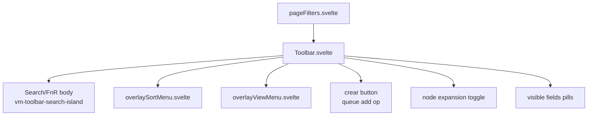

# Phase 04a - Layout Navigation Toolbar

## Navigation Components

| File | Contract | Important Behavior |
|---|---|---|
| `navbarDock.svelte` | `items`, `active`, left/right `FabDef`, labels, drawer mode, reorder callbacks, external tab IDs. | Renders bottom dock or drawer; wraps side FABs with `PrimitiveFab`; blocks active mutation for external mounted tabs. |
| `navbarTabs.svelte` | `tabs`, `active`, labels, disabled/faint/external IDs, `onSelect`. | Generic top tab bar; used by filters and tools pages; external tabs route through `onSelect` without local activation. |
| `GridNavigationToolbar.svelte` | breadcrumb path and back/forward/up/refresh callbacks. | Local grid navigation toolbar, not the frame/navbar toolbar. |

`navbarDock.svelte` is the true generic bottom-navigation surface. It receives primitive definitions from the frame and renders them with the dock pill, labels, side FABs, drawer presentation, and page reorder gestures.

## Toolbar Component

`Toolbar.svelte` is mounted by `pageFilters.svelte`, not by the frame. Its prop surface includes search state, sort state, view mode, add mode, operation scope, selected/hidden file toggles, manual DnD, FnR state/service, node expansion, visible node fields, crear callback, and mouse gesture config.

The current DOM order in header mode is:

1. Optional `crear` button when an `FnRIslandService` is present.
2. `.vm-toolbar-menu-min` containing view, sort, search/FnR popover, and node-expansion buttons.
3. The search/FnR body rendered inside `VmPopover` or as an absolute island/takeover.

## Toolbar Popups

| Popup | Source | State Mutated |
|---|---|---|
| Sort | `overlaySortMenu.svelte` | `sortBy`, `sortDir`, `sortTarget`, `operationScope`, file hidden/selected toggles, manual DnD. |
| View | `overlayViewMenu.svelte` | `viewMode`, `addMode`, visible field pills. |
| Search/FnR | `Toolbar.svelte` body + `FnRIslandService` | query, mode, flags, rename handoff, crear, history, help links. |

`overlaySortMenu.svelte` defines tab-specific sort options and keeps a vertical side column for files/props/tags toggles. `overlayViewMenu.svelte` derives selectable modes from `EXPLORER_PLATFORM_VIEW_MODES`, so hidden modes such as Markmap are not reintroduced by the menu surface.

## Popup Shells

`layoutOverlay.svelte` switches between active-filters, scope, search, and move popups. `overlayIsland.svelte` renders an overlay stack from `IOverlayState`.
`popupFilters.svelte` owns clear/template/toggle/delete active-filter actions, and `popupMove.svelte` owns the move target input plus preview rows.

## Style Sources

| Style File | Surface |
|---|---|
| `src/styles/nav/_v3-nav.scss` | bottom nav, dock pill, nav icons, filters top navbar. |
| `src/styles/nav/_tab-bar.scss` | top tab bar, tab item states, tab content stacking. |
| `src/styles/data/_filters.scss` | filters top navbar and search pill. |
| `src/styles/explorer/_explorer.scss` | toolbar takeover, minimal right-side toolbar cluster, search island positioning. |
| `src/styles/popup/_sort-popup.scss` | sort popup rows, vertical column, squircles. |
| `src/styles/popup/_viewmode-popup.scss` | view popup rows, circle buttons, field pills. |
| `src/styles/popup/_islands.scss` | popup island shell, queue/filter island bodies, squircle buttons, FAB badges. |

## Style Evidence

- `.vm-navbar-filters` is sticky, centered, and capped at `520px`.
- `.vm-filters-header` is a flex row with small gaps and padding.
- `.vm-toolbar-menu-min` is an inline-flex cluster with `margin-left: auto`, which pushes view/sort/search/expand controls to the right side.
- `.vm-toolbar-search-island` is absolutely positioned below the toolbar with left/right `8px`, border, radius `12px`, backdrop blur, and shadow.
- `.vm-filters-crear` appears in markup and takeover selectors, but no direct base style was found in the inspected SCSS hits.

## Risk Notes

- Moving toolbar state into the frame would increase blast radius; presentation changes should start in `Toolbar.svelte` and SCSS.
- Hiding toolbar controls with `display: none` risks layout measurement churn;
  existing comments intentionally use opacity/pointer-events during takeover.
- The generic dock/tab components must preserve external tab behavior, because detached leaves depend on not locally activating externally mounted tabs.
