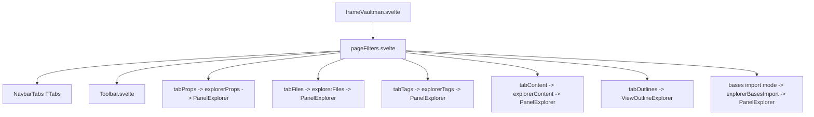
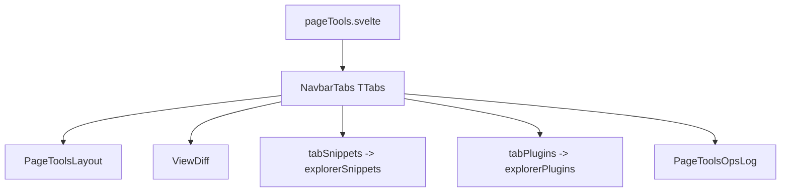

# Phase 04b - Page Surfaces

## Page-Level Components

| File | Responsibility | Main Dependencies |
|---|---|---|
| `pageFilters.svelte` | Owns filters tabs, toolbar state, FnR island service, base import mode, field visibility, node expansion commands. | `Toolbar`, `NavbarTabs`, filter tab components, `PanelExplorer`, filter/FnR/Bases services. |
| `pageTools.svelte` | Owns tools tabs and routes layout/diff/snippets/plugins/ops-log panels. | `NavbarTabs`, `PageToolsLayout`, `ViewDiff`, snippets/plugins tabs, ops log service. |
| `pageStats.svelte` | Shows vault/filter/selection stats or renders a selected note preview. | Obsidian `MarkdownRenderer`, metadata cache, vault, filter service, property index. |
| `Dashboard3Column.svelte` | Renders filters/explorer/addons snippets as 3 columns or one-column fallback. | Snippets from `frameVaultman.svelte`, `ThemeService`. |

## Filters Page Flow

`pageFilters.svelte` is the state bridge between the frame and actual explorer tabs. It creates a panel-scoped `FnRIslandService`, exposes command hooks for view/sort/content-search, resolves operation-scope files, queues crear/FnR changes, and forwards all active search/sort/view/field/expansion state into the selected tab.

## Filter Tabs

| Tab | Provider/View | Notable Behavior |
|---|---|---|
| `tabProps.svelte` | `explorerProps` + `PanelExplorer` | Supports rename handoff and prop-set island. |
| `tabFiles.svelte` | `explorerFiles` + `PanelExplorer` | Owns file provider creation and selected file set binding. |
| `tabTags.svelte` | `explorerTags` + `PanelExplorer` | Supports rename handoff and provider cleanup. |
| `tabContent.svelte` | `explorerContent` + `PanelExplorer` | Owns content FnR UI, content index subscription, queued replace. |
| `tabOutlines.svelte` | `ViewOutlineExplorer` | Builds outline from active file and reloads on active leaf/file-open events. |

`PanelExplorer.svelte` is the repeated downstream body for most tabs and should be mapped in the next phase instead of being flattened into this one.

## Tools Page Flow

`PageToolsLayout` embeds the menu curator panel and leaf-detach controls.
`PageToolsOpsLog` subscribes to `OpsLogService`, filters by kind/label, and renders a table-like operation log.

## Stats Page Flow

`pageStats.svelte` derives counts from vault folders, markdown files, filtered or selected files, property index entries, and metadata cache tags. When `previewFile` is present it renders the note through Obsidian `MarkdownRenderer`, tracks a serial to discard stale renders, and unloads the render component on destroy.

## Dashboard Edge

`Dashboard3Column.svelte` does not own data. It renders snippets provided by the frame into filters, explorer, and addons columns. The dashboard is a layout mode, not a separate state source.

## Risk Notes

- `pageFilters.svelte` is the highest-risk page file because it owns command hooks, FnR service exposure, bases import flow, node expansion state, and toolbar bindings.
- `tabContent.svelte` has its own content FnR UI as well as toolbar-driven content search. Toolbar changes must preserve both paths.
- `pageStats.svelte` performs metadata iteration in an effect; large-vault stats changes should stay cautious about blocking work.
