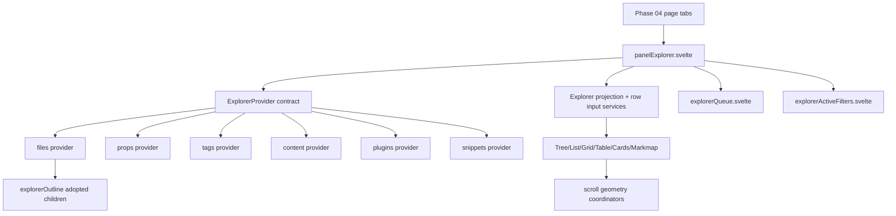

# Phase 05 - Containers Providers Views Layer

This phase maps the explorer composition layer below the layout/page tabs.
Phase 04 showed that Filters page tabs delegate their body to `PanelExplorer.svelte`; this layer shows how that panel turns provider data into Tree, List, Grid, Table, Cards, Markmap, queue, active-filter, and diff views.

## Files In This Phase

| Area | Files | Role |
|---|---|---|
| Main container | `src/components/containers/panelExplorer.svelte` | Orchestrates provider state, refresh, selection, projections, scroll reveal, queue actions, and view selection. |
| Auxiliary containers | `explorerQueue.svelte`, `explorerActiveFilters.svelte`, `explorerBasesImport.ts`, `panelCurator.ts` | Popup/body containers for queue, active filters, Bases import, and context menu curation. |
| Compatibility shims | `explorerContent.ts`, `explorerFiles.ts`, `explorerPlugins.ts`, `explorerProps.ts`, `explorerSnippets.ts`, `explorerTags.ts` under `components/containers/` | Re-export provider modules from old component paths. |
| Providers | `src/providers/explorerFiles.ts`, `explorerProps.ts`, `explorerTags.ts`, `explorerContent.ts`, `explorerPlugins.ts`, `explorerSnippets.ts`, `explorerOutline.ts` | Data/action adapters behind the `ExplorerProvider` contract. |
| Views | `ViewTree`, `ViewNodeList`, `ViewNodeGrid`, `ViewNodeTable`, `ViewNodeCards`, `ViewMarkmap`, diff, outline, empty, badge helpers | Render provider projections with selection, focus, badges, virtualization, keyboard, and context actions. |
| Contracts | `typeExplorer`, `typeExplorerDataPlane`, projection/row/table/scroll services | Shared shape for provider snapshots, row inputs, projections, columns, and scroll geometry. |

## Layer Map

## Key Conclusion

`PanelExplorer.svelte` is the narrow waist of the explorer system. Providers own domain reads and actions; views own rendering, keyboard, focus, scroll, and badges; services in `src/services/` translate between those two planes. That makes the next architectural layer `src/services/`, `src/logic/`, `src/registry/`, `src/utils/`, and `src/types/`, because phase 05 repeatedly crosses those contracts.

## Shards

- `05a-panel-explorer-orchestrator.md` - `PanelExplorer` state, flows, and auxiliary containers.
- `05b-explorer-providers.md` - provider responsibilities and provider-to-service edges.
- `05c-view-adapters-and-contracts.md` - rendered views, virtual scroll, row input, table, diff, and badge adapters.

## Canvas

- `visuals/phase-05-containers-providers-views.canvas`

## Next Layer

Phase 06 should map service and contract modules together: `src/services/`, `src/logic/`, `src/registry/`, `src/utils/`, and `src/types/`. Phase 05 depends on those modules for projection, snapshots, queue operations, filter indexes, selection, measurement, context menus, and provider logic.
