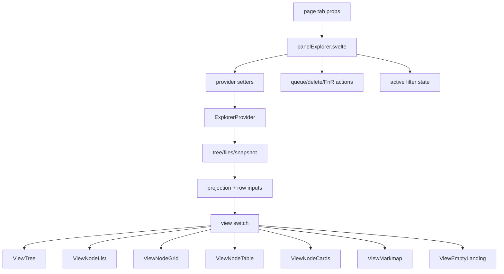

# Phase 05a - Panel Explorer Orchestrator

## Main Container

`panelExplorer.svelte` receives the active provider, selected view mode, search state, sort state, add mode, scope toggles, selected files, visible fields, node expansion commands, and plugin services from the page/tab layer. It is the first place where page state becomes concrete explorer rows.

| Responsibility | Evidence |
|---|---|
| Provider synchronization | Calls provider setters for search, sort, sort target, view mode, add mode, selected-only, and hidden-file toggles. |
| Data refresh | Reads `provider.getTree()`, `provider.getFiles()`, and provider snapshots; subscribes to provider and index changes. |
| Projection | Builds tree/list projections through `createExplorerProjection` and row adapters. |
| Selection and focus | Uses `NodeSelectionService`, selected maps, focused node IDs, visible IDs, and document/Escape clearing. |
| Reveal and scroll | Consumes scroll targets and node expansion command serials, then passes reveal state to views. |
| View routing | Renders Tree, Grid, Cards, Markmap, List, Table, or empty state based on `viewMode` and provider data. |
| Actions | Routes node click, secondary action, context menu, hover badges, delete, open note, and manual DnD. |

## Flow

## Important Runtime Edges

- The files provider is special: when `provider.id === "files"` and the provider exposes `getSnapshot`, `PanelExplorer` publishes an explorer data plane snapshot.
- Table view is adapter-backed: `PanelExplorer` derives table rows from tree nodes and table columns from `nodeTableColumnsForProvider(provider.id, visibleFields)`.
- Grid view carries extra hierarchy state: current grid parent, path, back and forward stacks, and folder/inline hierarchy mode from settings.
- Selection is pruned against visible node IDs, so provider refreshes cannot keep stale selected nodes alive.
- Context menu calls include selected nodes, which lets provider actions operate on the current multi-selection when available.

## Auxiliary Containers

| File | Role |
|---|---|
| `explorerQueue.svelte` | Queue popup body. Groups queued changes, renders them through `ViewNodeList`, exposes clear, mark, diff, and execute controls. |
| `explorerActiveFilters.svelte` | Active-filter popup body. Renders active filter tree through `ViewNodeList`, supports clear/search reset, selected-file normalization, logic groups, import/export, and drag reorder. |
| `explorerBasesImport.ts` | Temporary provider for Bases import targets. Selection of a target node calls `onImportTarget`. |
| `panelCurator.ts` | Obsidian `Component` that edits context-menu hide rules, rule toggles, and saved settings. |
| `explorer*.ts` shims | Compatibility re-exports from `src/components/containers/` to `src/providers/`, preserving older imports while provider code lives in `src/providers/`. |

## Risk Notes

- `PanelExplorer` has high coordination load. Changing provider contracts or projection services without checking all view modes risks cross-view breakage.
- The files provider snapshot path is conditional and easy to bypass. Any data plane refactor must keep the `files` provider publication path explicit.
- Queue and active-filter containers reuse `ViewNodeList`; list-view changes can affect popup surfaces, not just the main explorer.
