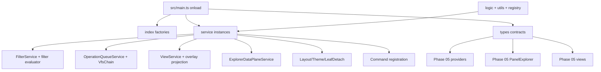

# Phase 06 - Services Types Logic Layer

This phase maps the shared contract and service layer used by the runtime spine, frame, pages, providers, and rendered explorer views. Phase 05 showed repeated edges from `PanelExplorer`, providers, and views into projection, snapshot, queue, filter, selection, context-menu, operation-scope, and scroll geometry modules; this layer makes those shared modules explicit.

## Files In This Phase

| Area | Count | Role |
|---|---:|---|
| `src/services/` | 67 | Stateful services, pure service adapters, UI model builders, queue/FnR/diff/DnD/theme/layout/measurement helpers. |
| `src/types/` | 22 | Public contracts for nodes, indexes, settings, views, operations, explorer snapshots, tabs, theme presets, and Obsidian internals. |
| `src/logic/` | 6 | Pure or mostly pure tree, snapshot, keyboard, and provider-domain logic. |
| `src/registry/` | 2 | Static registries for detachable tabs and explorer add operation builders. |
| `src/utils/` | 9 | Small pure utilities plus Obsidian suggestion/modal helpers. |

Full file inventory with line counts is in `06d-phase-06-inventory.md`.

## Runtime Flow

## Main Initialization Spine

`src/main.ts` is the concrete service composition root. In `onload()`, it:

- Loads settings, hydrates `ThemeService`, and starts ops-log/perf marks.
- Creates file/tag/prop indexes first, then registers debounced metadata and vault refresh hooks.
- Creates `FilterService`, `OperationQueueService`, `ExplorerDataPlaneService`, content/operations/active-filters/snippets/plugins/templates indexes, overlay state, decoration, view, icons, property types, context menu, node binding, and native surface binding.
- Registers the main frame view and every detachable tab view using `tabRegistry`.
- Creates `LeafDetachService`, loads persisted independent leaf state, then restores detached leaves after Obsidian layout replay.
- Registers legacy and canonical queue commands plus the quick-command set.

## Layer Boundary

The safest mental model is:

- `src/types/` describes contracts and settings.
- `src/logic/`, `src/registry/`, and most `src/utils/` provide reusable rules.
- `src/services/` owns runtime state or state transitions.
- Components and providers from earlier phases should call services through these contracts instead of duplicating queue, filter, projection, selection, layout, or view-model logic.

## Shards

- `06a-service-spine.md` - runtime service composition and service families.
- `06b-operation-view-service-clusters.md` - queue/FnR/view/diff/DnD/explorer service clusters.
- `06c-contracts-logic-registry-utils.md` - contracts, logic, registries, and utils.
- `06d-phase-06-inventory.md` - complete file inventory for this phase.

## Canvas

- `visuals/phase-06-services-types-logic.canvas`

## Next Layer

Phase 07 should map `test/` because this service layer has many explicit test boundaries: commands, queue, diff, selection, scroll geometry, view contracts, layout, detach, FnR, and provider logic all need contract-level coverage.
