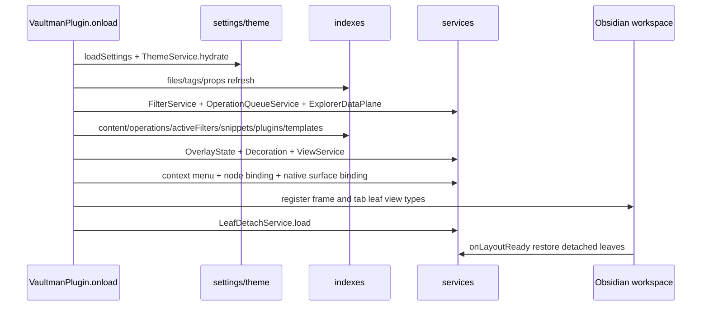

# Phase 06a - Service Spine

## Composition Root

`src/main.ts` composes this layer. The service order matters because later services depend on earlier indexes and settings.

## Service Families

| Family | Files | Runtime role |
|---|---|---|
| API/commands | `serviceAPI`, `serviceCommands` | Public read/plan/enqueue facade and Obsidian command registration. |
| Filters/index presentation | `serviceFilter`, `serviceActiveFilterPresentation`, `serviceGroups` | Active filter tree, filtered files, active-filter labels, logic groups, and popup row grouping. |
| Queue/operations | `serviceQueue`, `serviceVfsChain`, `serviceFileQueue`, `serviceTagQueue`, `serviceOperationScope`, `serviceQueuePresentation`, `serviceOpsLog`, `perfMeter` | Pending change staging, immutable snapshot chains, file/tag change builders, scope resolution, queue rows, and instrumentation. |
| View/explorer | `serviceViews`, `serviceExplorerDataPlane`, `serviceExplorerProjection`, `serviceExplorerRowInput`, `serviceExplorerScrollGeometry`, `serviceExplorerLayers`, `serviceExplorerViewContract`, `serviceViewTableAdapter` | Render models, snapshots, rows, projection maps, geometry, layer batching, selectable view modes, and table adapters. |
| Layout/theme/native | `serviceLayout`, `serviceTheme`, `serviceLeafDetach`, `serviceNavigation`, `serviceNativeSurfaceBinding`, `serviceNativeClickIntercept`, `servicePortalResolver`, `serviceFoulDetection` | Layout settings, CSS theme state, independent leaves, native bindings, portal/foul guardrails. |
| Interaction | `serviceMouse`, `serviceDnd`, `serviceManualDnd`, `serviceDndSvelteAdapter`, `serviceDndAliasAware`, `serviceSelection` | Mouse grammar, drag/drop state, adapter payloads, and selection authority. |
| Content helpers | `serviceFnR*`, `serviceDiff*`, `serviceBasesInterop`, `serviceNodeBinding`, `serviceTemplatesIndex` | Find/replace, templating, diffs, Bases import previews, binding notes, and templates index. |
| Measurement/style/media | `serviceTextMeasure`, `serviceNodeRowMeasure`, `serviceNodeRowStyle`, `serviceNodeCardLayout`, `serviceNodeCardStyle`, `serviceNodeFieldVisibility`, `serviceExplorerMediaCache`, `serviceViewSize`, `serviceIcons`, `serviceDecorate` | Row/card measurement, visible fields, media cache, size presets, icons, and decoration. |

## Contract Edges

`typeContracts.ts` defines index and service interfaces used by `main.ts`, providers, and UI services. `typeSettings.ts` pulls in layout, mouse gesture, operation-scope, and elastic UI contracts, so settings are not passive data:
they determine toolbar search mode, filter behavior, visible fields, operation scope, detached leaves, FnR defaults, layout, theme, and node gestures.

## Risks And Refactors

- `src/main.ts` is the only place where all service lifetimes are visible. New services should be wired there deliberately or through a small composition helper, not ad hoc inside components.
- `typeSettings.ts` imports service defaults. This is convenient but creates a contract-to-service dependency that should stay limited to constants/types.
- `serviceQueue.svelte.ts` remains the largest service and owns both mutable transactions and immutable chains. Any queue refactor should keep both paths visible until the strangler migration is complete.
