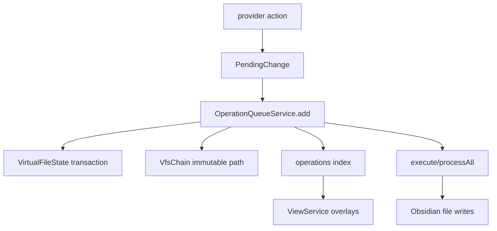

# Phase 06b - Operation View Service Clusters

## Queue And Operation Cluster

`OperationQueueService` stages `PendingChange` values into per-file virtual transactions. It exposes `pending`, `size`, `add`, `remove`, `clear`, `execute`, `processAll`, node-op bindings, conflict-aware delete requests, and immutable `VfsChain` helpers for diff/snapshot consumers.

Supporting builders are split by domain: `serviceFileQueue`, `serviceTagQueue`, `serviceFnR`, `serviceFnRPropSet`, and `explorerAddOps` create queueable changes, while `serviceOperationScope` resolves selected/filtered/auto file scope before those changes are created.

## View And Explorer Cluster

`ViewService` builds `ExplorerRenderModel` rows from nodes, decorations, selection snapshots, operation overlays, and active-filter overlays.
`serviceExplorerProjection`, `serviceExplorerRowInput`, and `serviceViewTableAdapter` bridge provider trees/snapshots into concrete view rows. `serviceExplorerScrollGeometry` supplies fixed and variable reveal geometry for virtualized views.

| Service | Consumed by | Role |
|---|---|---|
| `serviceViews` | providers, queue popup, active filters, `PanelExplorer` | Builds view rows, selection/focus state, actions, layers, and empty state. |
| `serviceOverlayProjection` | `ViewService` | Indexes queued operations and active filters into row layers. |
| `serviceExplorerLayers` | providers | Batch-projects view layers back onto explorer tree/projection rows. |
| `serviceExplorerDataPlane` | `PanelExplorer`, files provider | In-memory snapshot store with publish/clear/subscribe. |
| `serviceExplorerProjection` | `PanelExplorer`, views | Builds stable visible IDs, ID/index maps, media descriptors, and projection rows. |
| `serviceExplorerRowInput` | `PanelExplorer`, table/list/tree adapters | Normalizes snapshot rows, tree nodes, and view rows into one row input shape. |
| `serviceExplorerScrollGeometry` | Tree/List/Grid/Table/Cards | Fixed and variable scroll target resolution. |
| `serviceViewTableAdapter` | Table view path | Provider-specific table columns, rows, selection and sorting adapters. |

## Interaction And Measurement Cluster

`serviceSelection` owns selection authority; `logicKeyboard` provides pure pointer, keyboard, and box-selection transitions. `serviceMouse` maps click and modifier grammar to node actions. `serviceDnd` is the generic drag/drop state machine; `serviceManualDnd` adapts explorer nodes to workspace payloads and manual reorder; `serviceDndSvelteAdapter` and `serviceDndAliasAware` adapt DnD payloads to UI/native alias surfaces.

Measurement is separate: `serviceTextMeasure` wraps Pretext with prepared/layout caches, and row/card services derive stable row/card sizes from it. This is the service layer that protects Grid/Table/Cards from expensive all-row fallback measurement.

## Diff, FnR, And Template Cluster

| Service | Role |
|---|---|
| `serviceDiff` | Frontmatter/body/file/operation diff builders. |
| `serviceDiffSnapshot` | Diff builder for immutable VFS snapshots. |
| `serviceFnR` | FnR state, syntax options, rename handoffs, content replacement changes. |
| `serviceFnRIsland` | Panel-scoped FnR island state and dispatch surface. |
| `serviceFnRTemplate` | Token parser/resolver for FnR templates. |
| `serviceFnRDateParser` | Date expression parsing for templates. |
| `serviceFnRPropSet` | Prop-set island prefill, parse, and queue-change builder. |

## Risk Notes

- Queue, view overlays, and provider decorations are tightly coupled by IDs.
  Stable IDs and queue bindings are more important than component-local state.
- The view cluster is intentionally adapter-heavy. Refactors should preserve the direction: provider data becomes row inputs/projections, then view models.
- DnD and measurement services are shared by multiple surfaces. A change made for Grid can affect tabs, manual reorder, queue/list popups, or cards.
