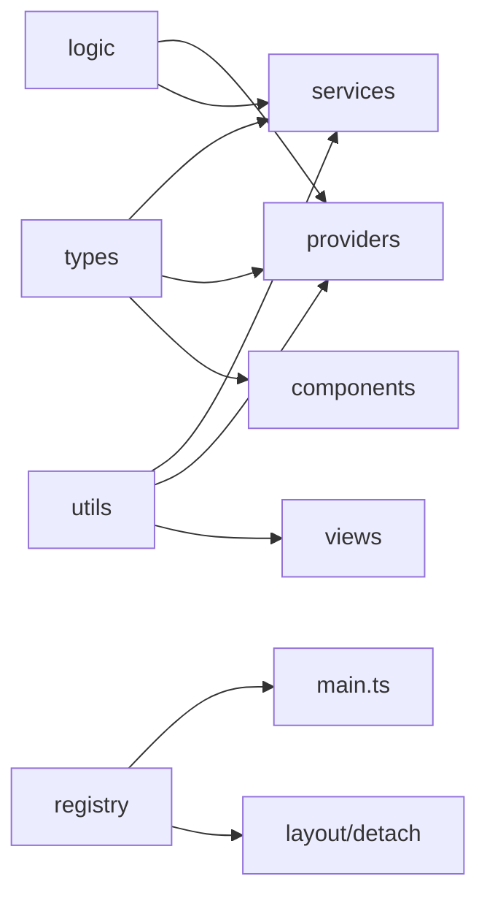

# Phase 06c - Contracts Logic Registry Utils

## Contract Layer

| Contract family | Files | What it controls |
|---|---|---|
| Core nodes/indexes | `typeContracts`, `typeNode`, `typeExplorer`, `typeExplorerDataPlane` | Node shapes, index contracts, provider contract, snapshots, reveal targets. |
| View model | `typeViews`, `typeSelection`, `typePrimitives` | View modes, rows, columns, layers, selection, FABs, popup primitives. |
| Operations | `typeOps`, `typeVfsImmutable`, `typeFnR`, `typeFilter`, `typeProp` | Queue changes, immutable VFS snapshots, FnR state, filters, property types. |
| Runtime shells | `typeFrame`, `typeTabLeaf`, `typeTab`, `typeSettings`, `typeObsidian` | Frame view, detached leaf view, tab configs, plugin settings, Obsidian internals. |
| Theme/Bases/adoption | `typeThemePreset`, `typeElasticUi`, `typeBasesInterop`, `typeAdoptedNode`, `typeCtxMenu` | Theme preset tokens, elastic UI settings, Bases import reports, adopted outline nodes, context menu actions. |

`typeContracts.ts` is the broadest surface because it defines `INodeIndex`, domain node contracts, `IFilterService`, `IOperationQueue`, `IOverlayState`, `IRouter`, and `IExplorer`. `typeViews.ts` is the view-facing counterpart: it defines rows, columns, layers, capabilities, empty states, render models, and `IViewService`.

## Logic Layer

| File | Role |
|---|---|
| `logicExplorer.ts` | Small generic explorer selection/search/expansion state. |
| `logicExplorerSnapshot.ts` | Builds `ExplorerSnapshot` rows and lookup maps from provider trees. |
| `logicKeyboard.ts` | Pure pointer, keyboard, box selection, and diff shortcut transitions. |
| `logicsFiles.ts` | Builds file/folder tree and flat file filtering from `TFile` inputs. |
| `logicProps.ts` | Builds property/value trees from `IPropsIndex`, checks property type compatibility, filters property/value nodes. |
| `logicTags.ts` | Builds nested tag trees from Obsidian metadata tags and filters them. |

## Registry Layer

| File | Role |
|---|---|
| `tabRegistry.ts` | Canonical detachable tab IDs, view type prefix, inner-tab translation, and detach guards. |
| `explorerAddOps.ts` | `crear` add-operation builders for tag and prop explorers; unsupported explorer kinds return `null`. |

## Utils Layer

| File | Role |
|---|---|
| `filter-evaluator.ts` | Evaluates filter trees against files using set arithmetic and metadata accessors. |
| `utilExplorerExpansion.ts` | Resolves auto/manual expanded IDs and counts tree nodes. |
| `utilBadgeBubbling.ts` | Bubbles hidden descendant badges to collapsed parent nodes. |
| `utilViewLayers.ts` | Converts `ViewLayers` into node badges, highlights, and CSS state classes. |
| `utilDebounce.ts` | Standard and leading-edge debounce helpers used by refresh paths. |
| `autocomplete.ts` | Obsidian property and folder input suggesters. |
| `dropDAutoSuggestionInput.ts` | Drop-down suggestion input attachment. |
| `inputModal.ts` | Promise-based Obsidian input modal. |
| `fileSuggestModal.ts` | File picker modal helper. |

## Dependency Direction

## Risk Notes

- `typeSettings.ts` has high blast radius because defaults connect toolbar, layout, explorer, Bases, DnD, gestures, queue, independent leaves, and FnR.
- `typeViews.ts` and `typeContracts.ts` should change only with adapter updates in services/providers/views; they define the cross-layer vocabulary.
- `logicKeyboard.ts`, `filter-evaluator.ts`, and `logicExplorerSnapshot.ts` are good candidates for high-signal regression tests because they are pure and sit under many UI behaviors.
