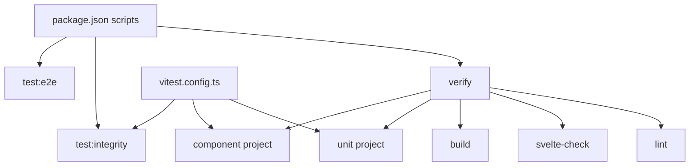

# Phase 07 - Tests Architecture Layer

This phase maps the test architecture that verifies the runtime, service, component, provider, logic, and style layers already mapped in phases 01-06.

## Test Projects

| Project | Environment | Include | Primary purpose |
|---|---|---|---|
| integration | node | `test/integration/**/*.test.ts` | Obsidian integration testing through `evalInObsidian`, real plugin loading, vault access, queue behavior, explicit vault checks. |
| component | jsdom | `test/component/**/*.test.ts` | Mounted Svelte components, view behavior, toolbar/nav, dialogs, pages, panels, and virtualized surfaces. |
| unit | node | `test/unit/**/*.test.ts` | Pure services, logic, providers, types, indexes, scripts, styles, and performance contracts. |

## Verification Script Boundary

`package.json` defines `verify` as lint, check, build, unit tests, and component tests. Integration tests are separate under `test:integrity`, and e2e is separate under `test:e2e`.

## Test Surface Counts

| Area | Files | Tests | Lines | Layer emphasis |
|---|---:|---:|---:|---|
| `test/unit/services` | 89 | 603 | 11321 | Phase 06 service contracts and regressions. |
| `test/component` | 77 | 391 | 13915 | Phases 03-05 UI, views, toolbar/nav, popups, virtualized surfaces. |
| `test/integration` | 8 | 13 | 514 | Phase 02 runtime plugin lifecycle and Obsidian vault behavior. |
| `test/unit/components` | 9 | 78 | 2482 | Phase 05 providers/container shims and frame hooks without full DOM mount. |
| `test/unit/logic` | 6 | 38 | 664 | Phase 06 pure logic. |
| `test/unit/utils` | 9 | 44 | 665 | Phase 06 utilities. |
| `test/unit/performance` | 3 | 13 | 701 | Explorer scale and Notebook Navigator comparison gates. |
| Other unit groups | 20 | 100 | 1193 | Types, registry, styles, scripts, build, dev, badges, index, frame. |
| Helpers/support/fixtures | 8 | 0 | 1061 | Obsidian mocks, DOM polyfill, generated vault/synthetic datasets, snippets. |

## Key Conclusion

Tests are strongest around the phase 06 service layer and phase 05 view layer.
The integration project exists but is outside `verify`, so live Obsidian confidence depends on explicit `test:integrity`, e2e, or smoke commands.

## Shards

- `07a-test-harness-and-config.md` - Vitest projects, scripts, mocks, helpers, and support data.
- `07b-test-suites-by-contract.md` - suites grouped by architecture contract.
- `07c-test-risk-and-coverage-map.md` - coverage strengths, gaps, and next-risk guidance.
- `07d-test-inventory.md` - condensed inventory of all test groups.

## Canvas

- `visuals/phase-07-tests-architecture.canvas`

## Next Layer

Phase 08 should map `scripts/`, CI, release, security, generated artifacts, and runtime build outputs because phase 07 shows scripts outside `verify` still carry smoke, e2e, audit, SBOM, build sync, and release behavior.
