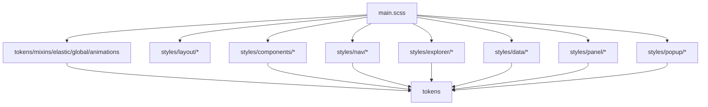

# Styles Dashboard Addons Modals

## SCSS Import Topology

`src/main.scss` is the stylesheet composition root.

Every category partial either imports `tokens`, `mixins`, or both. The practical direction is one-way: component/runtime markup emits classes and `main.scss` aggregates all partials into the plugin stylesheet.

## Style Groups

| Group | Files |
| --- | --- |
| Base | `_tokens.scss`, `_mixins.scss`, `_elastic.scss`, `_global.scss`, `_animations.scss` |
| Components | badges, curator, explorer-ui, modals, navbar, primitives, settings, sidebar, statistics, tabs |
| Data | cards, file-list, filters-page, filters, grid, table |
| Explorer | cards, explorer, tags, tree, virtual-list |
| Layout/Nav | glass, layout, v3-layout, tab-bar, toolbar, v3-nav |
| Panel/Popup | content-ops, diff-view, ops, queue, islands, sort-popup, v3-popups, viewmode-popup |

## Dashboard And Addons

`Dashboard3Column.svelte` is a thin layout renderer. It receives Svelte snippets for filters, explorer, and addons, and switches between three-column and single-column dashboard layouts based on `enabled`.

`AddonsMarkdownPane.svelte` is an add-on island surface:

- IN: `AddonsIslandService`, stats renderer, optional markdown renderer, and optional Obsidian-like app.
- Uses `MarkdownRenderer.render` with a disposable `ObsidianComponent`.
- Resolves Markdown files through `getFileByPath` or `getAbstractFileByPath`.
- Cleans up renderer component on pane changes and destroy.
- Can open the quick switcher through the add-ons service.

## Modal Support

`modalDeleteConflict.svelte` is a Svelte conflict dialog for destructive delete operations. It receives a node label, conflicting queue op descriptors, confirm and cancel callbacks, translates title/body/buttons, renders op details, and routes `Escape` to cancel.

## Test Coverage

Component coverage exists for add-ons markdown rendering, dashboard layout, delete conflict modal behavior, primitive FAB behavior, settings UI, settings leaf toggle, and badge hover/collision behavior. Style partials are indirectly verified by component and visual/live smoke coverage rather than selector-level unit tests.
