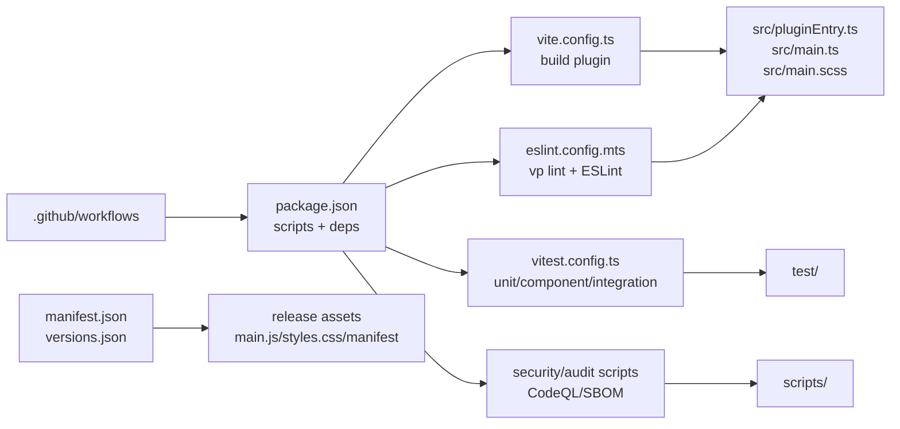

# Codebase Architecture Cluster

## Purpose

Build a layered visual map of the Vaultman codebase. Each phase adds a Markdown
record and, when useful, a child Canvas linked from the central Canvas.

This first phase covers only the root layer: root files, root directories, and
how those root controls reach the first surface of `src/`, `test/`, and
`scripts/`.

## Visual Hub

- [[visuals/codebase-architecture-central.canvas|Central codebase architecture canvas]]
- [[visuals/phase-01-root-surface.canvas|Phase 01 root surface canvas]]

## Phases

| Phase | Status | Record | Scope |
| --- | --- | --- | --- |
| 01 | done | [[01-root-surface-layer|Root surface layer]] | Root configs, package scripts, release metadata, CI/security, top-level `src/`, `test/`, `scripts/`. |
| 02 | done | [[02-src-runtime-spine|Source runtime spine]] | `src/` entrypoints and first-level runtime modules. |
| 03 | pending | TBD | `src/components/` vertical UI surface, starting with `components/frame/`. |
| 04 | pending | TBD | `src/services/`, `providers/`, `registry/`, `logic/`, `utils/`. |
| 05 | pending | TBD | `test/` architecture and how tests bind to runtime layers. |
| 06 | pending | TBD | `scripts/`, CI, release, security, generated artifacts. |

## Root Layer Summary

## Decision Point

Recommended next phase: map `src/components/frame/` before broader component
work. The frame shell is the runtime bridge between `VaultmanPlugin`, page
surfaces, layout/nav state, overlays, hooks, dock, and detachable tab routing.
