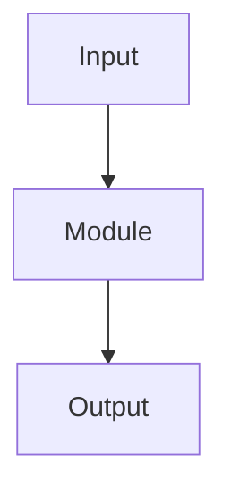

# Vertical Codebase Analysis

## Overview

Generate vertical specifications from real code, not memory. A vertical spec explains each major file or logical directory from purpose through dependencies, state/data flow, architecture patterns, risks, and key code. Preserve technical detail; when the codebase is large, batch and shard the work instead of compressing away context.

## Required Inputs

- A workspace path, repository, or pasted file/tree inventory.
- If the user asks to analyze the current workspace, build the inventory yourself.
- If files are missing or pasted snippets are insufficient, say exactly which paths are needed.

## Required Sub-Skills

- Use `svelte-code-writer` when analyzing `.svelte`, `.svelte.ts`, or `.svelte.js` files.
- Use `verification-before-completion` before claiming coverage is complete.

## Inventory First

Start with the smallest useful inventory:

```powershell
rg --files -g '!node_modules' -g '!dist' -g '!coverage'
```

Prioritize source and architecture files:

- `src/**/*.svelte`, `src/**/*.ts`, `src/**/*.js`
- root config: `package.json`, `vite.config.*`, `svelte.config.*`, `tsconfig*.json`
- tests that reveal contracts: `test/**`, `*.test.ts`, `*.spec.ts`
- generated or bundled artifacts only when they are the runtime output being reviewed.

Do not analyze a file as if you read it. Mark unread files as pending.

## Batching Strategy

For large codebases, announce and execute batches:

1. Root and build/runtime entrypoints.
2. `src/components`, grouped by `containers`, `views`, `pages`, `settings`, and reusable UI.
3. `src/services`, stores, and stateful modules.
4. `src/providers`, adapters, and API boundaries.
5. `src/logic`, `utils`, `registry`, and pure domain modules.
6. `src/types`, settings contracts, schemas, and public interfaces.
7. Tests, performance harnesses, and generated outputs if relevant.

Maintain a coverage table with `done`, `partial`, and `pending` status per batch. Never claim "total" coverage until every listed path is covered or explicitly excluded with a reason.

## Analysis Axes

For each file or logical directory, inspect:

- Purpose and unique responsibility.
- Dependencies IN: imports, injected services, props, external APIs, Obsidian/Svelte/TanStack/Pretext dependencies.
- Dependencies OUT: exports, events, callbacks, stores, rendered components, side effects.
- Data flow: inputs, outputs, state ownership, derived state, async boundaries, subscriptions, cache invalidation.
- Architecture patterns: Svelte runes, stores, services, providers, adapters, registries, virtualizers, command routing, Obsidian lifecycle.
- Issues and refactors: performance, render churn, invalidation bugs, coupling, test gaps, accessibility, error handling, naming, modularity.
- Testing: existing coverage, missing behavior tests, likely regression tests.

For Vaultman-style Svelte/TypeScript/Obsidian work, pay special attention to:

- render-trigger risk, `$effect` tracking, `$derived.by`, subscriptions, and virtualizer keys.
- Pretext/text measurement and cache boundaries.
- deep module boundaries between providers, services, views, and Obsidian APIs.
- keyboard navigation, selection/focus/hover/action separation, and reduced-motion/accessibility behavior.

## Output Format

Use strict Markdown. For every file or directory section:

````markdown
## [Archivo/Dir] - [Resumen 1 linea]

### Proposito
[3-5 oraciones basadas en el codigo leido.]

### Dependencias
- IN: [imports, props, injected services, external APIs]
- OUT: [exports, events, mutations, rendered children, side effects]

### Flujo de datos


### Issues/Mejoras
- [Riesgo o mejora concreta con razon tecnica]

### Codigo clave
- `[path]`: [funcion/componente/contrato relevante y por que importa]
````

Use Mermaid `flowchart`, `sequenceDiagram`, or `classDiagram` based on the module shape. If a diagram would be misleading, write a concise data-flow description instead.

## Critical Tone

Be direct and constructive. Name concrete risks and refactors, but distinguish evidence from inference:

- Evidence: "This component subscribes in `onMount` and unsubscribes in cleanup."
- Inference: "This may re-render too often if the parent passes unstable arrays."
- Unknown: "Need to inspect `X` before judging this boundary."

## Completeness Rules

- Start from `src/` or the root entrypoint if `src/` is absent.
- Group logical directories, but list important files inside each group.
- Ask for more files only after identifying the exact missing path or snippet.
- For active Vaultman docs, put long analysis records under the relevant initiative/research folder and keep current status/handoff as compact links.
- Preserve detail first. If a record becomes large, shard it with an `index.md` manifest instead of summarizing away technical context.

## Common Mistakes

| Mistake | Correction |
|---|---|
| Summarizing a directory without reading representative files | Read entrypoints and contracts first, then mark uninspected files pending. |
| Calling the analysis complete after one batch | Maintain a coverage table and state the next batch. |
| Listing imports without explaining direction | Separate IN and OUT dependencies and describe side effects. |
| Giving generic refactors | Tie each issue to a path, state flow, dependency, or test gap. |
| Ignoring generated/runtime artifacts | Explicitly exclude or include them based on whether they are source of truth. |

