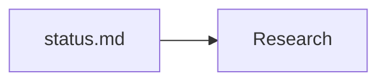
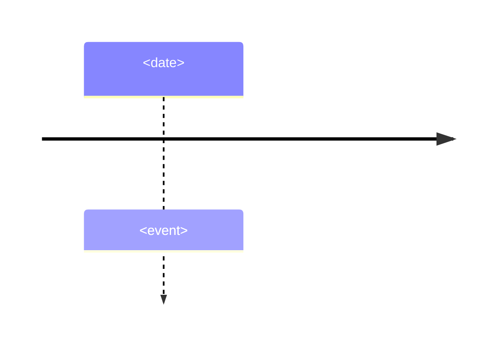

# Vaultman Work Visualizer

Use this skill to turn Vaultman work history into navigable visuals without
compressing away source detail. Produce complementary outputs when useful:

- A Markdown note containing Mermaid diagrams for quick text review.
- A `.canvas` file using the `json-canvas` skill for Obsidian navigation.
- A native `.excalidraw.md` drawing plus SVG preview when spatial review,
  annotation, or durable visual editing matters.

## Core Workflow

1. Define the visual scope from the user request.
   If the request is broad, start from `.agents/docs/current/status.md`,
   `.agents/docs/current/handoff.md`, and the linked initiative records.
2. Gather only source-backed facts.
   Use current docs, initiative `specs/`, `plans/`, `research/`, `items/`,
   `backlog/`, audit records, `git status --short`, `git diff --stat`, and
   relevant diffs or commits. Do not invent missing sequence or causality.
3. Classify every item as one of:
   `source`, `research`, `decision`, `change`, `verification`, `risk`,
   `residual`, `next-action`, or `handoff`.
4. Choose the diagram set:
   - Flowchart for dependencies, cause/effect, or architecture relationships.
   - Timeline for investigation, implementation, review, audit, and verification
     chronology.
   - Sequence diagram for runtime interactions, agent handoffs, or command flow.
   - Mindmap for broad topic inventory.
   - Canvas for source navigation, clustered evidence, and next-action maps.
5. Create the Markdown and Canvas outputs near the source record:
   - For a folder record with `index.md`, write visuals under `visuals/`.
   - For a single Markdown record, write sibling files named
     `<record-stem>-visuals.md` and `<record-stem>-visuals.canvas`.
   - For ad hoc current-state maps, use
     `.agents/docs/work/<initiative>/visuals/` when the initiative is clear.
6. Validate outputs before final response.

## Native Excalidraw Output

Use `scripts/render-excalidraw.mjs` for deterministic, dependency-free native
Obsidian drawings. The renderer accepts a declarative JSON file and emits both
`.excalidraw.md` and accessible SVG:

```bash
node scripts/render-excalidraw.mjs \
  source/architecture.json \
  architecture.excalidraw.md \
  architecture.svg
```

The input requires `title`, `description`, `width`, `height`, `nodes`, and
`edges`. Node IDs and edge IDs are stable alphanumeric/dash identifiers of at
most eight characters. Supported semantic node kinds are `source`,
`authority`, `runtime`, `decision`, `risk`, and `neutral`.
Edges may include an optional ordered `via: [{x, y}]` waypoint list. The local
renderer clips route endpoints just outside node rectangles, binds arrows and
text to their containers, and applies deterministic bounded wrapping to both
native Excalidraw and SVG output.

Prefer this local renderer over a live MCP when reproducibility, reviewability,
or supply-chain minimization is the priority. A live canvas remains useful for
manual refinement, but it is not required to generate or validate artifacts.
Never invoke upload/share actions unless the user explicitly requests them.

## Source Discipline

- Preserve complete source records. Do not replace detailed docs with visual
  summaries.
- Include source file paths in visual notes, canvas file nodes, or node text.
- Separate completed changes from planned work and residual risks.
- Show verification status explicitly: `passed`, `failed`, `not-run`,
  `blocked`, or `unknown`.
- Mark inference as inference when a relationship is derived from multiple
  sources rather than stated directly.
- If sources conflict, show the conflict as a risk/residual instead of silently
  resolving it.

## Markdown Mermaid Output

Create a Markdown note with this shape:

````markdown
---
title: <visual title>
type: visual-map
status: active
parent: "[[source-or-initiative-index]]"
created: <ISO date>
updated: <ISO date>
tags:
  - agent/visual
---

# <Visual Title>

## Sources

- [source label](relative/path.md)

## Work Map



## Timeline



## Verification

| Check | Status | Source |
| --- | --- | --- |
| <check> | passed | <path> |
````

Keep Mermaid labels short. Put detailed evidence in nearby prose or tables, not
inside diagram nodes. Use stable node IDs with letters, digits, and underscores.

## JSON Canvas Output

Always load and follow `.agents/skills/json-canvas/SKILL.md` before writing a
`.canvas` file.

Recommended Canvas layout:

- Left column: source file nodes.
- Second column: research and audit findings.
- Third column: decisions and changes.
- Fourth column: verification, residuals, and next actions.
- Use group nodes for phases or lanes.
- Use file nodes for important source records and text nodes for synthesis.
- Label edges with short verbs such as `evidences`, `drives`, `changes`,
  `verifies`, `blocks`, or `next`.

Keep nodes scannable. Prefer several linked nodes over one oversized text node.
Use preset colors consistently:

- `"5"` sources
- `"6"` research or audit
- `"4"` completed changes and passed verification
- `"3"` decisions, plans, or next actions
- `"2"` risks, residuals, partial verification, or blocked work
- `"1"` failed checks or regressions

## Pattern Reference

Read `references/visual-patterns.md` when choosing between diagram types, when
the requested map is large, or when you need ready Mermaid and Canvas patterns.

## Validation

Before reporting completion:

1. Parse every `.canvas` file as JSON.
2. Verify all canvas node IDs and edge IDs are unique.
3. Verify every `fromNode` and `toNode` exists.
4. Confirm referenced local source paths exist.
5. Inspect Mermaid fences for balanced code blocks and obvious syntax issues.
6. Run `git diff --check` when files were edited.
7. Run `node --test test/render-excalidraw.test.mjs` after renderer changes.
8. Parse every native Drawing JSON block and verify text block IDs are unique.
9. Inspect every SVG preview as pixels for clipping, overlap, and legibility.

In the final response, list the created visual files and any source gaps,
conflicts, or verification that could not be completed.
