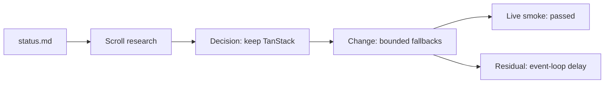
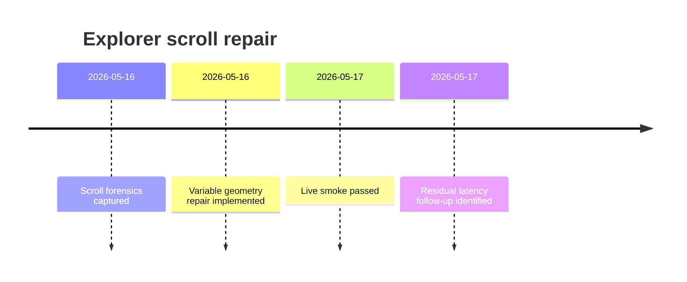
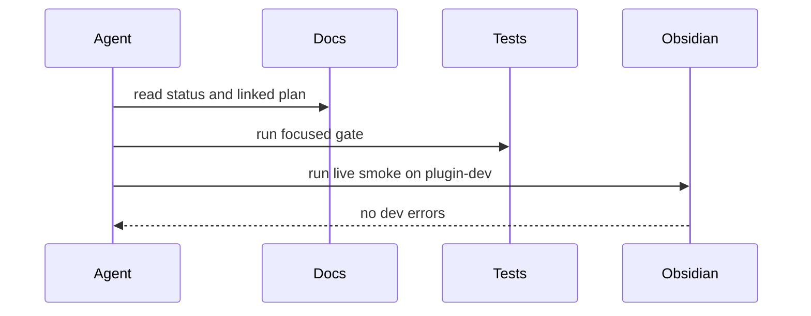
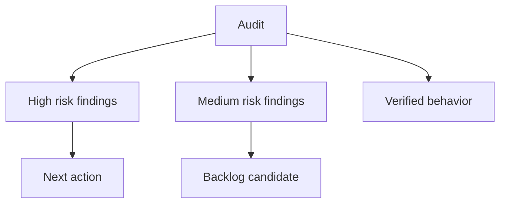

# Visual Patterns

Use these patterns to select the smallest useful visual for Vaultman work.

## Diagram Selection

| User need | Mermaid pattern | Canvas pattern |
| --- | --- | --- |
| What happened? | `timeline` | left-to-right chronology |
| What changed? | `flowchart LR` | source -> change -> verification |
| What did the audit find? | `flowchart TD` or mindmap | finding clusters by severity |
| How do modules relate? | `flowchart LR` | architecture lanes by layer |
| How did a command or workflow run? | `sequenceDiagram` | actors and artifacts |
| What remains? | `flowchart LR` with risk nodes | residuals and next-action lane |

## Mermaid Patterns

### Work Dependency Flow

### Investigation Timeline

### Runtime Or Command Sequence

### Audit Map

## Canvas Patterns

### Evidence-To-Change Canvas

Use this for implementation or regression work.

- Group 1: `Sources`
  - File nodes for `status.md`, `handoff.md`, active plan/spec, relevant tests.
- Group 2: `Findings`
  - Text nodes for reproduced behavior, audit observations, or constraints.
- Group 3: `Changes`
  - Text nodes for files or modules changed.
- Group 4: `Verification`
  - Text nodes for passed checks, failed checks, blocked checks, and residuals.

Connect:

- source -> finding: `evidences`
- finding -> change: `drives`
- change -> verification: `verified by`
- verification -> residual: `leaves`
- residual -> next action: `next`

### Initiative Overview Canvas

Use this for broad "show everything" requests.

- Put the initiative index in the top-left as the anchor file node.
- Create one group per source category: `Research`, `Plans`, `Implementation`,
  `Verification`, `Residuals`, `Next`.
- Use file nodes for records the user may open.
- Use short text nodes for synthesis that does not already exist as a file.

## Size Rules

- For fewer than 12 facts, use one Mermaid diagram plus a compact canvas.
- For 12-40 facts, use one overview Mermaid diagram, one timeline, and a canvas.
- For more than 40 facts, shard by initiative, workstream, or phase. Create an
  index Markdown note linking each visual shard.
- Do not make a single canvas with so many edges that source navigation becomes
  harder than reading the original docs.
